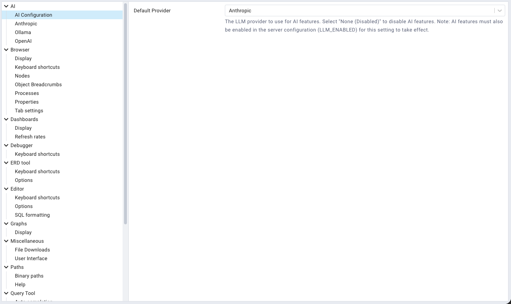
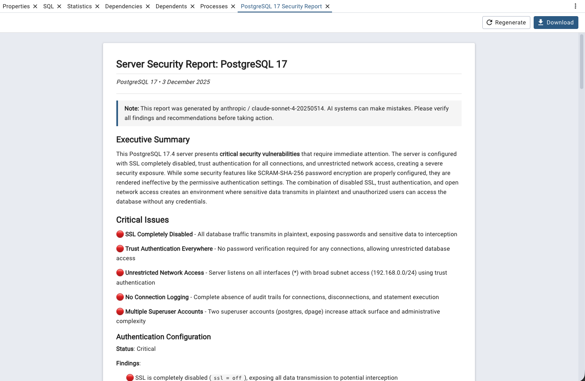

.. _ai_tools:

*******************
`AI Reports`:index:
*******************

**AI Reports** is a feature that provides AI-powered database analysis and insights
using Large Language Models (LLMs). Use the *Tools → AI Reports* menu to access
the various AI-powered reports.

The AI Reports feature allows you to:

 * Generate security reports to identify potential security vulnerabilities and configuration issues.

 * Create performance reports with optimization recommendations for queries and configurations.

 * Perform design reviews to analyze database schema structure and suggest improvements.

**Prerequisites:**

Before using AI Reports, you must:

 1. Ensure AI features are enabled in the server configuration (set ``LLM_ENABLED`` to ``True`` in ``config.py``).

 2. Configure an LLM provider in :ref:`Preferences → AI <preferences>`.

**Note:**

 * AI Reports using cloud providers (Anthropic, OpenAI) require an active internet connection.
   Local providers (Ollama, Docker Model Runner) do not require internet access.

 * API usage may incur costs depending on your LLM provider's pricing model.
   Local providers (Ollama, Docker Model Runner) are free to use.

 * The quality and accuracy of reports depend on the LLM provider and model configured.

Configuring AI Reports
**********************

To configure AI Reports, navigate to *File → Preferences → AI* (or click the *Settings*
button and select *AI*).

Select your preferred LLM provider from the dropdown:

**Anthropic**
  Use Claude models from Anthropic. Requires an Anthropic API key.

  * **API Key File**: Path to a file containing your Anthropic API key (obtain from https://console.anthropic.com/).
  * **Model**: Select from available Claude models (e.g., claude-sonnet-4-20250514).

**OpenAI**
  Use GPT models from OpenAI. Requires an OpenAI API key.

  * **API Key File**: Path to a file containing your OpenAI API key (obtain from https://platform.openai.com/).
  * **Model**: Select from available GPT models (e.g., gpt-4).

**Ollama**
  Use locally-hosted open-source models via Ollama. Requires a running Ollama instance.

  * **API URL**: The URL of your Ollama server (default: http://localhost:11434).
  * **Model**: Enter the name of the Ollama model to use (e.g., llama2, mistral).

**Docker Model Runner**
  Use models running in Docker Desktop's built-in model runner (available in Docker Desktop 4.40+).
  No API key is required.

  * **API URL**: The URL of the Docker Model Runner API (default: http://localhost:12434).
  * **Model**: Select from available models or enter a custom model name.

After configuring your provider, click *Save* to apply the changes.

Security Reports
****************

Security Reports analyze your PostgreSQL server, database, or schema for potential
security vulnerabilities and configuration issues.

To generate a security report:

1. In the *Browser* tree, select a server, database, or schema.

2. Choose *Tools → AI Reports → Security* from the menu, or right-click the
   object and select *Security* from the context menu.

3. The report will be generated and displayed in a new tab.

**Security Report Scope:**

* **Server Level**: Analyzes server configuration, authentication settings, roles, and permissions.

* **Database Level**: Reviews database-specific security settings, roles with database access, and object permissions.

* **Schema Level**: Examines schema permissions, object ownership, and access controls.

Each report includes:

* **Security Findings**: Identified vulnerabilities or security concerns.

* **Risk Assessment**: Severity levels for each finding (Critical, High, Medium, Low).

* **Recommendations**: Specific actions to remediate security issues.

* **Best Practices**: General security recommendations for PostgreSQL.

Performance Reports
*******************

Performance Reports analyze query performance, configuration settings, and provide
optimization recommendations.

To generate a performance report:

1. In the *Browser* tree, select a server or database.

2. Choose *Tools → AI Reports → Performance* from the menu, or right-click the
   object and select *Performance* from the context menu.

3. The report will be generated and displayed in a new tab.

**Performance Report Scope:**

* **Server Level**: Analyzes server configuration parameters, resource utilization, and overall server performance metrics.

* **Database Level**: Reviews database-specific configuration, query performance, index usage, and table statistics.

Each report includes:

* **Performance Metrics**: Key performance indicators and statistics.

* **Configuration Analysis**: Review of relevant configuration parameters.

* **Query Optimization**: Recommendations for improving slow queries.

* **Index Recommendations**: Suggestions for adding, removing, or modifying indexes.

* **Capacity Planning**: Resource utilization trends and recommendations.

Design Review Reports
*********************

Design Review Reports analyze your database schema structure and suggest
improvements for normalization, naming conventions, and best practices.

To generate a design review report:

1. In the *Browser* tree, select a database or schema.

2. Choose *Tools → AI Reports → Design* from the menu, or right-click the
   object and select *Design* from the context menu.

3. The report will be generated and displayed in a new tab.

**Design Review Scope:**

* **Database Level**: Reviews overall database structure, schema organization, and cross-schema dependencies.

* **Schema Level**: Analyzes tables, views, functions, and other objects within the schema.

Each report includes:

* **Schema Structure Analysis**: Review of table structures, relationships, and constraints.

* **Normalization Review**: Recommendations for database normalization (1NF, 2NF, 3NF, etc.).

* **Naming Conventions**: Suggestions for consistent naming patterns.

* **Data Type Usage**: Review of data type choices and recommendations.

* **Index Design**: Analysis of indexing strategy.

* **Best Practices**: General PostgreSQL schema design recommendations.

Working with Reports
********************

All AI reports are displayed in a dedicated panel with the following features:

**Report Display**
  Reports are formatted as Markdown and rendered with syntax highlighting for SQL code.

**Toolbar Actions**

  * **Stop** - Cancel the current report generation. This is useful if the report
    is taking too long or if you want to change parameters.

  * **Regenerate** - Generate a new report for the same object. Useful when you
    want to get a fresh analysis or if data has changed.

  * **Download** - Download the report as a Markdown (.md) file. The filename
    includes the report type, object name, and date for easy identification.

**Multiple Reports**
  You can generate and view multiple reports simultaneously. Each report opens in
  a new tab, allowing you to compare reports across different servers, databases,
  or schemas.

**Report Management**
  Each report tab can be closed individually by clicking the *X* in the tab.
  Panel titles show the object name and report type for easy identification.

**Copying Content**
  You can select and copy text from reports to use in documentation or share with
  your team.

Troubleshooting
***************

**"AI features are disabled in the server configuration"**
  The administrator has disabled AI features on the server. Contact your
  pgAdmin administrator to enable the ``LLM_ENABLED`` configuration option.

**"Please configure an LLM provider in Preferences"**
  You need to configure an LLM provider before using AI Reports. See *Configuring AI Reports* above.

**"Please connect to the server/database first"**
  You must establish a connection to the server or database before generating reports.

**API Connection Errors**
  * Verify your API key is correct (for Anthropic and OpenAI).
  * Check your internet connection (for cloud providers).
  * For Ollama, ensure the Ollama server is running and accessible.
  * For Docker Model Runner, ensure Docker Desktop 4.40+ is running with the model runner enabled.
  * Check that your firewall allows connections to the LLM provider's API.

**Report Generation Fails**
  * Check the pgAdmin logs for detailed error messages.
  * Verify the database connection is still active.
  * Ensure the selected model is available for your account/subscription.
