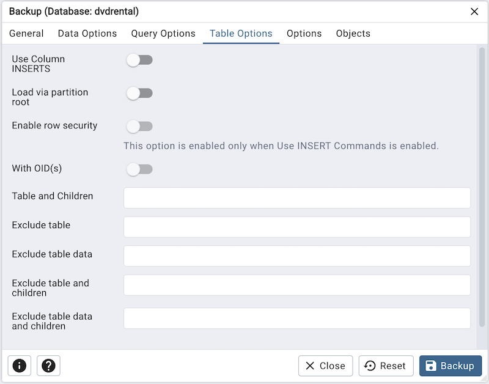
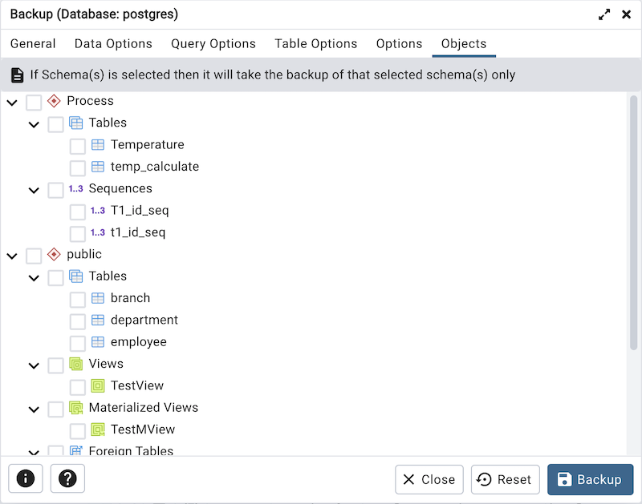

.. _backup_dialog:

**********************
`Backup Dialog`:index:
**********************

*pgAdmin* uses the *pg_dump* utility to provide an easy way to create a backup
in a plain-text or archived format.  You can then use a client application (like
*psql* or the *Query Tool*) to restore a plain-text backup file, or use the
Postgres *pg_restore* utility to restore an archived backup. The *pg_dump*
utility must have read access to all database objects that you want to back up.

You can backup a single table, a schema, or a complete database. Select the name
of the backup source in the *pgAdmin* tree control, right click to open the
context menu, and select *Backup...* to open the *Backup* dialog.  The name of
the object selected will appear in the dialog title bar.

.. image:: images/backup_general.png
    :alt: Backup dialog general tab
    :align: center

Use the fields in the *General* tab to specify parameters for the backup:

* Enter the name of the backup file in the *Filename* field. Optionally, select
  the *Browser* icon (...) to the right to navigate into a directory and select
  a file that will contain the archive.

* Use the drop-down listbox in the *Format* field to select the format that is
  best suited for your application.  Each format has advantages and
  disadvantages:

   * Select *Custom* to create a custom archive file that you can use with
     *pg_restore* to create a copy of a database. Custom archive file formats
     must be restored with *pg_restore*. This format offers the opportunity to
     select which database objects to restore from the backup file. *Custom*
     archive format is recommended for medium to large databases as it is
     compressed by default.

   * Select *Tar* to generate a tar archive file that you can restore with
     *pg_restore*. The tar format does not support compression.

   * Select *Plain* to create a plain-text script file. A plain-text script file
     contains SQL statements and commands that you can execute at the *psql*
     command line to recreate the database objects and load the table data.  A
     plain-text backup file can be edited in a text editor, if desired, before
     using the *psql* program to restore database objects.  *Plain* format is
     normally recommended for smaller databases; script dumps are not
     recommended for blobs. The SQL commands within the script will reconstruct
     the database to the last saved state of the database.  A plain-text script
     can be used to reconstruct the database on another machine, or (with
     modifications) on other architectures.

   * Select *Directory* to generate a directory-format archive suitable for use
     with *pg_restore*.  This file format creates a directory with one file for
     each table and blob being dumped, plus a *Table of Contents* file
     describing the dumped objects in a machine-readable format that
     *pg_restore* can read.  This format is compressed by default.

* Use the *Compression Ratio* field to select a compression level for the
  backup. Specify a value of zero to mean use no compression; specify a maximum
  compression value of 9.  Please note that tar archives do not support
  compression.
* Use the *Encoding* drop-down listbox to select the character encoding method
  that should be used for the archive.
* Use the *Number of Jobs* field (when applicable) to specify the number of
  tables that will be dumped simultaneously in a parallel backup.
* Use the dropdown listbox next to *Rolename* to specify the role that owns the
  backup.

Click the *Data Options* tab to continue. Use the fields in the *Data Options*
tab to provide options related to data or pgAdmin objects that correspond to *pg_dump*.

.. image:: images/backup_sections.png
    :alt: Sections option on backup dialog
    :align: center

* Move switches in the **Sections** field box to select a portion of the object
  that will be backed up.

   * Move the switch next to *Pre-data* towards right position to include all
     data definition items not included in the data or post-data item lists.

   * Move the switch next to *Data* towards right position to backup actual table
     data, large-object contents, and sequence values.

   * Move the switch next to *Post-data* towards right position to include
     definitions of indexes, triggers, rules, and constraints other than
     validated check constraints.

.. image:: images/backup_objects.png
    :alt: Type of objects option on backup dialog
    :align: center

* Move switches in the **Type of objects** field box to specify details about
  the type of objects that will be backed up.

   * Move the switch next to *Only data* towards right position to limit the back
     up to data.

   * Move the switch next to *Only schemas* to limit the back up to schema-level
     database objects.

   * Move the switch next to *Blobs* towards left position to exclude large
     objects in the backup.

.. image:: images/backup_do_not_save.png
    :alt: Do not save option on backup dialog
    :align: center

* Move switches in the **Do not save** field box to select the objects that will
  not be included in the backup.

   * Move the switch next to *Owner* towards right position to exclude commands
     that set object ownership.

   * Move the switch next to *Privileges* towards right position to exclude
     commands that create access privileges.

   * Move the switch next to *Tablespaces* towards right position to exclude
     tablespaces.

   * Move the switch next to *Unlogged table data* towards right position to
     exclude the contents of unlogged tables.

   * Move the switch next to *Comments* towards right position to exclude
     commands that set the comments. **Note:** This option is visible only for
     database server greater than or equal to 11.

   * Move the switch next to *Publications* towards right position to exclude
     publications.

   * Move the switch next to *Subscriptions* towards right position to exclude
     subscriptions.

   * Move the switch next to *Security labels* towards right position to exclude
     Security labels.

   * Move the switch next to *Toast compressions* towards right position to exclude
     Toast compressions. **Note:** This option is visible only for
     database server greater than or equal to 14.

   * Move the switch next to *Table access methods* towards right position to exclude
     Table access methods. **Note:** This option is visible only for
     database server greater than or equal to 15.

.. image:: images/backup_queries.png
    :alt: Queries option on backup dialog
    :align: center

Click the *Query Options* tab to continue. Use these additional fields to specify
the type of statements that should be included in the backup.

   * Move the switch next to *Use INSERT commands* towards right position to
     dump the data in the form of INSERT statements rather than using a COPY
     command.  Please note: this may make restoration from backup slow.

   * Use the *Maximum rows per INSERT command* field to controls the maximum
     number of rows per INSERT command. **Note:** This option is visible only for
     database server greater than or equal to 12.

   * Move the switch next to *On conflict do nothing to INSERT command* towards
     right position to add ON CONFLICT DO NOTHING to INSERT command.
     This option is not valid unless *Use INSERT commands*, *Use Column INSERTS*
     or *Maximum rows per INSERT command* is also specified.
     **Note:** This option is visible only for database server greater than or
     equal to 12.

   * Move the switch next to *Include CREATE DATABASE statement* towards right
     position to include a command in the backup that creates a new database
     when restoring the backup.

   * Move the switch next to *Include DROP DATABASE statement* towards right
     position to include a command in the backup that will drop any existing
     database object with the same name before recreating the object during a
     backup.

   * Move the switch next to *Include IF EXISTS clause* towards right
     position to add an IF EXISTS clause to drop databases and other objects.
     This option is not valid unless *Include DROP DATABASE statement* is also set.

Click the *Table Options* tab to continue. Use the fields in the *Table Options*
tab related to tables that should be included in the backup.

   * Move the switch next to *Use Column INSERTS* towards right position to dump
     the data in the form of INSERT statements and include explicit column
     names. Please note: this may make restoration from backup slow.

   * Move the switch next to *Load via partition root* towards right position,
     so when dumping a COPY or INSERT statement for a partitioned table, target
     the root of the partitioning hierarchy which contains it rather than the
     partition itself. **Note:** This option is visible only for database server
     greater than or equal to 11.

   * Move the switch next to *Enable row security* towards right position to
     set row_security to on instead, allowing the user to dump the parts of the
     contents of the table that they have access to. This option is relevant
     only when dumping the contents of a table which has row security.

   * Move the switch next to *With OIDs* towards right position to include object
     identifiers as part of the table data for each table.

   * Use the *Exclude table data* field to not dump data for any tables
     matching the table pattern.

Click the *Options* tab to continue. Use the fields in the *Options*
tab to provide other backup options.

.. image:: images/backup_disable.png
    :alt: Disable option on backup dialog
    :align: center

* Move switches in the **Disable** field box to specify the type of statements
  that should be excluded from the backup.

   * Move the switch next to *Triggers* (active when creating a data-only backup)
     towards right position to include commands that will disable triggers on the
     target table while the data is being loaded.

   * Move the switch next to *$ quoting* towards right position to enable dollar
     quoting within function bodies; if disabled, the function body will be
     quoted using SQL standard string syntax.

.. image:: images/backup_miscellaneous.png
    :alt: Miscellaneous option on backup dialog
    :align: center

* Move switches in the **Miscellaneous** field box to specify miscellaneous
  backup options.

   * Move the switch next to *Verbose messages* towards left position to instruct
     *pg_dump* to exclude verbose messages.

   * Move the switch next to *Force double quotes on identifiers* towards right
     position to force the quoting of all identifiers.

   * Move the switch next to *Use SET SESSION AUTHORIZATION* towards right
     position to include a statement that will use a SET SESSION AUTHORIZATION
     command to determine object ownership (instead of an ALTER OWNER command).

   * Use the *Exclude schema* field to not dump schemas whose name matches
     pattern.

   * Use the *Extra float digits* field to use the specified value when dumping
     floating-point data, instead of the maximum available precision.

   * Use the *Lock wait timeout* field to do not wait forever to acquire shared
     table locks at the beginning of the dump. Instead, fail if unable to lock a
     table within the specified timeout.

Click the *Objects* tab to continue.

* Select the objects from tree to take backup of selected objects only.
    * If Schema is selected then it will take the backup of that selected schema only.
    * If any Table, View, Materialized View, Sequences, or Foreign Table is selected then it will take the backup of those selected objects.

When you’ve specified the details that will be incorporated into the pg_dump
command:

* Click the *Backup* button to build and execute a command that builds a backup
  based on your selections on the *Backup* dialog.

* Click the *Cancel* button to exit without saving work.

pgAdmin will run the backup process in background. You can view all the background
process with there running status and logs on the :ref:`Processes <processes>`
tab
