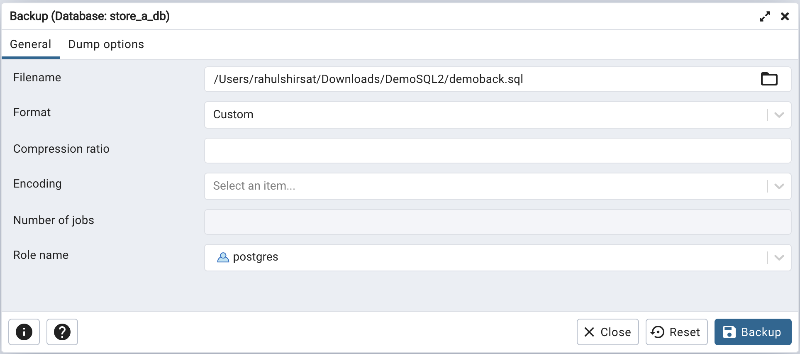
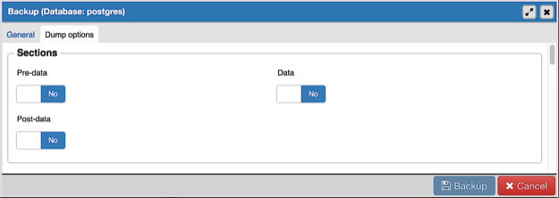
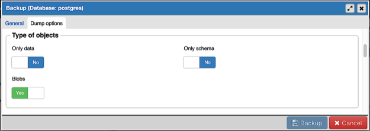
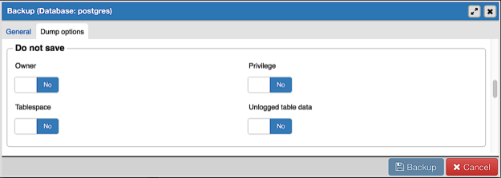
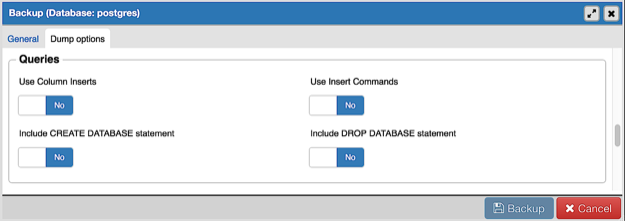
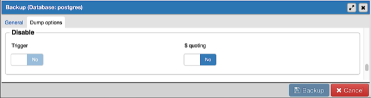
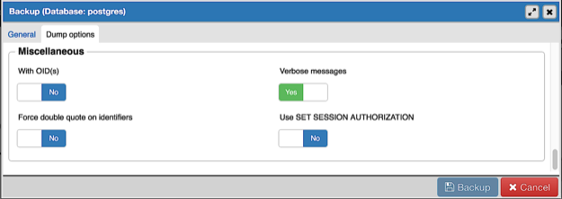
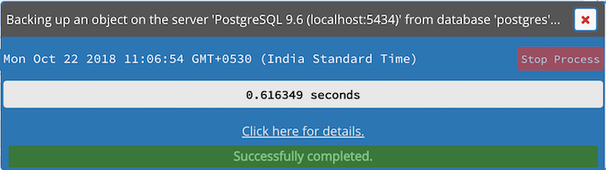
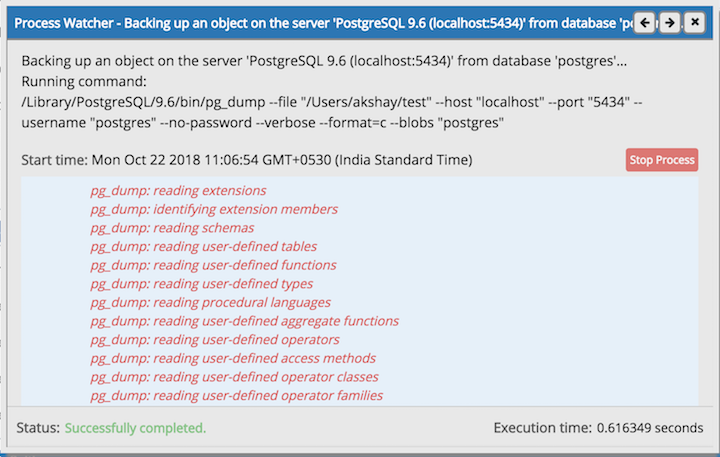

.. _backup_dialog:

**********************
`Backup Dialog`:index:
**********************

Using the *pg_dump* utility, *pgAdmin* provides an easy way to create a backup in a plain-text or archived format.  You can then use a client application (like *psql* or the *Query Tool*) to restore a plain-text backup file, or use the Postgres *pg_restore* utility to restore an archived backup. The *pg_dump* utility must have read access to all database objects that you want to back up.

You can backup a single table, a schema, or a complete database. Select the name of the backup source in the *pgAdmin* tree control, right click to open the context menu, and select *Backup...* to open the *Backup* dialog.  The name of the object selected will appear in the dialog title bar.

Use the fields in the *General* tab to specify parameters for the backup:

* Enter the name of the backup file in the *Filename* field.  Optionally, select the *Browser* icon (...) to the right to navigate into a directory and select a file that will contain the archive.
* Use the drop-down listbox in the *Format* field to select the format that is best suited for your application.  Each format has advantages and disadvantages:

   * Select *Custom* to create a custom archive file that you can use with *pg_restore* to create a copy of a database. Custom archive file formats must be restored with *pg_restore*. This format offers the opportunity to select which database objects to restore from the backup file. *Custom* archive format is recommended for medium to large databases as it is compressed by default.

   * Select *Tar* to generate a tar archive file that you can restore with *pg_restore*. The tar format does not support compression.

   * Select *Plain* to create a plain-text script file. A plain-text script file contains SQL statements and commands that you can execute at the *psql* command line to recreate the database objects and load the table data.  A plain-text backup file can be edited in a text editor, if desired, before using the *psql* program to restore database objects.  *Plain* format is normally recommended for smaller databases; script dumps are not recommended for blobs. The SQL commands within the script will reconstruct the database to the last saved state of the database.  A plain-text script can be used to reconstruct the database on another machine, or (with modifications) on other architectures.

   * Select *Directory* to generate a directory-format archive suitable for use with *pg_restore*.  This file format creates a directory with one file for each table and blob being dumped, plus a *Table of Contents* file describing the dumped objects in a machine-readable format that *pg_restore* can read.  This format is compressed by default.

* Use the *Compression Ratio* field to select a compression level for the backup.  Specify a value of zero to mean use no compression; specify a maximum compression value of 9.  Please note that tar archives do not support compression.
* Use the *Encoding* drop-down listbox to select the character encoding method that should be used for the archive.
* Use the *Number of Jobs* field (when applicable) to specify the number of tables that will be dumped simultaneously in a parallel backup.
* Use the dropdown listbox next to *Rolename* to specify the role that owns the backup.

Click the *Dump options* tab to continue. Use the box fields in the *Dump options* tab to provide options for *pg_dump*.

* Move switches in the **Sections** field box to select a portion of the object that will be backed up.

   * Move the switch next to *Pre-data* to the *Yes* position to include all data definition items not included in the data or post-data item lists.

   * Move the switch next to *Data* to the *Yes* position to backup actual table data, large-object contents, and sequence values.

   * Move the switch next to *Post-data* to the *Yes* position to include definitions of indexes, triggers, rules, and constraints other than validated check constraints.

* Move switches in the **Type of objects** field box to specify details about the type of objects that will be backed up.

   * Move the switch next to *Only data* to the *Yes* position to limit the back up to data.

   * Move the switch next to *Only schema* to limit the back up to schema-level database objects.

   * Move the switch next to *Blobs* to the *No* position to exclude large objects in the backup.

* Move switches in the **Do not save** field box to select the objects that will not be included in the backup.

   * Move the switch next to *Owner* to the *Yes* position to include commands that set object ownership.

   * Move the switch next to *Privilege* to the *Yes* position to include commands that create access privileges.

   * Move the switch next to *Tablespace* to the *Yes* position to include tablespaces.

   * Move the switch next to *Unlogged table data* to the *Yes* position to include the contents of unlogged tables.

* Move switches in the **Queries** field box to specify the type of statements that should be included in the backup.

   * Move the switch next to *Use Column Inserts* to the *Yes* position to dump the data in the form of INSERT statements and include explicit column names.  Please note: this may make restoration from backup slow.

   * Move the switch next to *Use Insert commands* to the *Yes* position to dump the data in the form of INSERT statements rather than using a COPY command.  Please note: this may make restoration from backup slow.

   * Move the switch next to *Include CREATE DATABASE statement* to the *Yes* position to include a command in the backup that creates a new database when restoring the backup.

   * Move the switch next to *Include DROP DATABASE statement* to the *Yes* position to include a command in the backup that will drop any existing database object with the same name before recreating the object during a backup.

* Move switches in the **Disable** field box to specify the type of statements that should be excluded from the backup.

   * Move the switch next to *Trigger* (active when creating a data-only backup) to the *Yes* position to include commands that will disable triggers on the target table while the data is being loaded.

   * Move the switch next to *$ quoting* to the *Yes* position to enable dollar quoting within function bodies; if disabled, the function body will be quoted using SQL standard string syntax.

* Move switches in the **Miscellaneous** field box to specify miscellaneous backup options.

   * Move the switch next to *With OIDs* to the *Yes* position to include object identifiers as part of the table data for each table.

   * Move the switch next to *Verbose messages* to the *No* position to instruct *pg_dump* to exclude verbose messages.

   * Move the switch next to *Force double quotes on identifiers* to the *Yes* position to force the quoting of all identifiers.

   * Move the switch next to *Use SET SESSION AUTHORIZATION* to the *Yes* position to include a statement that will use a SET SESSION AUTHORIZATION command to determine object ownership (instead of an ALTER OWNER command).

When you’ve specified the details that will be incorporated into the pg_dump command:

* Click the *Backup* button to build and execute a command that builds a backup based on your selections on the *Backup* dialog.
* Click the *Cancel* button to exit without saving work.

If the backup is successful, a popup window will confirm success. Click *Click here for details* on the popup window to launch the *Process Watcher*. The *Process Watcher* logs all the activity associated with the backup and provides additional information for troubleshooting.

If the backup is unsuccessful, you can review the error messages returned by the backup command on the *Process Watcher*.