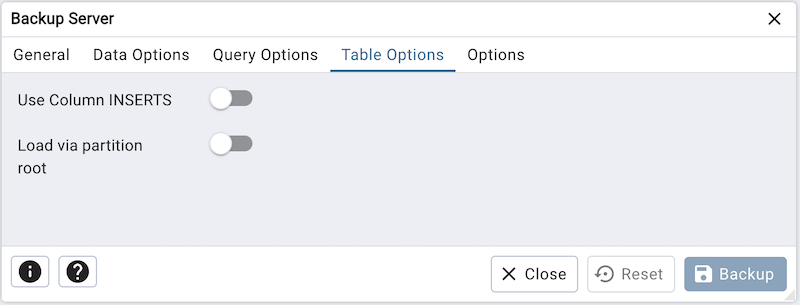

.. _backup_server_dialog:

*****************************
`Backup Server Dialog`:index:
*****************************

Use the *Backup Server* dialog to create a plain-text script that will recreate
the selected server. You can use the pgAdmin *Query Tool* to play back a
plain-text script, and recreate the server.

.. image:: images/backup_server_general.png
    :alt: Backup server dialog
    :align: center

Use the fields in the *General* tab to specify the following:

* Enter the name of the backup file in the *Filename* field.  Optionally, select
  the *Browser* icon (ellipsis) to the right to navigate into a directory and
  select a file that will contain the archive.
* Use the *Encoding* drop-down listbox to select the character encoding method
  that should be used for the archive. **Note:** This option is visible only for
  database server greater than or equal to 11.
* Use the drop-down listbox next to *Role name* to specify a role with
  connection privileges on the selected server.  The role will be used for
  authentication during the backup.

Click the *Data Options* tab to continue. Use the fields in the *Data Options*
tab to provide options related to data or pgAdmin objects that correspond to *pg_dumpall*.

.. image:: images/backup_server_objects.png
    :alt: Type of objects option on backup server dialog
    :align: center

* Move switches in the **Type of objects** field box to specify details about
  the type of objects that will be backed up.

   * Move the switch next to *Only data* towards right position to limit the back
     up to data.

   * Move the switch next to *Only schemas* to limit the back up to schema-level
     database objects.

   * Move the switch next to *Only tablespaces* to limit the back
     up to tablespaces only.

   * Move the switch next to *Only roles* to limit the back up to roles only.

.. image:: images/backup_server_do_not_save.png
    :alt: Do not save option on backup server dialog
    :align: center

* Move switches in the **Do not save** field box to select the objects that will
  not be included in the backup.

   * Move the switch next to *Owner* towards right position to exclude commands
     that set object ownership.

   * Move the switch next to *Role passwords* towards right position to exclude
     passwords for roles.

   * Move the switch next to *Privileges* towards right position to exclude
     commands that create access privileges.

   * Move the switch next to *Tablespaces* towards right position to exclude
     tablespaces.

   * Move the switch next to *Unlogged table data* towards right position to
     exclude the contents of unlogged tables.

   * Move the switch next to *Comments* towards right position to exclude
     commands that set the comments. **Note:** This option is visible only for
     database server greater than or equal to 11.

   * Move the switch next to *Publications* towards right position to exclude
     publications.

   * Move the switch next to *Subscriptions* towards right position to exclude
     subscriptions.

   * Move the switch next to *Security labels* towards right position to exclude
     Security labels.

   * Move the switch next to *Toast compressions* towards right position to exclude
     Toast compressions. **Note:** This option is visible only for
     database server greater than or equal to 14.

   * Move the switch next to *Table access methods* towards right position to exclude
     Table access methods. **Note:** This option is visible only for
     database server greater than or equal to 15.

.. image:: images/backup_server_queries.png
    :alt: Queries option on backup server dialog
    :align: center

Click the *Query Options* tab to continue. Use these additional fields to specify
the type of statements that should be included in the backup.

   * Move the switch next to *Use INSERT commands* towards right position to
     dump the data in the form of INSERT statements rather than using a COPY
     command.  Please note: this may make restoration from backup slow.

   * Use the *Maximum rows per INSERT command* field to controls the maximum
     number of rows per INSERT command. **Note:** This option is visible only for
     database server greater than or equal to 12.

   * Move the switch next to *On conflict do nothing to INSERT command* towards
     right position to add ON CONFLICT DO NOTHING to INSERT command.
     This option is not valid unless *Use INSERT commands*, *Use Column INSERTS*
     or *Maximum rows per INSERT command* is also specified.
     **Note:** This option is visible only for database server greater than or
     equal to 12.

   * Move the switch next to *Include DROP DATABASE statement* towards right
     position to include a command in the backup that will drop any existing
     database object with the same name before recreating the object during a
     backup.

   * Move the switch next to *Include IF EXISTS clause* towards right
     position to add an IF EXISTS clause to drop databases and other objects.
     This option is not valid unless *Include DROP DATABASE statement* is also set.

Click the *Table Options* tab to continue. Use the fields in the *Table Options*
tab related to tables that should be included in the backup.

   * Move the switch next to *Use Column INSERTS* towards right position to dump
     the data in the form of INSERT statements and include explicit column
     names. Please note: this may make restoration from backup slow.

   * Move the switch next to *Load via partition root* towards right position,
     so when dumping a COPY or INSERT statement for a partitioned table, target
     the root of the partitioning hierarchy which contains it rather than the
     partition itself. **Note:** This option is visible only for database server
     greater than or equal to 11.

   * Move the switch next to *With OIDs* towards right position to include object
     identifiers as part of the table data for each table.

Click the *Options* tab to continue. Use the fields in the *Options*
tab to provide other backup options.

.. image:: images/backup_server_disable.png
    :alt: Disable option on backup server dialog
    :align: center

* Move switches in the **Disable** field box to specify the type of statements
  that should be excluded from the backup.

   * Move the switch next to *Triggers* (active when creating a data-only backup)
     towards right position to include commands that will disable triggers on the
     target table while the data is being loaded.

   * Move the switch next to *$ quoting* towards right position to enable dollar
     quoting within function bodies; if disabled, the function body will be
     quoted using SQL standard string syntax.

.. image:: images/backup_server_miscellaneous.png
    :alt: Miscellaneous option on backup server dialog
    :align: center

* Move switches in the **Miscellaneous** field box to specify miscellaneous
  backup options.

   * Move the switch next to *Verbose messages* towards left position to instruct
     *pg_dumpall* to exclude verbose messages.

   * Move the switch next to *Force double quotes on identifiers* towards right
     position to force the quoting of all identifiers.

   * Move the switch next to *Use SET SESSION AUTHORIZATION* towards right
     position to include a statement that will use a SET SESSION AUTHORIZATION
     command to determine object ownership (instead of an ALTER OWNER command).

   * Use the *Exclude database* field to not dump databases whose name matches
     pattern.

   * Use the *Extra float digits* field to use the specified value when dumping
     floating-point data, instead of the maximum available precision.

   * Use the *Lock wait timeout* field to do not wait forever to acquire shared
     table locks at the beginning of the dump. Instead, fail if unable to lock a
     table within the specified timeout.

When you’ve specified the details that will be incorporated into the pg_dumpall
command:

* Click the *Backup* button to build and execute a command that builds a backup
  based on your selections on the *Backup Server* dialog.

* Click the *Cancel* button to exit without saving work.

pgAdmin will run the backup process in background. You can view all the background
process with there running status and logs on the :ref:`Processes <processes>`
tab
