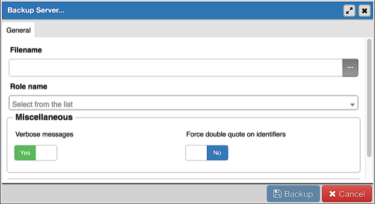
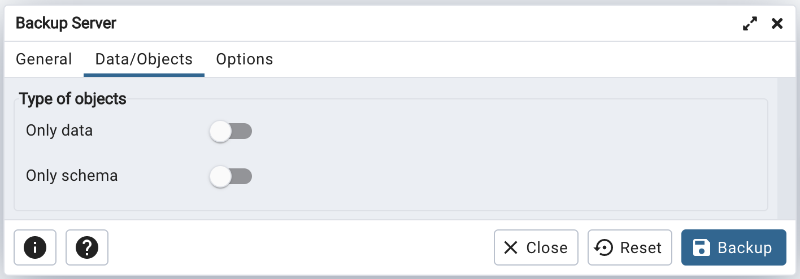
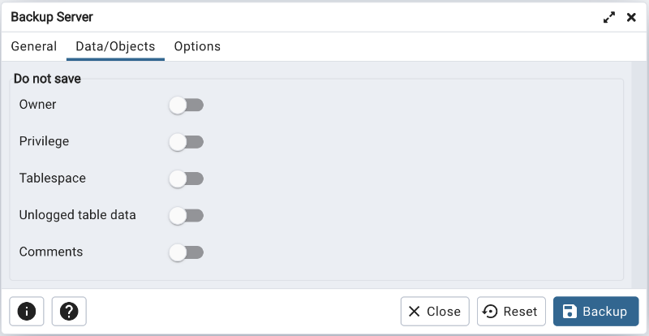
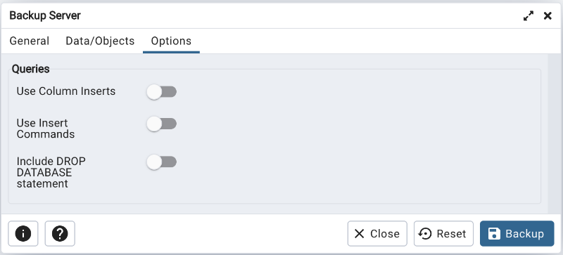
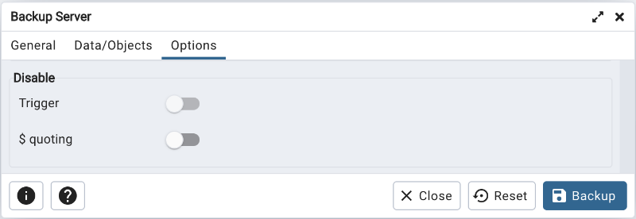
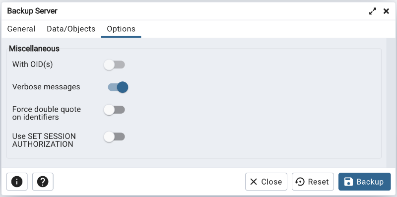
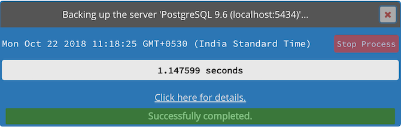
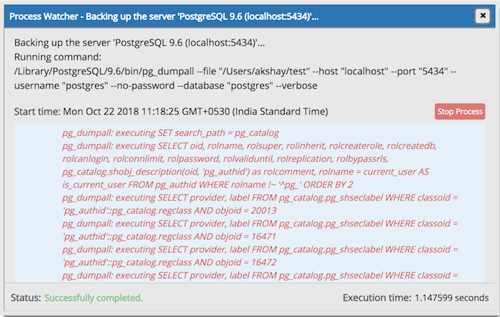

.. _backup_server_dialog:

*****************************
`Backup Server Dialog`:index:
*****************************

Use the *Backup Server* dialog to create a plain-text script that will recreate
the selected server. You can use the pgAdmin *Query Tool* to play back a
plain-text script, and recreate the server.

Use the fields in the *General* tab to specify the following:

* Enter the name of the backup file in the *Filename* field.  Optionally, select
  the *Browser* icon (ellipsis) to the right to navigate into a directory and
  select a file that will contain the archive.
* Use the *Encoding* drop-down listbox to select the character encoding method
  that should be used for the archive. **Note:** This option is visible only for
  database server greater than or equal to 11.
* Use the drop-down listbox next to *Role name* to specify a role with
  connection privileges on the selected server.  The role will be used for
  authentication during the backup.

* Move switches in the **Type of objects** field box to specify details about
  the type of objects that will be backed up.

   * Move the switch next to *Only data* to the *Yes* position to limit the back
     up to data.

   * Move the switch next to *Only schema* to limit the back up to schema-level
     database objects.

* Move switches in the **Do not save** field box to select the objects that will
  not be included in the backup.

   * Move the switch next to *Owner* to the *Yes* position to exclude commands
     that set object ownership.

   * Move the switch next to *Privilege* to the *Yes* position to exclude
     commands that create access privileges.

   * Move the switch next to *Tablespace* to the *Yes* position to exclude
     tablespaces.

   * Move the switch next to *Unlogged table data* to the *Yes* position to
     exclude the contents of unlogged tables.

   * Move the switch next to *Comments* to the *Yes* position to exclude
     commands that set the comments. **Note:** This option is visible only for
     database server greater than or equal to 11.

* Move switches in the **Queries** field box to specify the type of statements
  that should be included in the backup.

   * Move the switch next to *Use Column Inserts* to the *Yes* position to dump
     the data in the form of INSERT statements and include explicit column
     names. Please note: this may make restoration from backup slow.

   * Move the switch next to *Use Insert commands* to the *Yes* position to dump
     the data in the form of INSERT statements rather than using a COPY command.
     Please note: this may make restoration from backup slow.

   * Move the switch next to *Include DROP DATABASE statement* to the *Yes*
     position to include a command in the backup that will drop any existing
     database object with the same name before recreating the object during a
     backup.

* Move switches in the **Disable** field box to specify the type of statements
  that should be excluded from the backup.

   * Move the switch next to *Trigger* (active when creating a data-only backup)
     to the *Yes* position to include commands that will disable triggers on the
     target table while the data is being loaded.

   * Move the switch next to *$ quoting* to the *Yes* position to enable dollar
     quoting within function bodies; if disabled, the function body will be
     quoted using SQL standard string syntax.

* Move switches in the **Miscellaneous** field box to specify miscellaneous
  backup options.

   * Move the switch next to *With OIDs* to the *Yes* position to include object
     identifiers as part of the table data for each table.

   * Move the switch next to *Verbose messages* to the *No* position to instruct
     *pg_dump* to exclude verbose messages.

   * Move the switch next to *Force double quotes on identifiers* to the *Yes*
     position to force the quoting of all identifiers.

   * Move the switch next to *Use SET SESSION AUTHORIZATION* to the *Yes*
     position to include a statement that will use a SET SESSION AUTHORIZATION
     command to determine object ownership (instead of an ALTER OWNER command).

Click the *Backup* button to build and execute a command based on your
selections; click the *Cancel* button to exit without saving work.

Use the **Stop Process** button to stop the Backup process.

If the backup is successful, a popup window will confirm success. Click *Click
here for details* on the popup window to launch the *Process Watcher*. The
*Process Watcher* logs all the activity associated with the backup and provides
additional information for troubleshooting.

If the backup is unsuccessful, review the error message returned by the
*Process Watcher* to resolve any issue.