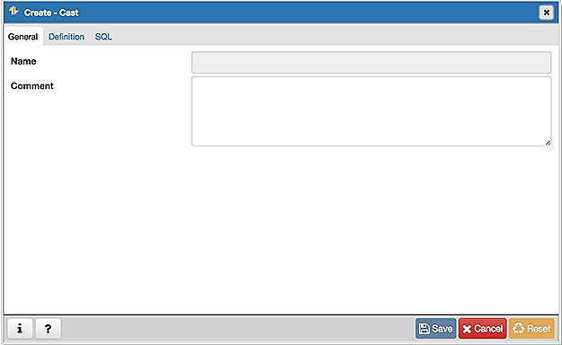
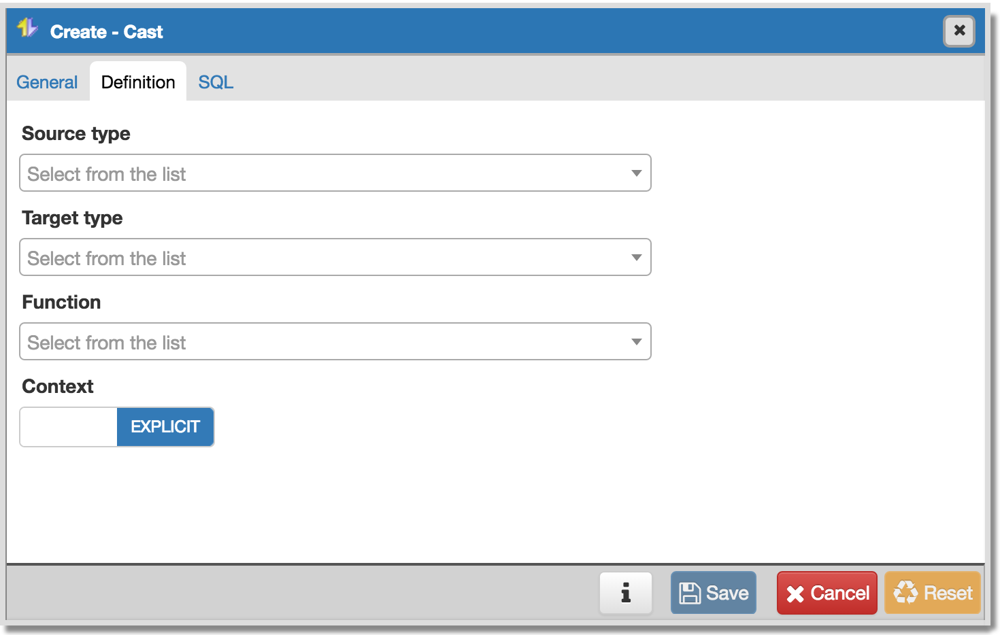
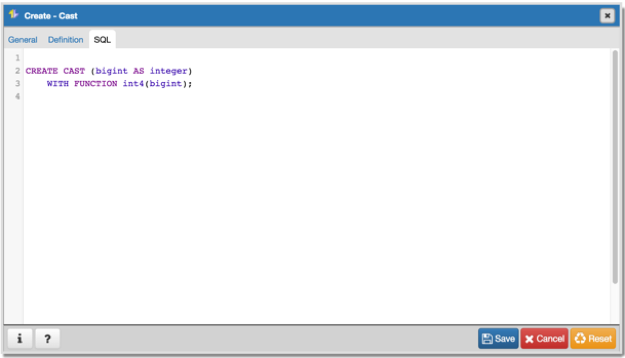

.. _cast_dialog:

********************
`Cast Dialog`:index:
********************

Use the *Cast* dialog to define a cast. A cast specifies how to convert a value
from one data type to another.

The *Cast* dialog organizes the development of a cast through the following
dialog tabs: *General* and *Definition*. The *SQL* tab displays the SQL code
generated by dialog selections.

Use the fields in the *General* tab to identify the cast:

* The *Name* field is disabled. The name that will be displayed in the
  *pgAdmin* tree control is the *Source* type concatenated with the *Target*
  type, and is generated automatically when you make selections on the *Cast*
  dialog *Definition* tab.
* Store notes about the cast in the *Comment* field.

Click the *Definition* tab to continue.

Use the fields in the *Definition* tab to define parameters:

* Use the drop-down listbox next to *Source type* to select the name of the
  source data type of the cast.
* Use the drop-down listbox next to *Target type* to select the name of the
  target data type of the cast.
* Use the drop-down listbox next to *Function* to select the function used to
  perform the cast. The function's result data type must match the target type
  of the cast.
* Move the *Context* switch to the *Implicit* position if the cast is implicit.
  By default, a cast can be invoked only by an explicit cast request. If the
  cast is marked *Implicit* then it can be invoked implicitly in any context,
  whether by assignment or internally in an expression.

Click the *SQL* tab to continue.

Your entries in the *Cast* dialog generate a SQL command (see an example below).
Use the *SQL* tab for review; revisit or switch tabs to make any changes to the
SQL command.

**Example**

The following is an example of the sql command generated by user selections in
the *Cast* dialog:

The cast uses a function named *int4(bigint)* to convert a biginteger data type
to an integer.

* Click the *Info* button (i) to access online help.
* Click the *Save* button to save work.
* Click the *Cancel* button to exit without saving work.
* Click the *Reset* button to restore configuration parameters.