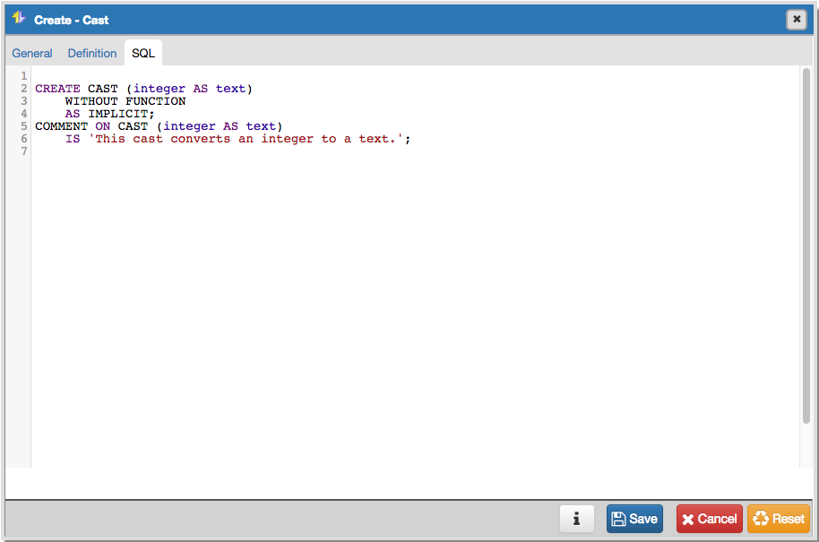

***********
Cast Dialog
***********

Use the *Cast* dialog to define a cast. A cast specifies how to convert a value from one data type to another.

The *Cast* dialog allows you to implement options of the *CREATE CAST* command. For more information about the *CREATE CAST* command, see the PostgreSQL core documentation available at:

   http://www.postgresql.org/docs/current/static/sql-createcast.html

The *Cast* dialog organizes the development of a cast through the following dialog tabs: *General* and *Definition*. The *SQL* tab displays the SQL code generated by dialog selections.

.. image:: images/cast_general.png

Use the fields in the *General* tab to identify the cast:

* The *Name* field is disabled. The name that will be displayed in the tree control is the *Source* type concatenated with the *Target* type, and is generated automatically when you make selections on the *Create - Cast* *Definition* tab. 
* Store notes about the cast in the *Comments* field.

Click the *Definition* tab to continue.

.. image:: images/cast_definition.png

Use the fields in the *Definition* tab to define parameters:

* Use the drop-down listbox next to *Source type* to select the name of the source data type of the cast.
* Use the drop-down listbox next to *Target type* to select the name of the target data type of the cast.
* Use the drop-down listbox next to *Function* to select the function used to perform the cast. The function's result data type must match the target type of the cast.
* Slide the *Context* switch to the *Implicit* position if the cast is implicit. By default, a cast can be invoked only by an explicit cast request. If the cast is marked *Implicit* then it can be invoked implicitly in any context, whether assignment or internally in an expression.

Click the *SQL* tab to continue.

.. image:: images/cast_sql.png

Your entries in the *Cast* dialog generate a SQL command; you can review the command on the *SQL* pane.
 
* Click the *Info* button (i) to access online help. 
* Click the *Save* button to save work.
* Click the *Cancel* button to exit without saving work.
* Click the *Reset* button to restore configuration parameters.

Example
=======

The following is an example of the sql command generated by user selections in the *Cast dialog*:

