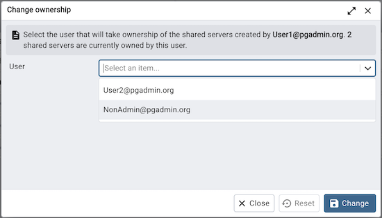
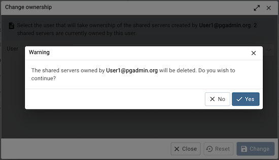

.. _change_ownership:

************************************
`Change Ownership Dialog`:index:
************************************

Use the *Change Ownership* dialog to change the ownership of the shared servers.
This dialog will appear if a user has been deleted from
:ref:`User Management <user_management>` and owned some shared servers.

Choose the user who will own the shared servers from the drop-down.

Click the *Change* button to change the ownership.

The shared servers owned by the user will be deleted if the user is not
selected from the drop-down.

Click the *Change* button to change the ownership; click *Close* to
exit the dialog.
