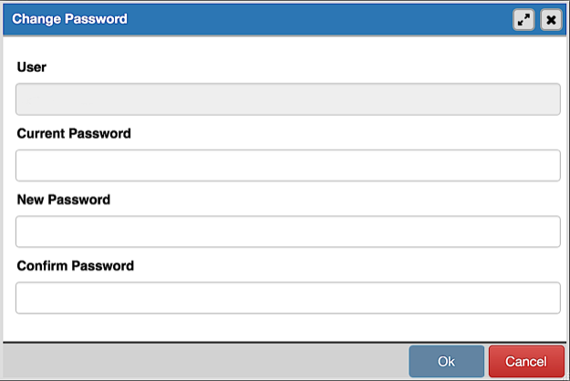

.. _change_password_dialog:

*******************************
`Change Password Dialog`:index:
*******************************

It is a good policy to routinely change your password to protect data, even in
what you may consider a 'safe' environment. In the workplace, failure to apply
an appropriate password policy could leave you in breach of Data Protection
laws.

Please consider the following guidelines when selecting a password:

* Ensure that your password is an adequate length; 6 characters should be the
  absolute minimum number of characters in the password.
* The minimum password length is set by default to six characters. This value 
  can be changed by setting the *PASSWORD_LENGTH_MIN* option to desired length 
  in pgAdmin configuration; see :ref:`config_py` for more information.
* Ensure that your password is not open to dictionary attacks. Use a mixture of
  upper and lower case letters and numerics, and avoid words or names. Consider
  using the first letter from each word in a phrase that you will remember
  easily but is an unfamiliar acronym.
* Ensure that your password is changed regularly; at minimum, change it every
  ninety days.

The guidelines above should be considered a starting point: They are not a
comprehensive list and they **will not guarantee security**.

Use the *Change Password* dialog to change your password:

* The name displayed in the *User* field is the role for which you are modifying
  the password; it is the role that is associated with the server connection
  that is highlighted in the tree control.
* Enter the password associated with the role in the *Current Password* field.
* Enter the desired password for in the *New Password* field.
* Re-enter the new password in the *Confirm Password* field.

Click the *Save* button to change your password.

Click the *Close* button to exit without changing your password.

Click the *Reset* button to reset the values.
