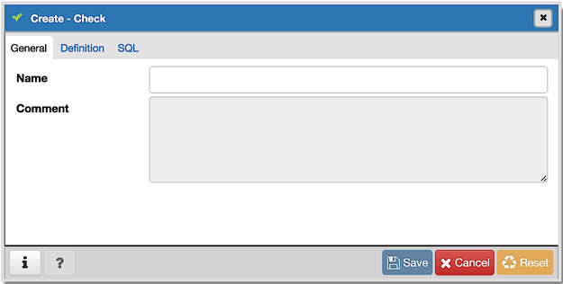
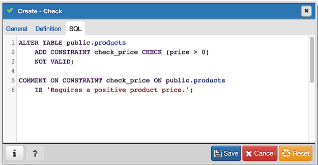

.. _check_dialog:

*********************
`Check Dialog`:index:
*********************

Use the *Check* dialog to define or modify a check constraint. A check
constraint specifies an expression that produces a Boolean result that new or
updated rows must satisfy for an insert or update operation to succeed.

The *Check* dialog organizes the development of a check constraint through the
*General* and *Definition* tabs. The *SQL* tab displays the SQL code generated
by dialog selections.

Use the fields in the *General* tab to identify the check constraint:

* Use the *Name* field to provide a descriptive name for the check constraint
  that will be displayed in the *pgAdmin* tree control. With PostgreSQL 9.5
  forward, when a table has multiple check constraints, they will be tested for
  each row in alphabetical order by name and after NOT NULL constraints.
* Store notes about the check constraint in the *Comment* field.

Click the *Definition* tab to continue.

.. image:: images/check_definition.png
    :alt: Check dialog definition tab
    :align: center

Use the fields in the *Definition* tab to define the check constraint:

* Provide the expression that a row must satisfy in the *Check* field.
* Move the *No Inherit?* switch to the *Yes* position to specify that this
  constraint is not automatically inherited by a table's children. The default
  is *No*, meaning that the constraint will be inherited by any children.
* Move the *Don't validate?* switch to the *No* position to skip validation of
  existing data; the constraint may not hold for all rows in the table. The
  default is *Yes*.

Click the *SQL* tab to continue.

Your entries in the *Check* dialog generate a SQL command (see an example
below). Use the *SQL* tab for review; revisit or switch tabs to make any changes
to the SQL command.

**Example**

The following is an example of the sql command generated by user selections in
the *Check* dialog:

The example shown demonstrates creating a check constraint named *check_price*
on the *price* column of the *products* table.  The constraint confirms that
any values added to the column are greater than 0.

* Click the *Info* button (i) to access online help.
* Click the *Save* button to save work.
* Click the *Cancel* button to exit without saving work.
* Click the *Reset* button to restore configuration parameters.