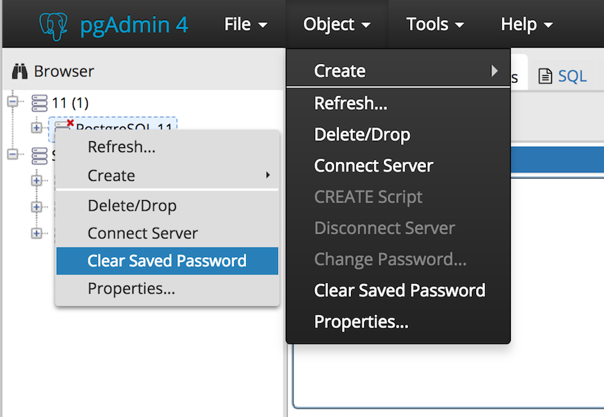

.. _clear_saved_passwords:

******************************
`Clear Saved Passwords`:index:
******************************

Use *Clear Saved Password* functionality to clear the saved password for the database server.

*Clear Saved Password* shows in the context menu for the selected server as well as under the *Object* menu on the top menu bar.

**Note:** It will be enabled/visible when the password for the selected database server is already saved.