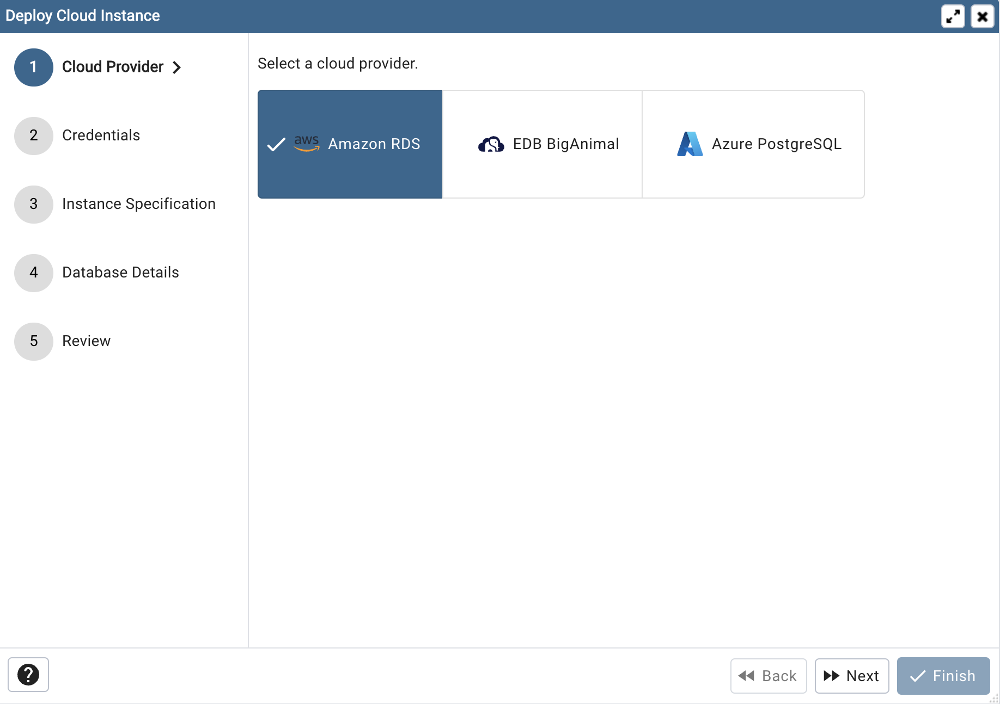
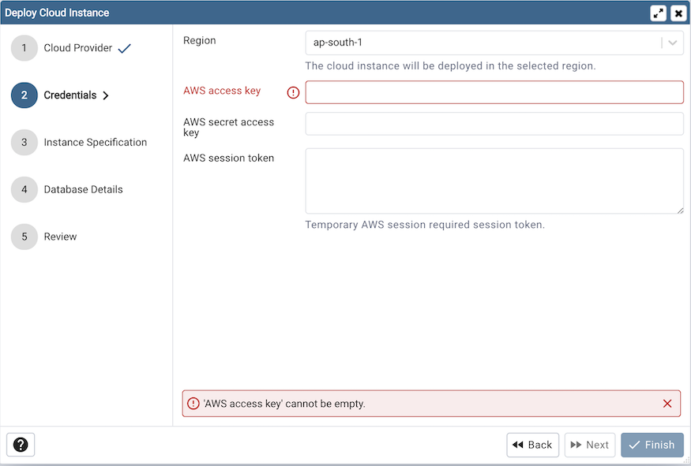
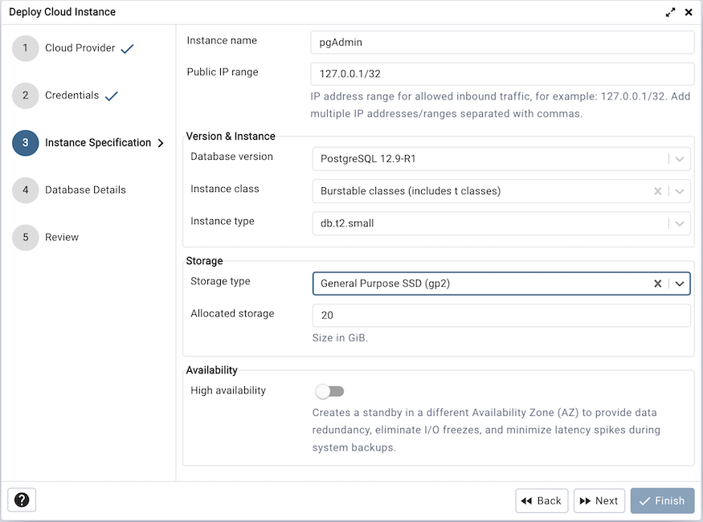
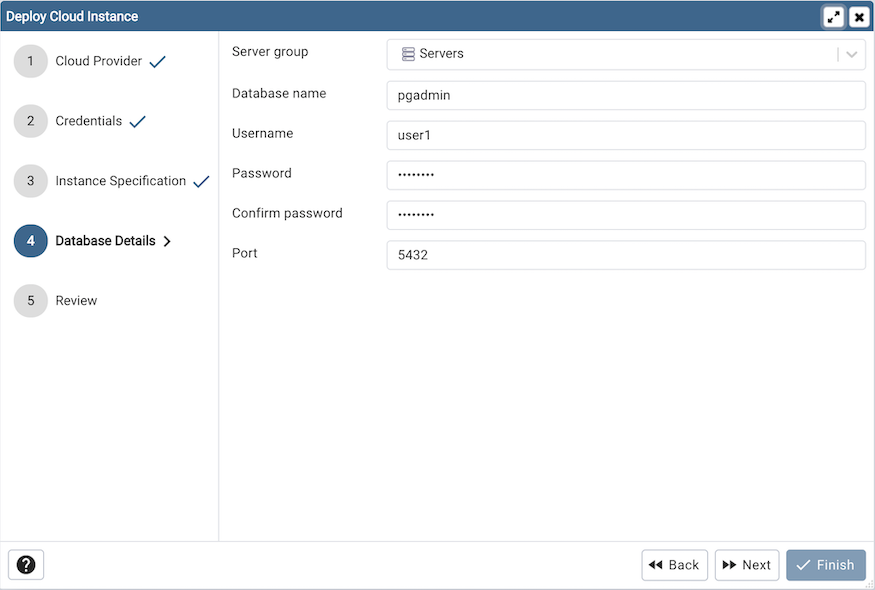
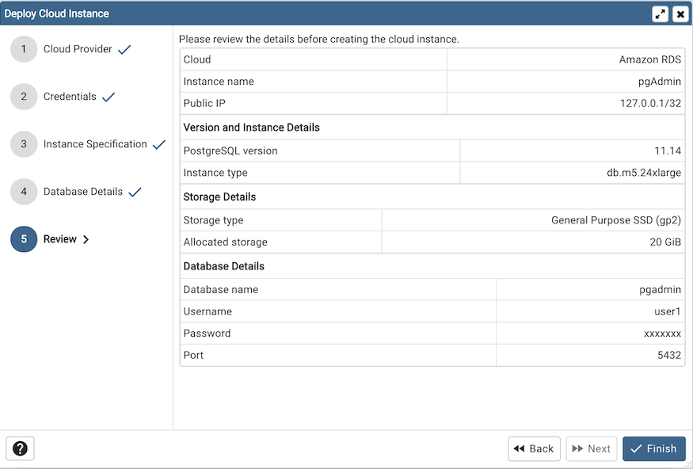

.. _cloud_aws_rds:

******************************************
`Amazon AWS RDS Cloud Deployment`:index:
******************************************

To deploy a PostgreSQL server on the Amazon AWS cloud, follow the below steps.

Once you launch the tool, select the Amazon RDS option.
Click on the *Next* button to proceed further.

In the Credentials dialog, provide the region in which you want to deploy the
instance along with the *AWS access key* and *AWS secret access key*.
Provide *AWS session token* only if your AWS session is temporary.

To proceed further, click on the next button. Before going further, pgAdmin
will validate your credentials.

Use the fields from the Instance Specification tab to specify the Instance
details.

* Use the *Instance name* field to add an instance name for the PostgreSQL
  server; the name specified will be displayed in the *Browser* tree control
  too.

* Use the *Public IP* field to specify the IP Address range for permitting the
  inbound traffic.

* Use the *Database version* field to specify the PostgreSQL version to deploy.

* Use the *Instance class* field to allocate the computational, network, and
  memory capacity required by planned workload of this DB instance.

* Use the *Instance type* field to select the instance type.

* Use the *Storage type* field to select the instance storage type. Three
  options are available. General Purpose (SSD) storage, Provisioned IOPS (SSD)
  and Magnetic storage.

* Use the *Allocated storage* field to specify the storage capacity in GiB.

* Use the *Provisioned IOPS* in case of  Provisioned IOPS (SSD) storage type.

* Use the *High Availability* option to specify High Availability
  option. This option creates a standby in a different Availability Zone(AZ).

Use the fields from the Database Details tab to specify the Instance details.

* Use the drop-down list box in the *Server group* field to select the parent
  node for the server; the server will be displayed in the *Browser* tree
  control within the specified group.

* Use the *Database name* field to add the database name for the PostgreSQL
  server.

* Use the *Username* field to specify the name of a role that will be used when
  authenticating with the server.

* Use the *Password* field to provide a password that will be supplied when
  authenticating with the server.

* Use the *Confirm password* field to repeat the password.

* Enter the listener port number of the server host in the *Port* field.

At the end, review the Instance details that you provided. Click on Finish
button to deploy the instance on Amazon RDS.

.. image:: images/cloud_deployment_tree.png
    :alt: Cloud Deployment Provider
    :align: center

Once you click on the finish, one background process will start which will
deploy the instance in the cloud and monitor the progress of the deployment.
You can view all the background process with there running status and logs
on the :ref:`Processes <processes>` tab

The Server will be added to the tree with the cloud deployment icon. Once the
deployment is done, the server details will be updated.
