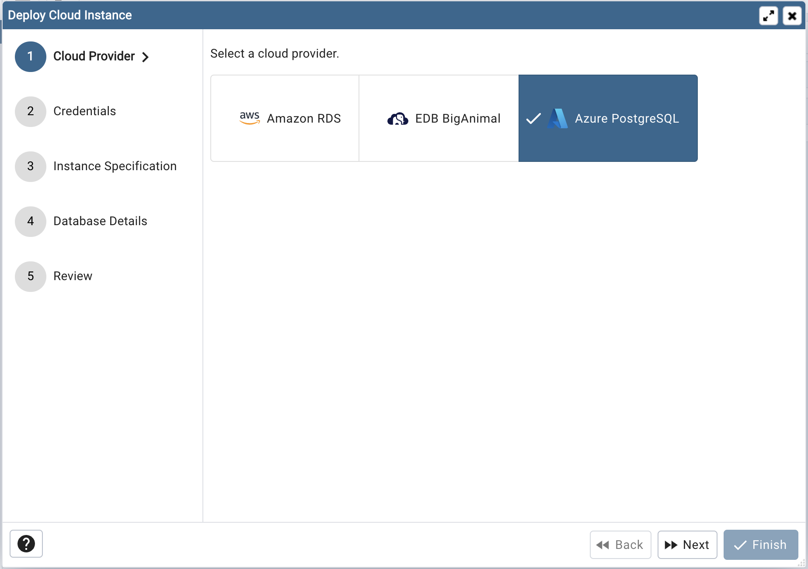
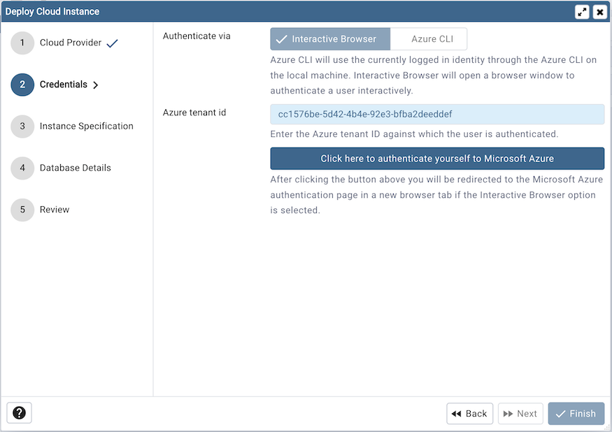
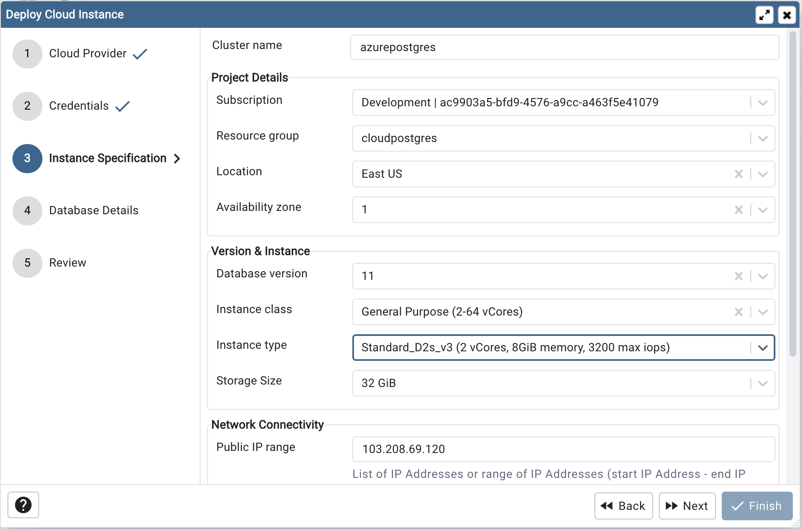
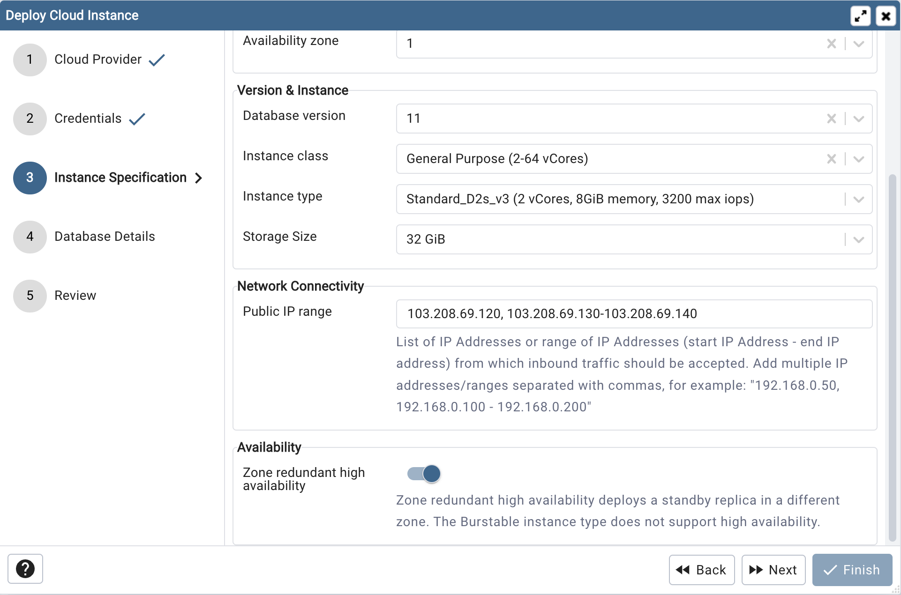
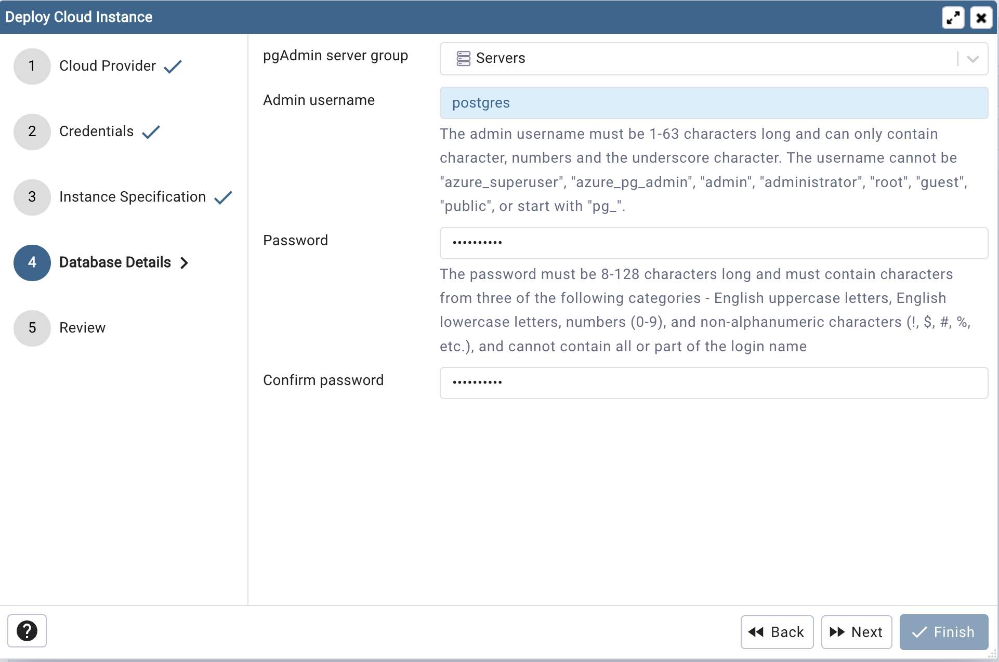
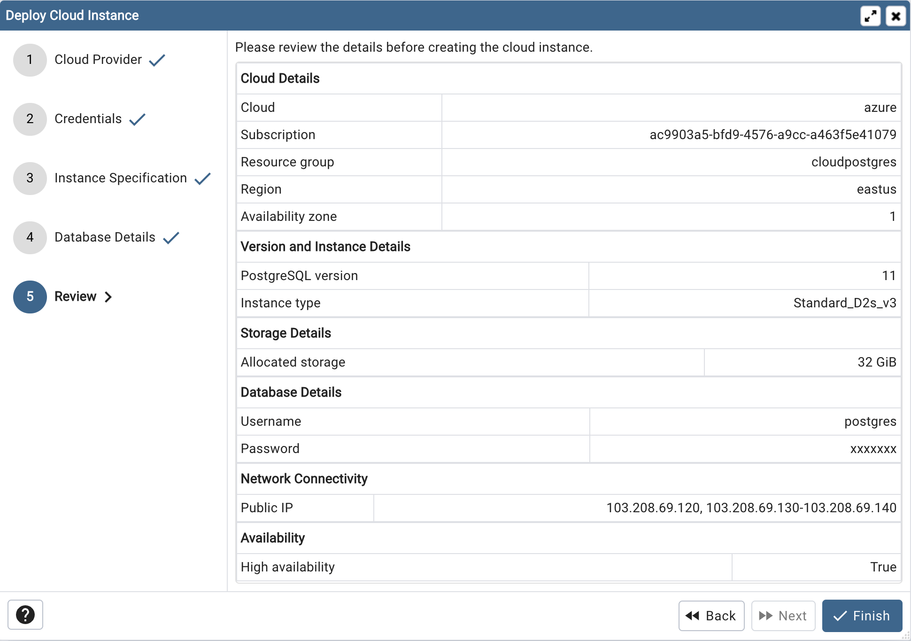
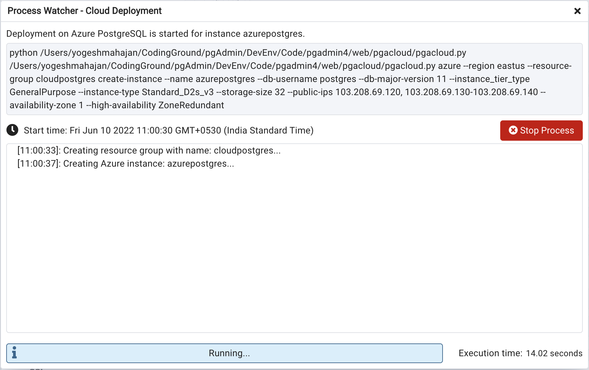
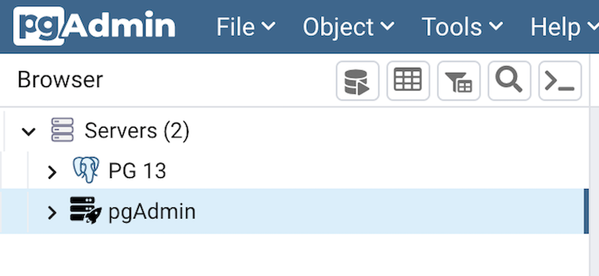

.. _cloud_azure_postgresql:

******************************************
`Azure PostgreSQL Cloud Deployment`:index:
******************************************

To deploy a PostgreSQL server on the Azure cloud, follow the below steps.

Once you launch the tool, select the Azure PostgreSQL option.
Click on the *Next* button to proceed further.

In the Credentials dialog, select authentication method either interactive
browser or Azure CLI. Azure CLI will use the currently logged in identity
through the Azure CLI on the local machine. Interactive Browser will
open a browser window to authenticate a user interactively.

Use the *Azure tenant* id to specify Azure tenant ID against which user
is authenticated.

Clicking the *Click here to authenticate yourself to Microsoft Azure*
button, user will be redirected to the Microsoft Azure authentication page in a
new browser tab if the Interactive Browser option is selected.
Azure CLI authentication can be used only in Desktop mode.

Once authentication is completed, click on the next button to proceed.

Use the fields from the Instance Specification tab to specify the Instance
details.

* Use the *Cluster name* field to add a name for the PostgreSQL
  server; the name specified will be displayed in the *Browser* tree control too.

* Select a subscription from the *Subscription* options which are populated based
  on user access levels in Azure portal.

* Select the resource group from *Resource Group* dropdown under which the
  PostgreSQL instance will be created.

* Select the location to deploy PostgreSQL instance from *Location*
  options.

* Select the availability zone in specified region to deploy PostgreSQL
  instance from *Availability zone* options.

* Use *Database version* options to specify PostgreSQL database version.

* Use the *Instance class* field to allocate the computational, network, and
  memory capacity required by planned workload of this DB instance.

* Use the *Instance type* field to select the instance type.

* Use the *Storage size* option to specify the storage capacity.

* Use the *Public IP* field to specify the List of IP Addresses or range of
  IP Addresses (start IP Address - end IP address) from which inbound traffic
  should be accepted. Add multiple IP addresses/ranges separated with commas,
  for example: "192.168.0.50, 192.168.0.100 - 192.168.0.200"

* Use *Zone redundant high availability* option to specify High Availability
  option. Zone redundant high availability deploys a standby replica in a
  different zone.
  The Burstable instance type does not support high availability.

Use the fields from the Database Details tab to specify the PostgreSQL database details.

* Use the drop-down list in the *pgAdmin server group* field to select the parent
  node for the server; the server will be displayed in the *Browser* tree
  control within the specified group.

* Use the *Admin username* field to add the database name for the PostgreSQL
  server.

* Use the *Password* field to provide a password that will be supplied when
  authenticating with the server.

* Use the *Confirm password* field to repeat the password.

Click on the next button to proceed.

At the end, review the instance details that you provided. Click on Finish
button to deploy the instance on Azure PostgreSQL.

Once you click on the finish, one background process will start which will
deploy the instance in the cloud and monitor the progress of the deployment.
You can view all the background process with there running status and logs
on the :ref:`Processes <processes>` tab

The Server will be added to the tree with the cloud deployment icon. Once the
deployment is done, the server details will be updated.

