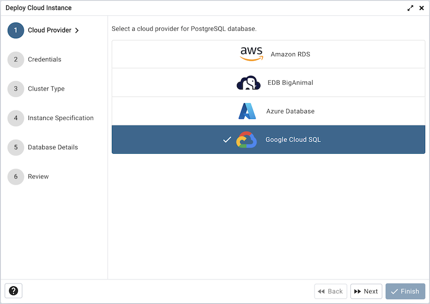
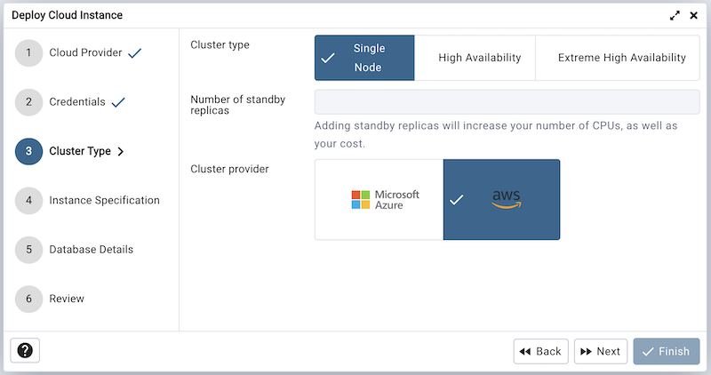
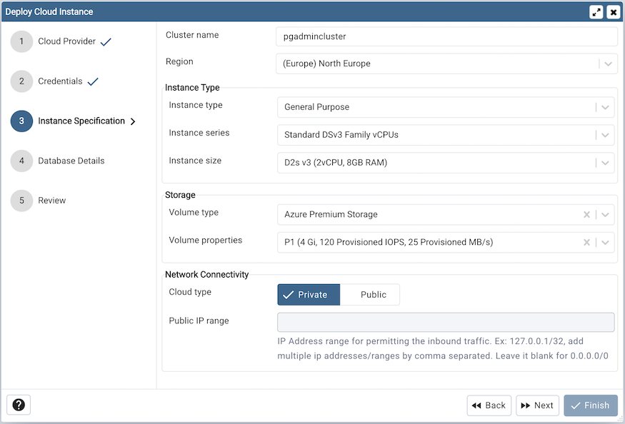
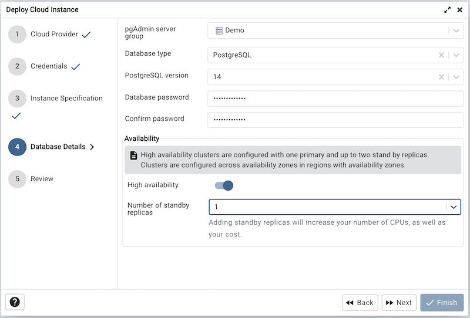
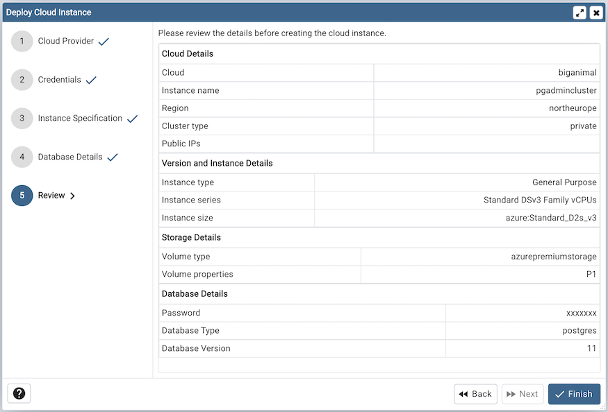

.. _cloud_edb_biganimal:

******************************************
`EDB BigAnimal Cloud Deployment`:index:
******************************************

To deploy a PostgreSQL server on the EDB BigAnimal cloud, follow the below steps.

Once you launch the tool, select the EDB BigAnimal option.
Click on the *Next* button to proceed further.

.. image:: images/cloud_biganimal_credentials.png
    :alt: Cloud Deployment Provider
    :align: center

The next steps is to authenticate the user to EDB BigAninal.
Click the given button to authenticate, by clicking the button, the user
will be redirected to the new tab for the verification.
Once you confirm the one time code, the pgAdmin will automatically detect it
and the next button will be enabled. To proceed further, click on the next button.

* Use the *Project* field to choose a project in your Biganimal account.

* Use the *Cluster type* field to choose a cluster type.

* Use the *No. of Standby Replicas* field to specify the replicas if you have selected the High Availability cluster.

* Use the *Cluster provider* field to choose the provider.

Use the fields from the Instance Specification tab to specify the Instance
details.

* Use the *Cluster name* field to add a cluster name for the PostgreSQL
  server; the name specified will be displayed in the *Object Explorer* too.

* Use the *Region* field to select the region.

* Use the *Public IP range* field to specify the IP Address range for permitting the
  inbound traffic. Leave it blank for 0.0.0.0/0

* Use the *Instance type* field to select the instance type.

* Use the *Instance series* field to select the instance series.

* Use the *Instance size* field to allocate the computational, network, and
  memory capacity required by planned workload of this DB instance.

* Use the *Volume type* field to select the instance storage type.

* Use the *Volume properties* field to specify the storage capacity. This field is specific to Azure.

* Use the *Volume size* field to specify the storage size. This field is specific to AWS.

* Use the *Volume IOPS* field to specify the storage IOPS. This field is specific to AWS.

* Use the *Disk throughput* field to specify the disk throughput. This field is specific to AWS.

Use the fields from the Database Details tab to specify the Instance details.

* Use the drop-down list box in the *Server group* field to select the parent
  node for the server; the server will be displayed in the *Object Explorer*
  within the specified group.

* Use the *Database type* field to specify the PostgreSQL
  type, EnterpriseDB PostgreSQL Advanced Server or PostgreSQL.

* Use the *PostgreSQL version* field to select the database version.

* Use the *Database Password* field to provide a password that will be supplied when
  authenticating with the server.

* Use the *Confirm password* field to repeat the password.

At the end, review the Cluster details that you provided. Click on Finish
button to deploy the instance on EDB BigAnimal.

.. image:: images/cloud_deployment_tree.png
    :alt: Cloud Deployment Provider
    :align: center

Once you click on the finish, one background process will start which will
deploy the instance in the cloud and monitor the progress of the deployment.
You can view all the background process with there running status and logs
on the :ref:`Processes <processes>` tab

The Server will be added to the tree with the cloud deployment icon. Once the
deployment is done, the server details will be updated.
