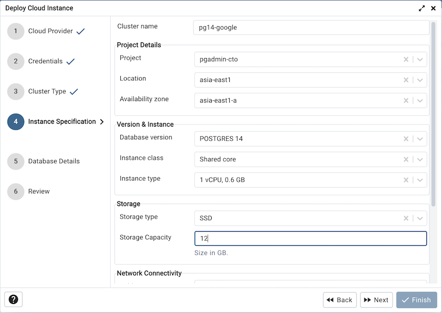
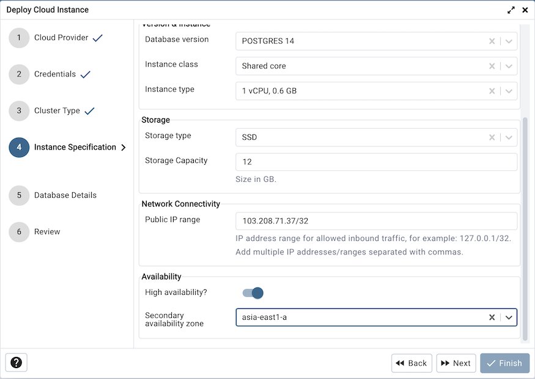
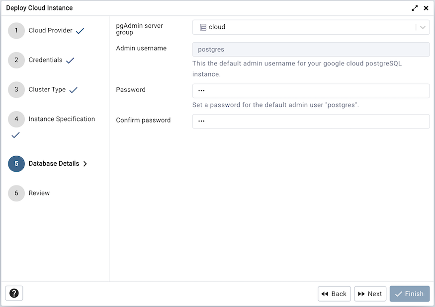
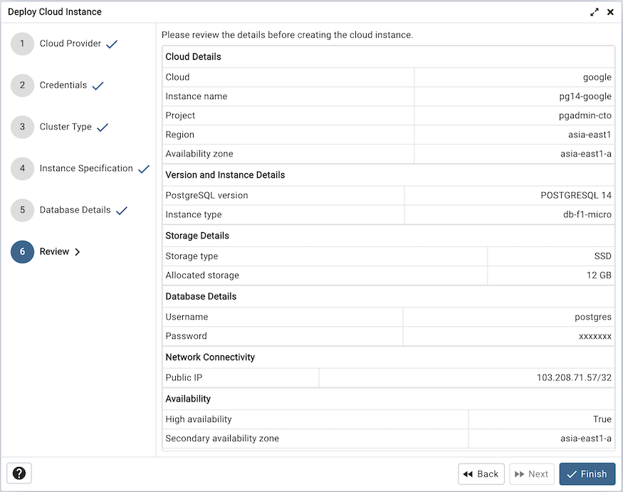
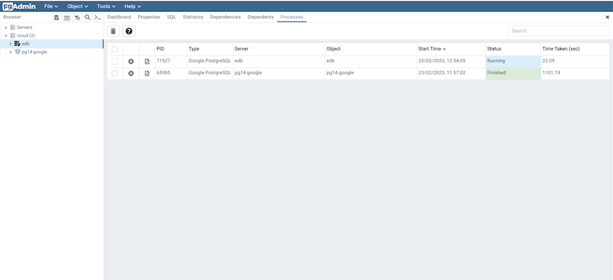

.. cloud_google_cloud_sql:

************************************************
`Google Cloud SQL Deployment`:index:
************************************************

To deploy a PostgreSQL server on the Google Cloud SQL, follow the below steps.

.. image:: images/cloud_provider_for_postgresql.png
    :alt: Cloud Deployment
    :align: center

Once you launch the tool, select the Google Cloud SQL option.
Click on the *Next* button to proceed further.

.. image:: images/cloud_google_credentials.png
    :alt: Cloud Deployment
    :align: center

In the Credentials dialog, select client secret file to authenticate
using google.You can download a client secret which is json formatted file
from google cloud console once OAuth2 client ID is created.

.. note:: While creating client OAuth client ID, select Desktop App as application type.
 Refer `this <https://support.google.com/cloud/answer/6158849?hl=en/>`_ link for creating client secret.

Clicking the *Click here to authenticate yourself to Google*
button, user will be redirected to the Google authentication page in a
new browser tab.

Once authentication is completed, click on the next button to proceed.

Use the fields from the Instance Specification tab to specify the Instance
details.

* Use the *Cluster name* field to add a name for the PostgreSQL
  server; the name specified will be displayed in the *Object Explorer* too.

* Select the project from *project* dropdown under which the
  PostgreSQL instance will be created.

* Select the location to deploy PostgreSQL instance from *Location*
  options.

* Select the availability zone in specified region to deploy PostgreSQL
  instance from *Availability zone* options.

* Use *Database version* options to specify PostgreSQL database version.

* Use the *Instance class* field to allocate the computational and
  memory capacity required by planned workload of this DB instance.

* Use the *Instance type* field to select the instance type.

* Specify storage type by selecting option from *Storage type*.

* Use the *Storage capacity* option to specify the storage capacity.

* Use the *Public IP* field to specify the list of IP address range
  for allowed inbound traffic, for example: 127.0.0.1/32. Add multiple
  IP addresses/ranges separated with commas.

* Use the *High Availability* option to specify High Availability
  option. This option creates a standby in a select Secondary
  Availability Zone.

* Select the secondary availability zone for high availability
  from *Secondary Availability zone* options.

Use the fields from the Database Details tab to specify the PostgreSQL database details.

* Use the drop-down list in the *pgAdmin server group* field to select the parent
  node for the server; the server will be displayed in the *Object Explorer*
  within the specified group.

* Admin username field will be default to postgres.
  server.

* Use the *Password* field to provide a password that will be supplied when
  authenticating with the server.

* Use the *Confirm password* field to repeat the password.

Click on the next button to proceed.

At the end, review the instance details that you provided. Click on Finish
button to deploy the instance on Azure PostgreSQL.

Once you click on the finish, one background process will start which will
deploy the instance in the cloud and monitor the progress of the deployment.
You can view all the background process with there running status and logs
on the :ref:`Processes <processes>` tab

The Server will be added to the tree with the cloud deployment icon. Once the
deployment is done, the server details will be updated.

