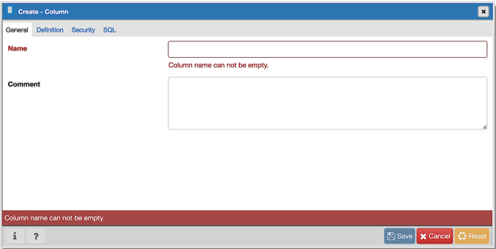
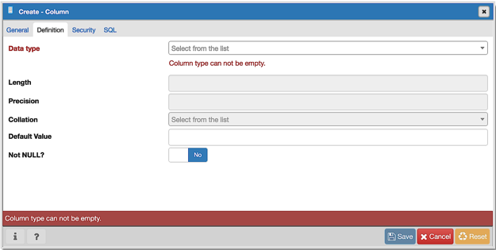
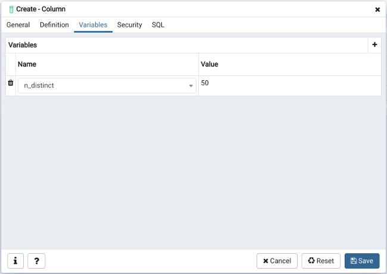
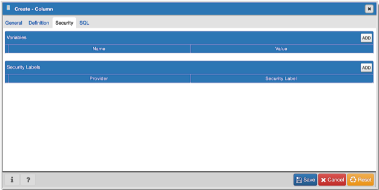
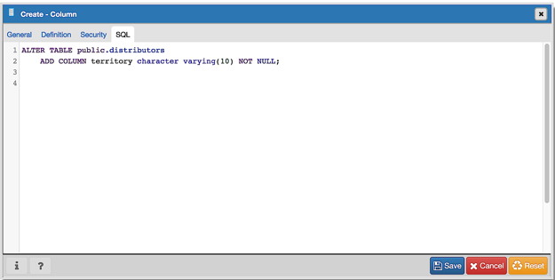

.. _column_dialog:

**********************
`Column Dialog`:index:
**********************

Use the *Column* dialog to add a column to an existing table or modify a column definition.

The *Column* dialog organizes the development of a column through the following dialog tabs: *General*, *Definition*, and *Security*. The *SQL* tab displays the SQL code generated by dialog selections.

Use the fields in the *General* tab to identify the column:

* Use the *Name* field to add a descriptive name for the column. The name will be displayed in the *pgAdmin* tree control. This field is required.
* Store notes about the column in the *Comment* field.

Click the *Definition* tab to continue.

Use the fields in the *Definition* tab to add parameters for the column. (Fields are disabled if inapplicable.)

* Use the drop-down listbox next to *Data Type* to select a data type for the column. For more information on the data types that are supported by PostgreSQL, refer to Chapter 8 of the Postgres core documentation. This field is required.
* Use the *Length* and *Precision* fields to specify the maximum number of significant digits in a numeric value, or the maximum number of characters in a text value.
* Use the drop-down listbox next to *Collation* to apply a collation setting to the column.
* Use the *Default Value* field to specify a default data value.
* Move the *Not Null* switch to the *Yes* position to specify the column may not contain null values. The default is *No*.

Click the *Variables* tab to continue.

Use the *Variables* tab to to specify the number of distinct values that may be present in the column; this value overrides estimates made by the ANALYZE command. Click the *Add* icon (+) to add a *Name*/*Value* pair:

* Select the name of the variable from the drop-down listbox in the *Name* field.

    * Select *n_distinct* to specify the number of distinct values for the column.
    * Select *n_distinct_inherited* to specify the number of distinct values for the table and its children.

* Specify the number of distinct values in the *Value* field. For more information, see the documentation for `ALTER TABLE  <http://www.postgresql.org/docs/9.6/static/sql_altertable.html>`_.

Click the *Add* icon (+) to specify each additional *Name*/*Value* pair; to discard a variable, click the trash icon to the left of the row and confirm deletion in the *Delete Row* popup.

Click the *Security* tab to continue.

Use the *Security* tab to assign attributes and define security labels. Click the *Add* icon (+) to add each security label selection:

* Specify a security label provider in the *Provider* field. The named provider must be loaded and must consent to the proposed labeling operation.
* Specify a a security label in the *Security Label* field. The meaning of a given label is at the discretion of the label provider. PostgreSQL places no restrictions on whether or how a label provider must interpret security labels; it merely provides a mechanism for storing them.

Click the *Add* icon (+) to assign additional security labels; to discard a security label, click the trash icon to the left of the row and confirm deletion in the *Delete Row* popup.

Click the *SQL* tab to continue.

Your entries in the *Column* dialog generate a SQL command (see an example below). Use the *SQL* tab for review; revisit or switch tabs to make any changes to the SQL command.

**Example**

The following is an example of the sql command generated by user selections in the *Column* dialog:

The example shown demonstrates creating a column named *territory* in the table named *distributors*.

* Click the *Info* button (i) to access online help. View context-sensitive help in the *Tabbed browser*, where a new tab displays the PostgreSQL core documentation.
* Click the *Save* button to save work.
* Click the *Cancel* button to exit without saving work.
* Click the *Reset* button to restore configuration parameters.