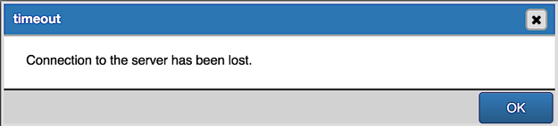
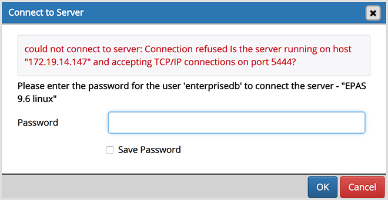
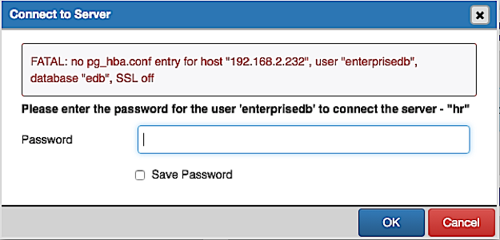
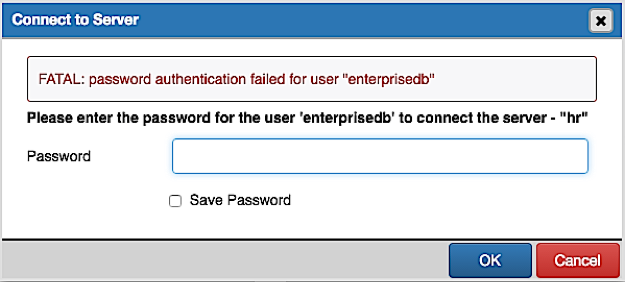

.. _connect_error:

*************************
`Connection error`:index:
*************************

When connecting to a PostgreSQL server, you may get an error message. If you encounter an error message, please review the message  carefully; each error message attempts to incorporate the information you'll need to resolve the problem.  For more details about specific errors, please locate the error message in the list below:

**Connection to the server has been lost**

This error message indicates that the connection attempt has taken longer than the specified threshold; there may be a problem with the connection properties provided on the *Server* dialog, network connectivity issues, or the server may not be running.

**could not connect to Server: Connection refused**

If pgAdmin displays this message, there are two possible reasons for this:
  * the database server isn't running - simply start it.
  * the server isn't configured to accept TCP/IP requests on the address shown.

For security reasons, a PostgreSQL server "out of the box" doesn't listen on TCP/IP ports. Instead, it must be enabled to listen for TCP/IP requests. This can be done by adding **tcpip = true** to the postgresql.conf file for Versions 7.3.x and 7.4.x, or **listen_addresses='*'** for Version 8.0.x and above; this will make the server accept connections on any IP interface.

For further information, please refer to the PostgreSQL documentation about `runtime configuration <http://www.postgresql.org/docs/current/interactive/runtime-config.html>`_.

**FATAL: no pg_hba.conf entry**

If pgAdmin displays this message when connecting, your server can be contacted correctly over the network, but is not configured to accept your connection. Your client has not been detected as a legal user for the database.

To connect to a server, the pg_hba.conf file on the database server must be configured to accept connections from the host of the pgAdmin client. Modify the pg_hba.conf file on the database server host, and add an entry in the form:

 * **host template1 postgres 192.168.0.0/24 md5** for an IPV4 network
 * **host template1 postgres ::ffff:192.168.0.0/120 md5** for an IPV6 network

For more information, please refer to the PostgreSQL documentation about `client authentication <http://www.postgresql.org/docs/current/interactive/client-authentication.html>`_.

**FATAL: password authentication failed**

* The *password authentication failed for user* error message indicates there may be a problem with the password you entered. Retry the password to confirm you entered it correctly. If the error message returns, make sure that you have the correct password, that you are authorized to access the server, and that the access has been correctly configured in the server's postgresql.conf configuration file.

