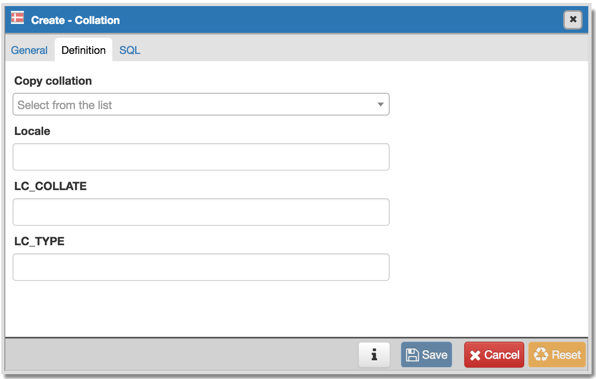
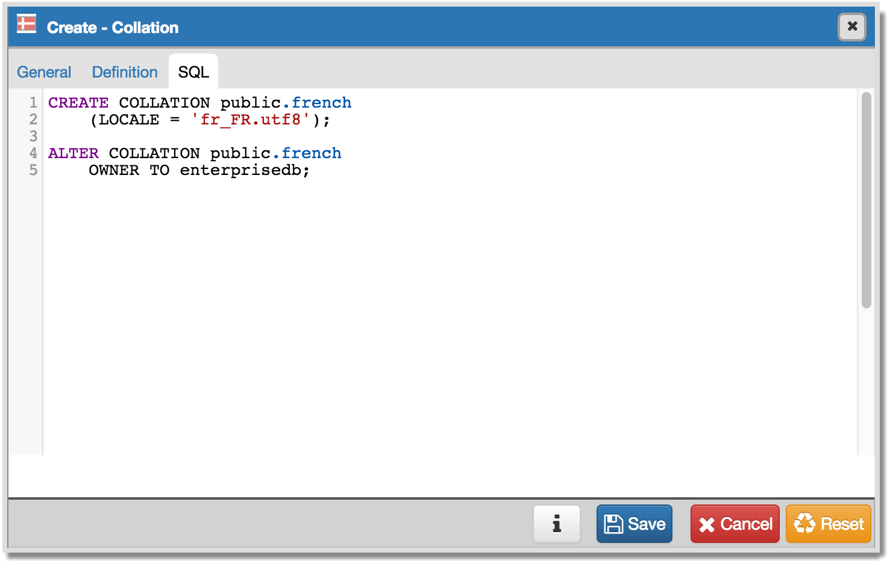

.. _create_collation:

******************
Create - Collation 
******************

Use the *Create - Collation* dialog to define a collation. To be able to create a collation, you must have a CREATE privilege on the destination schema.

The *Create - Collation* dialog allows you to implement options of the CREATE COLLATION command. For more information about the CREATE COLLATION command, see the documentation available at:

   http://www.postgresql.org/docs/current/static/sql-createcollation.html

The *Create - Collation* dialog organizes the development of a collation through the following dialog tabs: *General* and *Definition*. The *SQL* tab displays the SQL code generated by dialog selections. 

.. image:: images/create_collation_general.png

Use the fields in the *General* tab to identify the collation:

* Use the *Name* field to add a name for the collation. The collation name must be unique within a schema. The name will be displayed in the *pgAdmin* tree control.
* Select the name of the owner from the drop-down listbox in the *Owner* field.
* Select the name of the schema in which the collation will reside from the drop-down listbox in the *Schema* field.
* Store notes about the collation in the *Comments* field.

Click the *Definition* tab to continue.

Use the fields in the *Definition* tab to specify operating system locale settings: 

* Use the drop-down listbox next to *Copy collation* to select the name of an existing collation to copy. The new collation will have the same properties as the existing one, but will be an independent object. If you choose to copy an existing collation, you cannot modify the collation properties displayed on this tab.
* Use the *Locale* field to specify a locale; a locale specifies language and language formatting characteristics. If you specify this, you cannot specify either of the following parameters. To view a list of locales supported by your Linux system use the command *locale -a*.
* Use the *LC_COLLATE* field to specify a locale with specified string sort order. The locale must be applicable to the current database encoding. (See CREATE DATABASE for details.) 
* Use the *LC_CTYPE* field to specify a locale with specified character classification. The locale must be applicable to the current database encoding. (See CREATE DATABASE for details.) 

For more information about setting a locale, see Chapter 22.1 Locale Support of the PostgreSQL core documentation:
   
   http://www.postgresql.org/docs/9.5/static/locale.html

Click the *SQL* tab to continue.

.. image:: images/create_collation_sql.png

Your entries in the *Create - Collation* dialog generate a generate a SQL command. The example shown demonstrates creating a collation named *french* that uses the rules specified for the locale, *fr_FR.utf8.  The collation is owned by *enterprisedb*.
 
* Click the *Info* button (i) to access online help. 
* Click the *Save* button to save work.
* Click the *Cancel* button to exit without saving work.
* Click the *Reset* button to restore configuration parameters.

Example
=======

The following is an example of the sql command generated by user selections in the *Create - Database* dialog: 

