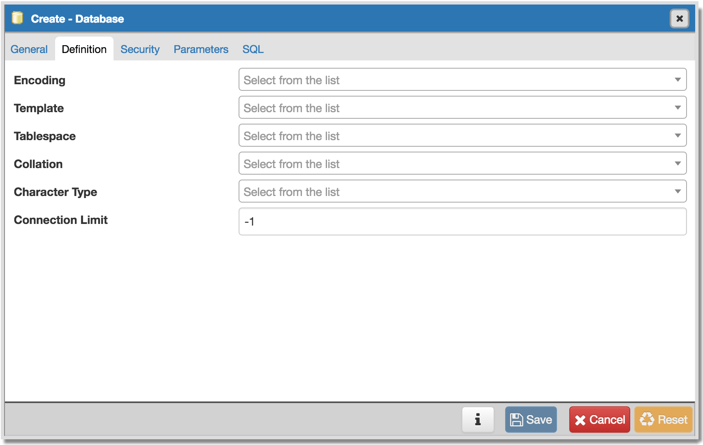
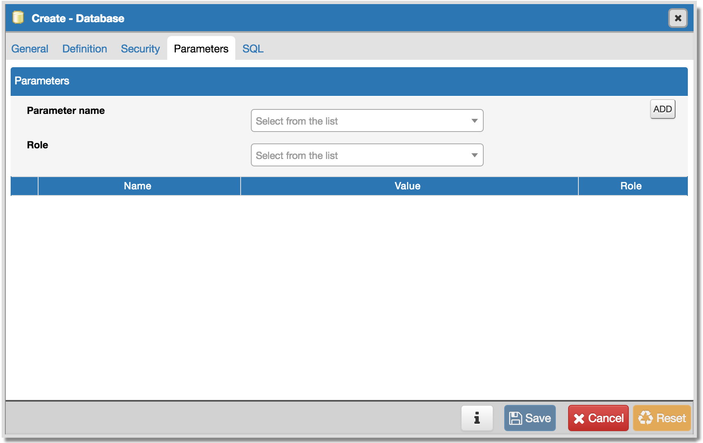
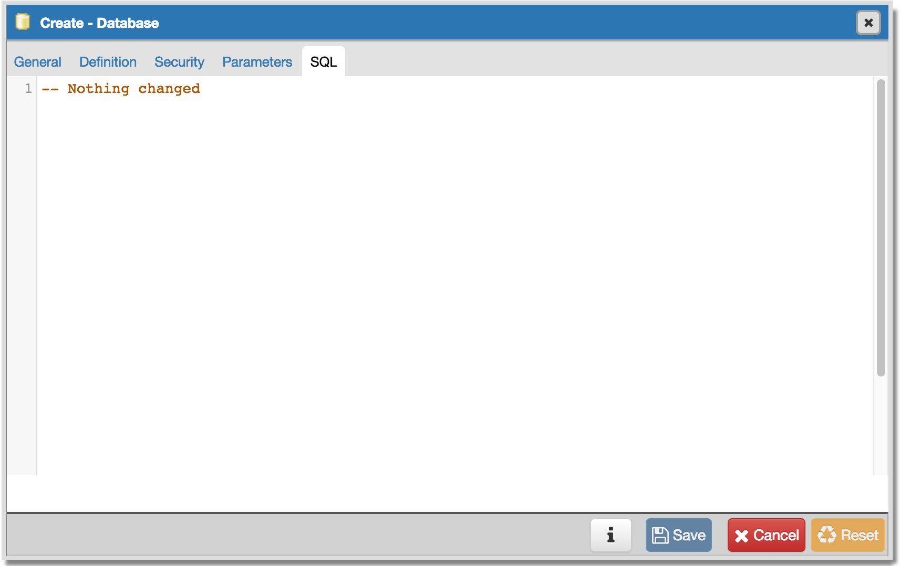

.. _create_database:

*****************
Create - Database
*****************

Use the *Create - Database* dialog to create a database. To create a database, you must be a database superuser or have the CREATE privilege.  

The *Create - Database* dialog allows you to implement options of the CREATE DATABASE command. For more information about the CREATE DATABASE command, please see:

   http://www.postgresql.org/docs/9.5/static/sql-createdatabase.html

 The *Create - Database* dialog organizes the development of a database through the following dialog tabs: *General*, *Definition*, *Security*, and *Parameters*. The *SQL* tab displays the SQL code generated by dialog selections. 

.. image:: images/create_database_general.png

Use the fields in the *General* tab to identify the database:

* Use the *Database* field to add a descriptive name for the database. The name will be displayed in the *pgAdmin* tree control.
* Select the owner of the database from the drop-down listbox in the *Owner* field.
* Store notes about the database in the *Comments* field.  

Click the *Definition* tab to continue.

Use the *Definition* tab to set properties for the database:

* Select a character set from the drop-down listbox in the *Encoding* field. The default is *UTF8*.
* Select a template from the drop-down listbox in the *Template* field. 
* Select a tablespace from the drop-down listbox in the *Tablespace* field. The selected tablespace will be the default tablespace used to contain database objects. 
* Select the collation order from the drop-down listbox in the *Collation* field.
* Select the character classification from the drop-down listbox in the *Character Type* field. This affects the categorization of characters, e.g. lower, upper and digit. The default, or a blank field, uses the character classification of the template database.
* Specify a connection limit in the *Connection Limit* field to configure the maximum number of connection requests. The default value (*-1*) allows unlimited connections to the database.
 
Click the *Security* tab to continue.

.. image:: images/create_database_security.png

Use the *Security* tab to assign privileges and define security labels.  

Use the *Privileges* panel to assign privileges to a role. Click *Add* to set privileges for database objects:

* Select the name of the role from the drop-down listbox in the *Grantee* field.
* Click inside the *Privileges* field. Check the boxes to the left of one or more privileges to grant the selected privilege to the specified user.
* Select the name of the role from the drop-down listbox in the *Grantor* field. The default grantor is the owner of the database.

To discard a privilege, click the trash icon to the left of the row and confirm deletion in the *Delete Row* popup.

Use the *Security Labels* panel to define security labels applied to the database. Click *Add* to add each security label selection: 

* Specify a security label provider in the *Provider* field. The named provider must be loaded and must consent to the proposed labeling operation.
* Specify a a security label in the *Security Label* field. The meaning of a given label is at the discretion of the label provider. PostgreSQL places no restrictions on whether or how a label provider must interpret security labels; it merely provides a mechanism for storing them. 

To discard a security label, click the trash icon to the left of the row and confirm deletion in the *Delete Row* popup.

Click the *Parameters* tab to continue.

Use the *Parameters* tab to set parameters for the database:

* Use the drop-down listbox next to *Parameter name* to select a parameter.
* Use the drop-down listbox next to *Role* to select a role to which the parameter setting specified will apply.
* Click *Add* to add the parameter definition to the table below.
* Use the *Value* field to set a value for the parameter.

Follow these steps to add additional parameter value definitions; to discard a parameter, click the trash icon to the left of the row and confirm deletion in the *Delete Row* popup.

Click the *SQL* tab to continue.

Your entries in the *Create - Database* dialog generate a SQL command; you can review the command on the *SQL* pane. 
 
* Click the *Info* button (i) to access online help. 
* Click the *Save* button to save work.
* Click the *Cancel* button to exit without saving work.
* Click the *Reset* button to restore configuration parameters.

Example
=======

The following is an example of the sql command generated by user selections in the *Create - Database* dialog: 

.. image:: images/create_database_sql_example.png

The example creates a database named *hr* that is owned by *enterprisedb*.  It allows unlimited connections, and is available to authenticated users in the *public* schema.  
