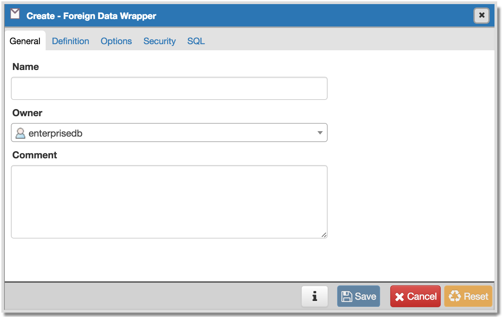
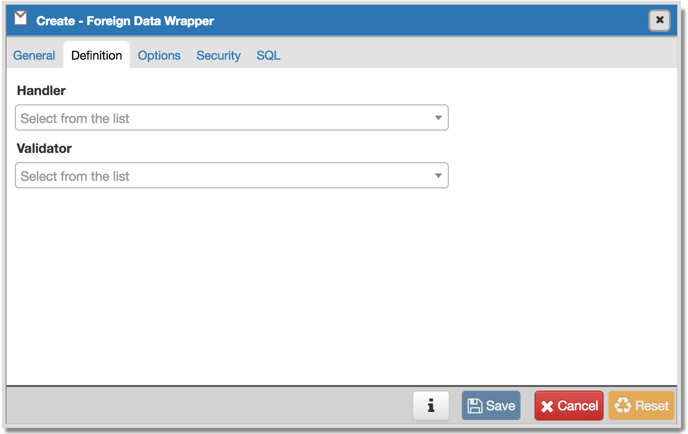
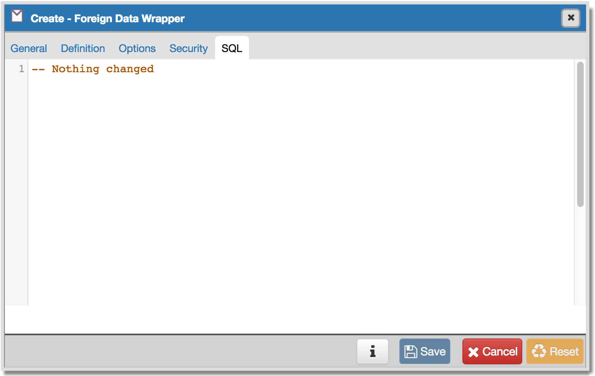
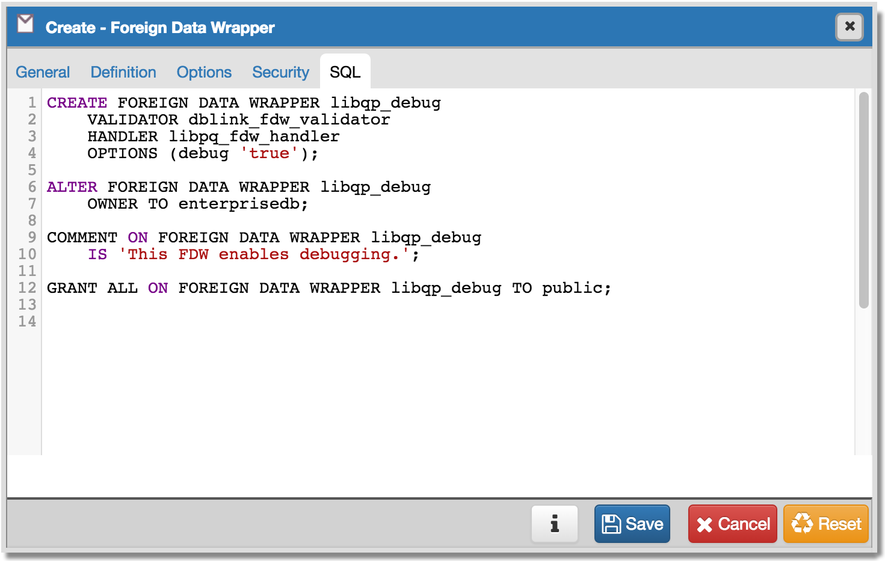

.. _create_fdw:

*****************************
Create - Foreign Data Wrapper
*****************************

Use the *Create - Foreign Data Wrapper* dialog to create a foreign data wrapper. The foreign data wrapper consists of a set of functions; all operations on a foreign table are handled through the foreign data wrapper. The foreign data wrapper is responsible for fetching data from the remote data source and returning it to the PostgreSQL executor. 

A foreign-data wrapper name must be unique within the database.  You must be a superuser to create a foreign-data wrapper.

The *Create - Foreign Data Wrapper* dialog allows you to implement options of the CREATE FOREIGN DATA WRAPPER command. For more information about the CREATE FOREIGN DATA WRAPPER command, see PostgreSQL core documentation available at:

   http://www.postgresql.org/docs/9.5/static/sql-createforeigndatawrapper.html

The *Create - Foreign Data Wrapper* dialog organizes the development of a foreign data wrapper through the following dialog tabs: *General*, *Definition*, *Options*, and *Security*. The *SQL* tab displays the SQL code generated by dialog selections. 

Use the fields in the *General* tab to identify the foreign data wrapper:

* Use the *Name* field to add a descriptive name for the foreign data wrapper. The name will be displayed in the *Object browser* tree control.
* Use the drop-down listbox next to *Owner* to select the name of the role that will own the foreign data wrapper.
* Store notes about the foreign data wrapper in the *Comments* field.

Click the *Definition* tab to continue.

Use the fields in the *Definition* tab to set parameters:

* Select the name of the handler from the drop-down listbox in the *Handler* field. This is the name of an existing function that will be called to retrieve the execution functions for foreign tables. 
* Select the name of the validator from the drop-down listbox in the *Validator* field. This is the name of an existing function that will be called to check the generic options given to the foreign-data wrapper, as well as options for foreign servers, user mappings and foreign tables using the foreign-data wrapper.

Click the *Options* tab to continue.

.. image:: images/create_fdw_options.png

Use the fields in the *Options* tab to specify options:

* Click the *Add* button to add an option/value pair for the foreign data wrapper. Supported option/value pairs will be specific to the selected foreign data wrapper.
* Specify the option name in the *Option* field and provide a corresponding value in the *Value* field.  

Click *Add* to specify each additional pair; to discard an option, click the trash icon to the left of the row and confirm deletion in the *Delete Row* popup.

Click the *Security* tab to continue.

.. image:: images/create_fdw_security.png

Use the *Security* tab to assign security privileges. Click *Add* to assign a set of privileges.

* Select the name of the role from the drop-down listbox in the *Grantee* field.
* Click inside the *Privileges* field. Check the boxes to the left of one or more privileges to grant the selected privileges to the specified user.
* Select the name of the role granting the privileges from the drop-down listbox in the *Grantor* field. The default grantor is the owner of the foreign data wrapper.

To discard a privilege, click the trash icon to the left of the row and confirm deletion in the *Delete Row* popup.

Click the *SQL* tab to continue.

Your entries in the *Create - Foreign Data Wrapper* dialog generate a SQL command; you can review the command on the *SQL* pane.
 
* Click the *Help* button (?) to access online help. 
* Click the *Save* button to save work.
* Click the *Cancel* button to exit without saving work.
* Click the *Reset* button to restore configuration parameters.

Example
=======

The following is an example of the sql command generated by user selections in the *Create - Foreign Data Wrapper* dialog: 

The example creates a foreign data wrapper named *libpq_debug* that uses pre-existing validator and handler functions, *dblink_fdw_validator* and *libpg_fdw_handler*.  Selections on the *Options* tab set *debug* equal to *true*.  The foreign data wrapper is owned by *enterprisedb*.
