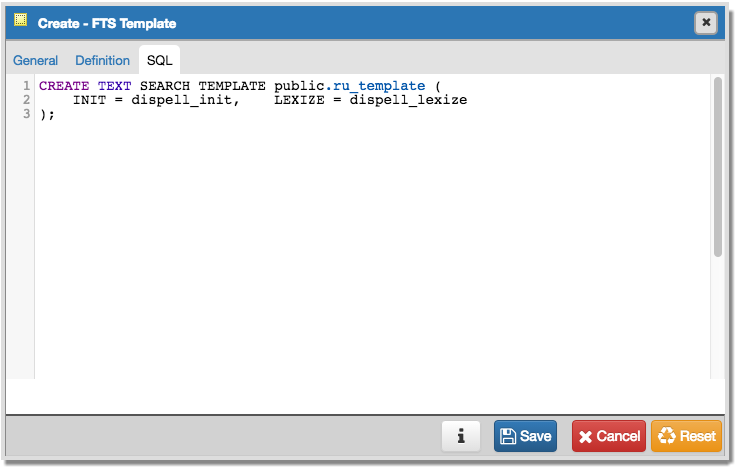

.. _fts_template:

**********************
Create - FTS Template     
**********************

Use the *Create - FTS Template* dialog to create a new text search template. A text search template defines the functions that implement text search dictionaries. The *Create - FTS Template* dialog allows you to implement options of the CREATE TEXT SEARCH TEMPLATE command. For more information about the CREATE TEXT SEARCH TEMPLATE command, see PostgreSQL core documentation available at:

   http://www.postgresql.org/docs/9.5/static/sql-createtstemplate.html

The *Create - FTS Template* dialog organizes the development of a text search Template through the following dialog tabs: *General*, and *Definition*. The *SQL* tab displays the SQL code generated by dialog selections. 

.. image:: images/create_fts_template_general.png

Use the fields in the *General* tab to identify a template:

* Use the *Name* field to add a descriptive name for the template. The name will be displayed in the *pgAdmin* tree control.
* Select the name of the schema in which the template will reside from the drop-down listbox in the *Schema* field.
* Store notes about the domain in the *Comments* field.

Click the *Definition* tab to continue.

.. image:: images/create_fts_template_definition.png

Use the fields in the *Definition* tab to define function parameters:

* Use the drop-down listbox next to *Init function* to select the name of the init function for the template. The init function is optional.
* Use the drop-down listbox next to *Lexize function* to select the name of the lexize function for the template. The lexize function is required.

Click the *SQL* tab to continue.

.. image:: images/create_fts_template_sql.png

Your entries in the *Create - FTS Template* dialog generate a SQL command; you can review the command on the *SQL* pane.
 
* Click the *Info* button (i) to access online help. 
* Click the *Save* button to save work.
* Click the *Cancel* button to exit without saving work.
* Click the *Reset* button to restore configuration parameters.

Example
=======

The following is an example of the sql command generated by user selections in the *Create - FTS Template* dialog: 

The example shown demonstrates creating a fts template named *ru_template* that uses the ispell dictionary.

