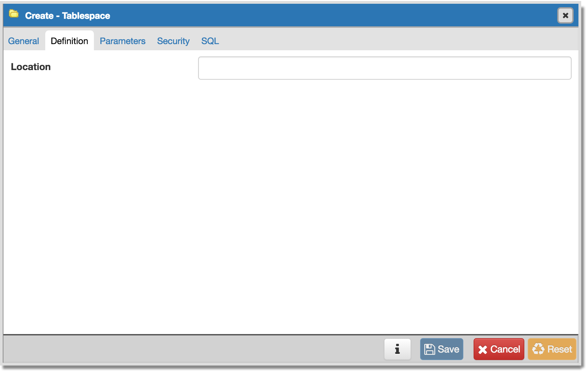
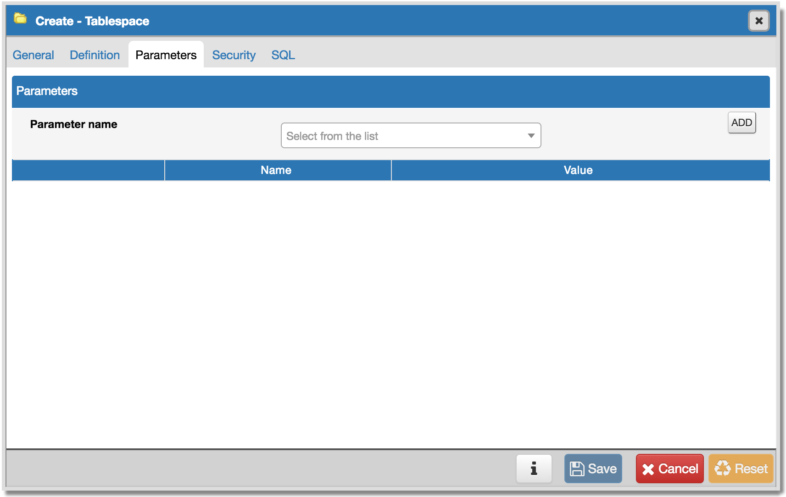

.. _create_tablespace:

*******************
Create - Tablespace
*******************

A tablespace allows superusers to define an alternative location on the file system where the data files containing database objects (such as tables and indexes) reside. Tablespaces are only supported on systems that support symbolic links. Note that a tablespace cannot be used independently of the cluster in which it is defined.

The *Create - Tablespace* dialog allows you to implement options of the CREATE TABLESPACE command.  For more information about the CREATE TABLESPACE command, please see:

   http://www.postgresql.org/docs/9.5/static/sql-createtablespace.html

The *Create - Tablespace* dialog organizes the definition of a tablespace through the following tabs: *General*, *Definition*, *Parameters*, and *Security*. The *SQL* tab displays the SQL code generated by dialog selections. 

.. image:: images/create_tablespace_general.png

* Use the *Name* field to identify the tablespace with a descriptive name. The name cannot begin with pg\_; these names are reserved for system tablespaces. 
* Select the owner of the tablespace from the drop-down listbox in the *Owner* field.
* Store notes about the tablespace in the *Comments* field.  

Click the *Definition* tab to continue.

* Use the *Location* field to specify an absolute path to a directory that will contain the tablespace.

Click the *Parameters* tab to continue.

Use the *Parameters* tab to set parameters for the tablespace:

* Use the drop-down listbox next to *Parameter name* to select a parameter.
* Click *Add* to add the parameter name to the table below.
* Use the *Value* field to set a value for the parameter.

Click *Add* to specify each additional parameter; to discard a parameter, click the trash icon to the left of the row and confirm deletion in the *Delete Row* dialog.

Click the *Security* tab to continue.

.. image:: images/create_tablespace_security.png

Use the *Security* tab to assign privileges and define security labels. 

Use the *Privileges* panel to assign security privileges to a role. Click *Add* to assign a set of privileges:

* Select the name of the role from the drop-down listbox in the *Grantee* field.
* Click inside the *Privileges* field. Check the boxes to the left of one or more privileges to grant the selected privileges to the specified user.
* Select the name of the role from the drop-down listbox in the *Grantor* field. The default grantor is the owner of the owner of the tablespace.

To discard a privilege, click the trash icon to the left of the row and confirm deletion in the *Delete Row* popup.

Use the *Security Labels* panel to define security labels applied to the tablespace. Click *Add* to add each security label selection: 

* Specify a security label provider in the *Provider* field. The named provider must be loaded and must consent to the proposed labeling operation.
* Specify a a security label in the *Security Label* field. The meaning of a given label is at the discretion of the label provider. PostgreSQL places no restrictions on whether or how a label provider must interpret security labels; it merely provides a mechanism for storing them. 

To discard a security label, click the trash icon to the left of the row and confirm deletion in the *Delete Row* popup.

Click the *SQL* tab to continue.

.. image:: images/create_tablespace_sql.png

Your entries in the *Create - Tablespace* dialog generate a SQL command; you can review the command on the *SQL* pane.
 
* Click the *Info* button (i) to access online help. 
* Click the *Save* button to save work.
* Click the *Cancel* button to exit without saving work.
* Click the *Reset* button to restore configuration parameters.

Example
=======

The following is an example of the sql command generated by user selections in the *Create - Tablespace* dialog: 

.. image:: images/create_tablespace_sql_example.png

