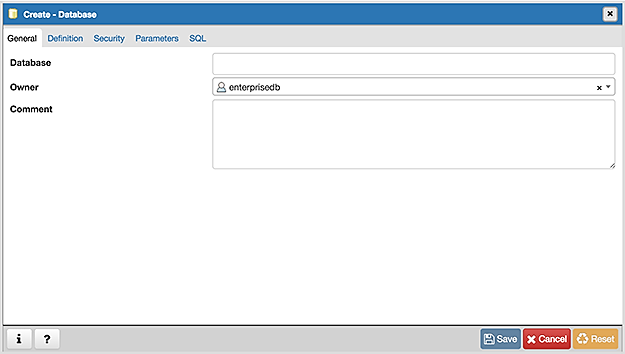
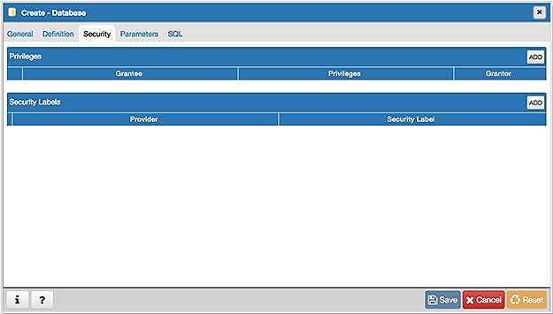
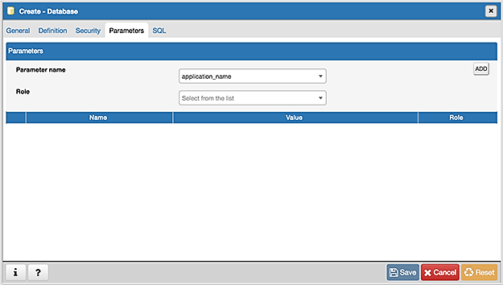
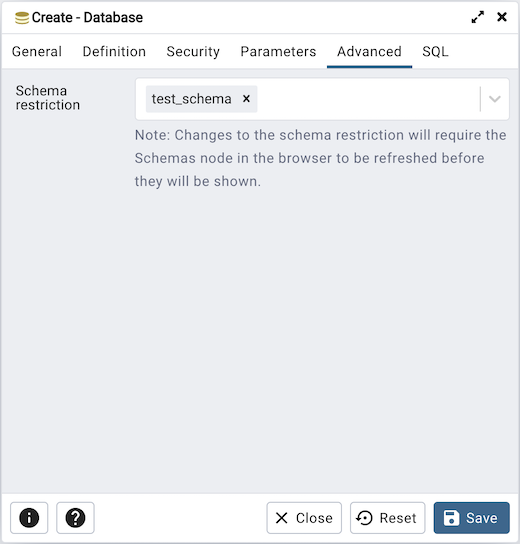
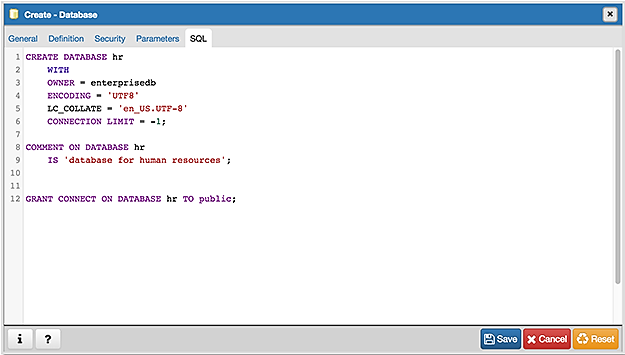

.. _database_dialog:

************************
`Database Dialog`:index:
************************

Use the *Database* dialog to define or modify a database. To create a database,
you must be a database superuser or have the CREATE privilege.

The *Database* dialog organizes the development of a database through the
following dialog tabs: *General*, *Definition*, *Security*, and *Parameters*.
The *SQL* tab displays the SQL code generated by dialog selections.

Use the fields in the *General* tab to identify the database:

* Use the *Database* field to add a descriptive name for the database. The name
  will be displayed in the *pgAdmin* tree control.
* Select the owner of the database from the drop-down listbox in the *Owner*
  field.
* Store notes about the database in the *Comment* field.

Click the *Definition* tab to continue.

.. image:: images/database_definition.png
    :alt: Database dialog definition tab
    :align: center

Use the *Definition* tab to set properties for the database:

* Select a character set from the drop-down listbox in the *Encoding* field.
  The default is *UTF8*.
* Select a template from the drop-down listbox in the *Template* field. If you
  do not specify a template, the database will use template1.
* Select a tablespace from the drop-down listbox in the *Tablespace* field. The
  selected tablespace will be the default tablespace used to contain database
  objects.
* Select the collation order from the drop-down listbox in the *Collation* field.
* Select the character classification from the drop-down listbox in the
  *Character Type* field. This affects the categorization of characters, e.g.
  lower, upper and digit. The default, or a blank field, uses the character
  classification of the template database.
* Specify a connection limit in the *Connection Limit* field to configure the
  maximum number of connection requests. The default value (*-1*) allows
  unlimited connections to the database.
* If the *templates?* is set to true, then database will be a template database.

Click the *Security* tab to continue.

Use the *Security* tab to assign privileges and define security labels.

Use the *Privileges* panel to assign privileges to a role. Click the *Add* icon
(+) to set privileges for database objects:

* Select the name of the role from the drop-down listbox in the *Grantee* field.
* Click inside the *Privileges* field. Check the boxes to the left of one or
  more privileges to grant the selected privilege to the specified user.
* The current user, who is the default grantor for granting the privilege, is displayed in the *Grantor* field.

Click add to set additional privileges; to discard a privilege, click the trash
icon to the left of the row and confirm deletion in the *Delete Row* popup.

Use the *Security Labels* panel to define security labels applied to the
database. Click the *Add* icon (+) to add each security label selection:

* Specify a security label provider in the *Provider* field. The named provider
  must be loaded and must consent to the proposed labeling operation.
* Specify a a security label in the *Security Label* field. The meaning of a
  given label is at the discretion of the label provider. PostgreSQL places no
  restrictions on whether or how a label provider must interpret security
  labels; it merely provides a mechanism for storing them.

To discard a security label, click the trash icon to the left of the row and
confirm deletion in the *Delete Row* popup.

Click the *Parameters* tab to continue.

Use the *Parameters* tab to set parameters for the database. Click the *Add*
icon (+) to add each parameter:

* Use the drop-down listbox in the *Name* field to select a parameter.
* Use the *Value* field to set a value for the parameter.
* Use the drop-down listbox next to *Role* to select a role to which the
  parameter setting specified will apply.

Follow these steps to add additional parameter value definitions; to discard a
parameter, click the trash icon to the left of the row and confirm deletion in
the *Delete Row* popup.

Click the *Advanced* tab to continue.

Use the *Advanced* tab to set advanced parameters for the database.

* Use *Schema restriction* field to provide a SQL restriction that will be used
  against the pg_namespace table to limit the schemas that you see.
  For example, you might enter: *public* so that only *public* are shown in
  the pgAdmin browser.Separate entries with a comma or tab as you type.

Click the *SQL* tab to continue.

Your entries in the *Database* dialog generate a SQL command (see an example
below). Use the *SQL* tab for review; revisit or switch tabs to make any changes
to the SQL command.

Example
*******

The following is an example of the sql command generated by user selections in
the *Database* dialog:

The example creates a database named *hr* that is owned by *postgres*. It
allows unlimited connections, and is available to all authenticated users.

* Click the *Info* button (i) to access online help.
* Click the *Save* button to save work.
* Click the *Close* button to exit without saving work.
* Click the *Reset* button to restore configuration parameters.
