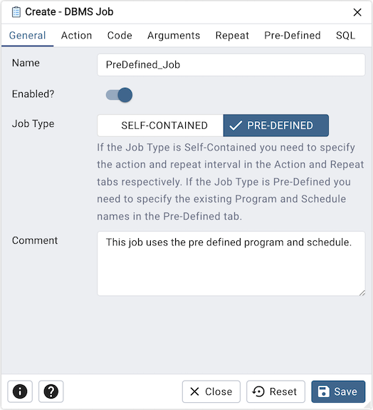
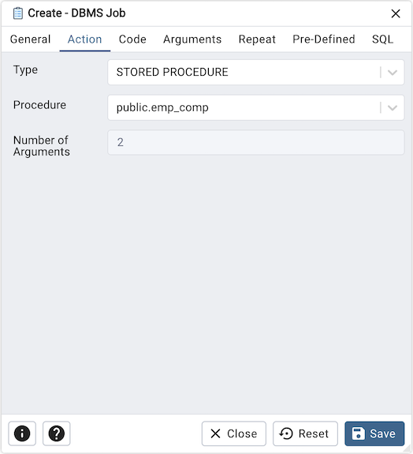
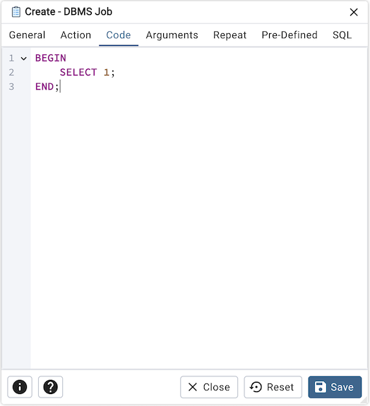
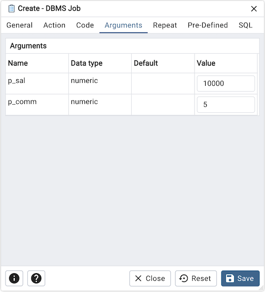
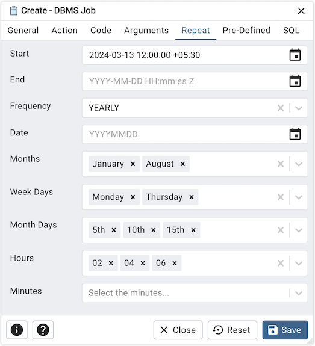
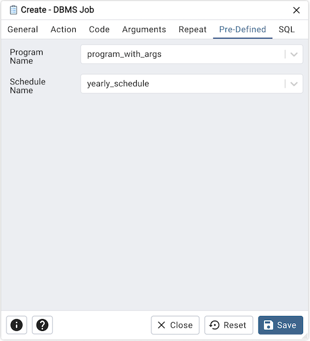
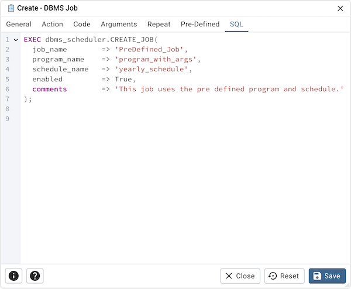

.. _dbms_job:

*****************
`DBMS Job`:index:
*****************

Use the *DBMS Job* dialog to create a DBMS Job.

Use the fields in the *General* tab to create job:

* Use the *Name* field to add a descriptive name for the job. The name will
  be displayed in the *pgAdmin* object explorer.
* Use the *Enabled?* switch to indicate that job should be enabled or disabled.
* Use the *Job Type* field to select the type of the job. Type could be SELF-CONTAINED or PRE-DEFINED.
  If the Job Type is Self-Contained you need to specify the action and repeat interval in the Action and Repeat tabs respectively.
  If the Job Type is Pre-Defined you need to specify the existing Program and Schedule names in the Pre-Defined tab.
* Store notes about the job in the *Comment* field.

Click the *Action* tab to continue.

Use the *Action* tab to select the action for the job. This tab is only enabled when the job type is 'SELF-CONTAINED'.

* Use the *Type* field to select the type of the job. Type could be PLSQL BLOCK or STORED PROCEDURE.
* Use the *Procedure* field to select an existing procedure that executes when the job is invoked.
* *Number of Arguments* field is read-only and indicates the quantity of arguments necessary for the chosen procedure.

Click the *Code* tab to continue.

* Use the *Code* field to write the code that executes when the job is invoked.
  This tab is only enabled when the job type is 'SELF-CONTAINED' and type of the action is set to 'PLSQL BLOCK'.

Click the *Arguments* tab to continue.

* *Arguments* tab outlines the arguments required by the selected procedure in the 'Action' tab. This tab is only enabled when the job type is 'SELF-CONTAINED'.

Click the *Repeat* tab to continue.

Use the *Repeat* tab to select the repeat interval for the job. This tab is only enabled when the job type is 'SELF-CONTAINED'.

* Use the calendar selector in the *Start* field to specify the starting date
  and time for the job.
* Use the calendar selector in the *End* field to specify the ending date and
  time for the job.
* Use the *Frequency* field to select the frequency. Frequency is one of the following:
  YEARLY, MONTHLY, WEEKLY, DAILY, HOURLY, MINUTELY.
* Use the *Date* field to select the date on which job will execute.Date is YYYYMMDD.
* Use the *Months* field to select the months in which the job will execute.
* Use the *Week Days* field to select the days on which the job will execute.
* Use the *Month Days* field to select the numeric days on which the job will
  execute.
* Use the *Hours* field to select the hour at which the job will execute.
* Use the *Minutes* field to select the minute at which the job will execute.

Click the *Pre-Defined* tab to continue.

Use the *Pre-Defined* tab to select the existing program and schedule to create the job.
This tab is only enabled when the job type is 'PRE-DEFINED'.

* Use the *Program Name* field to select the existing program.
* Use the *Schedule Name* field to select an existing schedule.

Click the *SQL* tab to continue.

Your entries in the *DBMS Job* dialog generate a SQL command (see an example below).
Use the *SQL* tab for review; revisit or switch tabs to make any changes to the
SQL command.

**Example**

The following is an example of the sql command generated by user selections in
the *DBMS Job* dialog:

* Click the *Info* button (i) to access online help.
* Click the *Help* button (?) to access dialog help.
* Click the *Save* button to save work.
* Click the *Close* button to exit without saving work.
* Click the *Reset* button to restore configuration parameters.