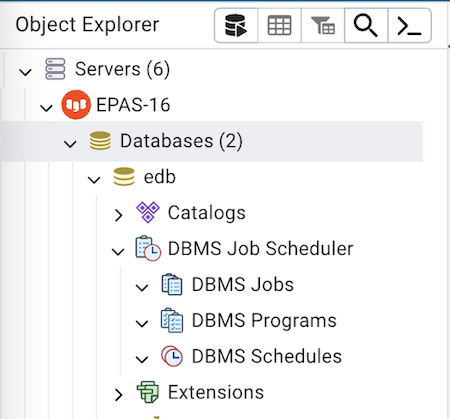
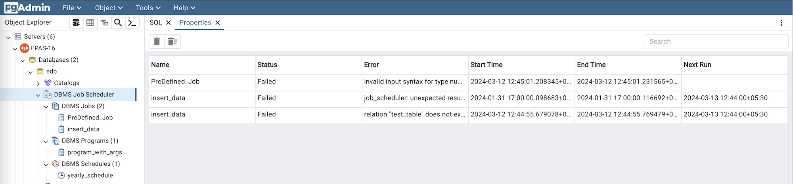

.. _dbms_job_scheduler:

********************************
`Using EDB Job Scheduler`:index:
********************************

In the past versions of EPAS, DBMS_SCHEDULER or DBMS_JOBS required the configuration
of pgAgent, an essential service for their functionality. Maintaining pgAgent in a
production environment is cumbersome. The need for correct configuration, regular updates,
and ensuring the service’s health added complexity.

EPAS 16 revolutionizes job scheduling by eliminating the need for the pgAgent component.
The new version introduces EDB Job Scheduler which is an extension that runs the job scheduler
as a background process for the DBMS_SCHEDULER and DBMS_JOB packages.

The EDB Job Scheduler has a scheduler process that starts when the database cluster starts.
To start the scheduler process, load the EDB Job Scheduler extension using the **shared_preload_libraries**
parameter. After you load the extension, create the extension **'edb_job_scheduler'** and **'dbms_scheduler'** using
the CREATE EXTENSION command. The database in which you're creating the extension must be listed in the
**edb_job_scheduler.database_list** parameter.

Instructions for configuring the EDB Job Scheduler can be found in the
`Configuring EDB Job Scheduler <https://www.enterprisedb.com/docs/pg_extensions/edb_job_scheduler/configuring/>`_.

Check the status of all the jobs
********************************

To check the running status of all the jobs select the 'DBMS Job Scheduler' collection node from the object
explorer and select the Properties tab.

.. toctree::
   :maxdepth: 1

   dbms_job
   dbms_program
   dbms_schedule