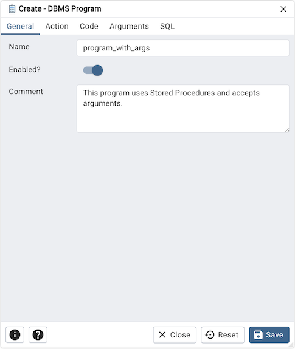
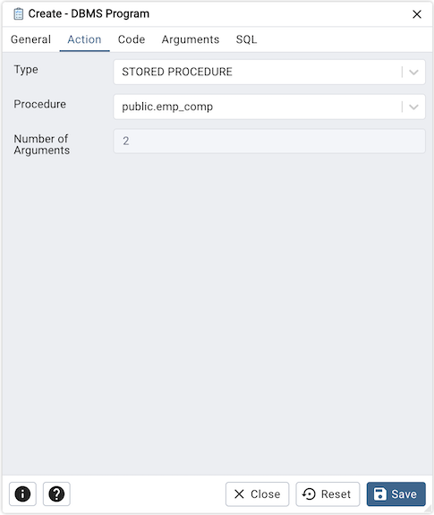
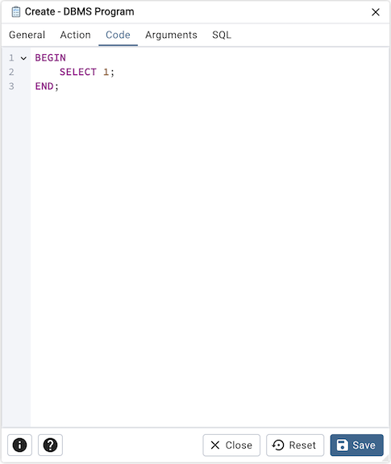
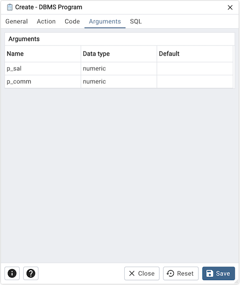
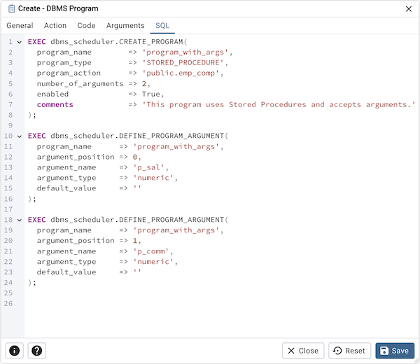

.. _dbms_program:

*********************
`DBMS Program`:index:
*********************

Use the *DBMS Program* dialog to create a DBMS Program.

Use the fields in the *General* tab to create program:

* Use the *Name* field to add a descriptive name for the program. The name will
  be displayed in the *pgAdmin* object explorer.
* Use the *Enabled?* switch to indicate that program should be enabled or disabled.
* Store notes about the program in the *Comment* field.

Click the *Action* tab to continue.

Use the *Action* tab to select the action for the program:

* Use the *Type* field to select the type of the program. Type could be PLSQL BLOCK or STORED PROCEDURE.
* Use the *Procedure* field to select an existing procedure that executes when the program is invoked.
* *Number of Arguments* field is read-only and indicates the quantity of arguments necessary for the chosen procedure.

Click the *Code* tab to continue.

* Use the *Code* field to write the code that executes when the program is invoked.
  This tab is only enabled when the type of the program is set to 'PLSQL BLOCK'.

Click the *Arguments* tab to continue.

* *Arguments* tab is a read-only section that outlines the arguments required by the selected procedure in the 'Action' tab.

Click the *SQL* tab to continue.

Your entries in the *DBMS Program* dialog generate a SQL command (see an example below).
Use the *SQL* tab for review; revisit or switch tabs to make any changes to the
SQL command.

**Example**

The following is an example of the sql command generated by user selections in
the *DBMS Program* dialog:

* Click the *Info* button (i) to access online help.
* Click the *Help* button (?) to access dialog help.
* Click the *Save* button to save work.
* Click the *Close* button to exit without saving work.
* Click the *Reset* button to restore configuration parameters.

