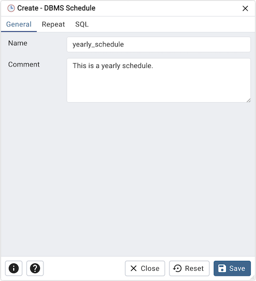
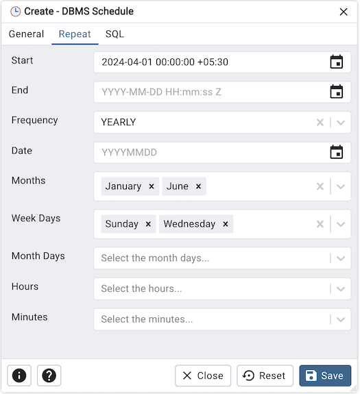
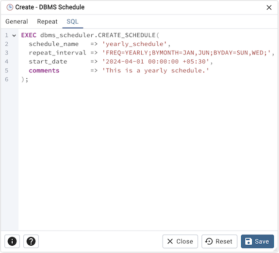

.. _dbms_schedule:

**********************
`DBMS Schedule`:index:
**********************

Use the *DBMS Schedule* dialog to create a DBMS Schedule.

Use the fields in the *General* tab to create schedule:

* Use the *Name* field to add a descriptive name for the schedule. The name will
  be displayed in the *pgAdmin* object explorer.
* Store notes about the schedule in the *Comment* field.

Click the *Repeat* tab to continue.

Use the *Repeat* tab to select the repeat interval for the schedule:

* Use the calendar selector in the *Start* field to specify the starting date
  and time for the schedule.
* Use the calendar selector in the *End* field to specify the ending date and
  time for the schedule.
* Use the *Frequency* field to select the frequency. Frequency is one of the following:
  YEARLY, MONTHLY, WEEKLY, DAILY, HOURLY, MINUTELY.
* Use the *Date* field to select the date on which schedule will execute.Date is YYYYMMDD.
* Use the *Months* field to select the months in which the schedule will execute.
* Use the *Week Days* field to select the days on which the schedule will execute.
* Use the *Month Days* field to select the numeric days on which the schedule will
  execute.
* Use the *Hours* field to select the hour at which the schedule will execute.
* Use the *Minutes* field to select the minute at which the schedule will execute.

Click the *SQL* tab to continue.

Your entries in the *DBMS Schedule* dialog generate a SQL command (see an example below).
Use the *SQL* tab for review; revisit or switch tabs to make any changes to the
SQL command.

**Example**

The following is an example of the sql command generated by user selections in
the *DBMS Schedule* dialog:

* Click the *Info* button (i) to access online help.
* Click the *Help* button (?) to access dialog help.
* Click the *Save* button to save work.
* Click the *Close* button to exit without saving work.
* Click the *Reset* button to restore configuration parameters.