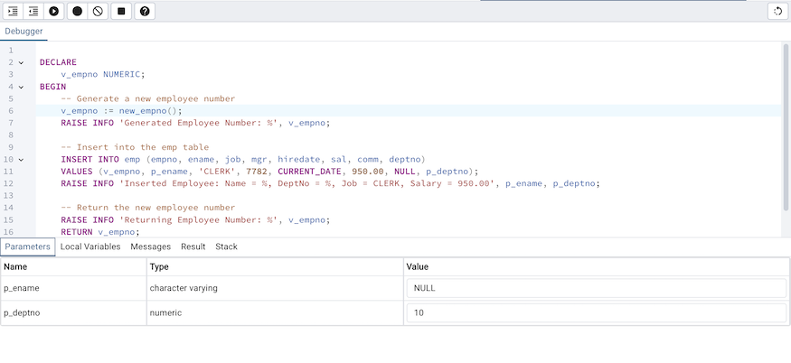
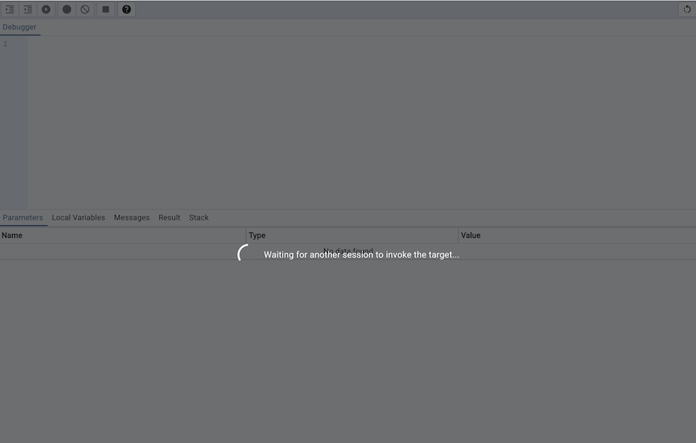
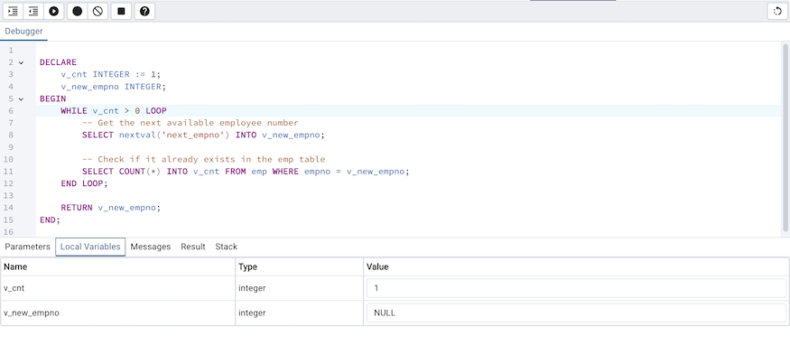
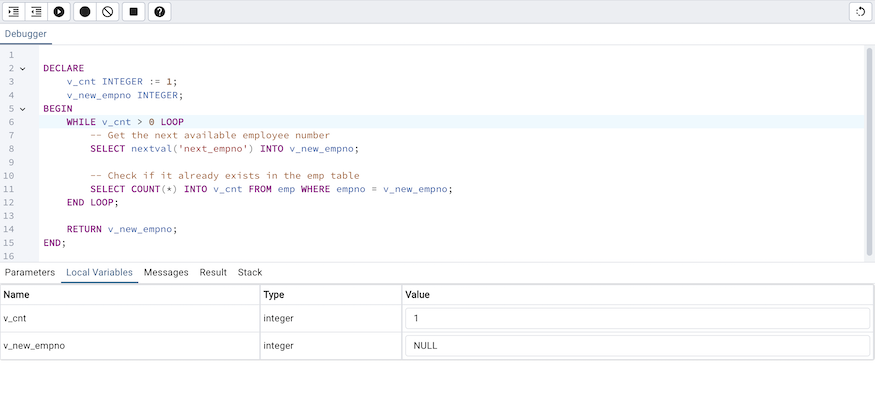
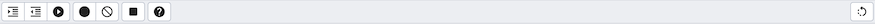
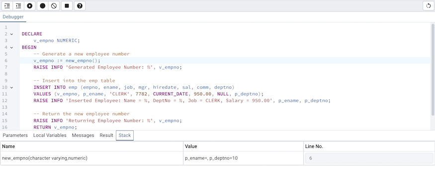
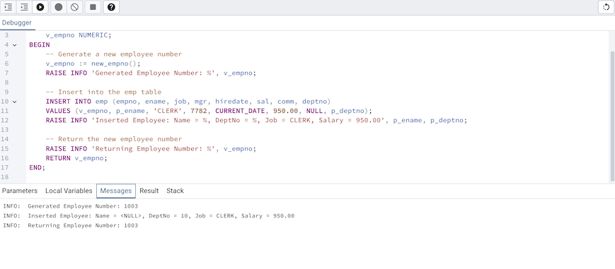

.. _debugger:

*************************
`pgAdmin Debugger`:index:
*************************

The debugger may be used to debug PL/pgSQL functions in PostgreSQL, as well as EDB-SPL functions, stored procedures and packages in Advanced Server. The Debugger is available as an extension for your PostgreSQL installation, and is distributed as part of Advanced Server.  You must have superuser privileges to use the debugger.

Before using the debugger, you must modify the *postgresql.conf* file, adding the server-side debugger components to the the value of the *shared_preload_libraries* parameter:

  shared_preload_libraries = '$libdir/*other_libraries*/plugin_debugger'

After modifying the *shared_preload_libraries* parameter, restart the server to apply the changes.

The debugger may be used for either in-context debugging or direct debugging of a target function or procedure.  When you use the debugger for in-context debugging, you set a breakpoint at the first line of a program; when a session invokes the target, control is transferred to the debugger. When using direct debugging, the debugger prompts you for any parameters required by the target, and then allows you to step through the code.

**In-context Debugging**

To set a breakpoint at the first line of a program, right-click the name of the object you would like to debug, and select *Set breakpoint* from the *Debugging* sub-menu.  The debugger window will open, waiting for another session to invoke the program.

When another session invokes the target, the debugger will display the code, allowing you to add break points, or step through line-by-line. The other session is suspended until the debugging completes; then control is returned to the session.

**Direct Debugging**

To use the debugger for direct debugging, right click on the name of the object that you wish to debug in the pgAdmin tree control and select *Debug* from the *Debugging* sub-menu.  The debugger window will open, prompting you for any values required by the program:

.. image:: images/debug_params.png
    :alt: Debugger parameter dialog

Use the fields on the *Debugger* dialog to provide a value for each parameter:

 * The *Name* field contains the formal parameter name.
 * The *Type* field contains the parameter data type.
 * Check the *Null?* checkbox to indicate that the parameter is a NULL value.
 * Check the *Expression?* checkbox if the Value field contains an expression.
 * Use the *Value* field to provide the parameter value that will be passed to the program.  When entering parameter values, type the value into the appropriate cell on the grid, or, leave the cell empty to represent NULL, enter '' (two single quotes) to represent an empty string, or to enter a literal string consisting of just two single quotes, enter \'\'. PostgreSQL 8.4 and above supports variadic function parameters. These may be entered as a comma-delimited list of values, quoted and/or cast as required.
 * Check the *Use default?* checkbox to indicate that the program should use the value in the Default Value field.
 * The *Default Value* field contains the default value of the parameter.

Provide values required by the program, and click the *Debug* button to start stepping through the program.

**Using the Debugger**

The main debugger window consists of two panels and a context-sensitive toolbar.  Use toolbar icons to manage breakpoints and step into or through code; hover over an icon for a tooltip that identifies the option associated with the icon. The toolbar options are:

+-------------------------+-----------------------------------------------------------------------------------------------------------+
| Option                  | Action                                                                                                    |
+=========================+===========================================================================================================+
| *Step into*             | Click the *Step into* icon to execute the currently highlighted line of code.                             |
+-------------------------+-----------------------------------------------------------------------------------------------------------+
| *Step over*             | Click the *Step over* icon to execute a line of code, stepping over any sub-functions invoked by the code.|
|                         | The sub-function executes, but is not debugged unless it contains a breakpoint.                           |
+-------------------------+-----------------------------------------------------------------------------------------------------------+
| *Continue/Start*        | Click the *Continue/Start* icon to execute the highlighted code, and continue until the program           |
|                         | encounters a breakpoint or completes.                                                                     |
+-------------------------+-----------------------------------------------------------------------------------------------------------+
| *Toggle breakpoint*     | Use the *Toggle breakpoint* icon to enable or disable a breakpoint (without removing the breakpoint).     |
+-------------------------+-----------------------------------------------------------------------------------------------------------+
| *Clear all breakpoints* | Click the *Clear all breakpoints* icon to remove all breakpoints from the program.                        |
+-------------------------+-----------------------------------------------------------------------------------------------------------+
| *Stop*                  | Click the *Stop* icon to halt the execution of a program.                                                 |
+-------------------------+-----------------------------------------------------------------------------------------------------------+

The top panel of the debugger window displays the program body; click in the grey margin next to a line number to add a breakpoint.  The highlighted line in the top panel is the line that is about to execute.

The lower panel of the debugger window provides a set of tabs that allow you to review information about the program:

 * The *Parameters* tab displays the value of each parameter.
 * The *Local* variables tab displays the current value of the program variables.
 * The *Messages* tab displays any messages returned by the server (errors, warnings and informational messages).
 * The *Results* tab displays the server message when the program completes.
 * The *Stack* tab displays the list of functions that have been invoked, but which have not yet completed.

As you step through a program, the *Local variables* tab displays the current value of each variable:

.. image:: images/debug_variables.png
    :alt: Debugger local variables tab

When you step into a subroutine, the *Stack* tab displays the call stack, including the name of each caller, the parameter values for each caller (if any), and the line number within each caller:

Select a caller to change focus to that stack frame and display the state of the caller in the upper panel.

When the program completes, the *Results* tab displays the message returned by the server.  If the program encounters an error, the *Messages* tab displays details:

