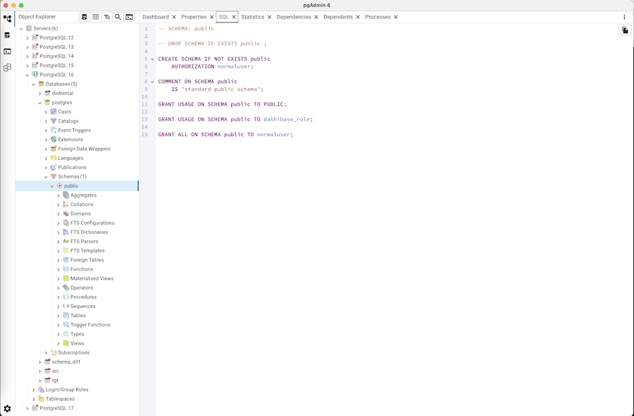

.. _desktop_deployment:

***************************
`Desktop Deployment`:index:
***************************

pgAdmin may be deployed as a desktop application by configuring the application
to run in desktop mode and then utilising the desktop runtime to host the
program on a supported Windows, Mac OS X or Linux installation.

The desktop runtime is a standalone application that when launched, runs the
pgAdmin server and opens a window to render the user interface.

.. note:: Pre-compiled and configured installation packages are available for
     a number of platforms. These packages should be used by end-users whereever
     possible - the following information is useful for the maintainers of those
     packages and users interested in understanding how pgAdmin works.

.. seealso:: For detailed instructions on building and configuring pgAdmin from
    scratch, please see the README file in the top level directory of the source code.
    For convenience, you can find the latest version of the file
    `here <https://git.postgresql.org/gitweb/?p=pgadmin4.git;a=blob;f=README.md>`_,
    but be aware that this may differ from the version included with the source code
    for a specific version of pgAdmin.

Configuration
*************

From pgAdmin 4 v2 onwards, the default configuration mode is server, however,
this is overridden by the desktop runtime at startup. In most environments, no
Python configuration is required unless you wish to override other default
settings.

See :ref:`config_py` for more information on configuration settings.

Desktop Runtime Standalone Application
======================================

The Desktop Runtime is based on `NWjs <https://nwjs.io/>`_ which integrates a
browser and the Python server creating a standalone application.

Runtime Menu
------------

.. image:: images/runtime_menu.png
    :alt: Runtime Menu
    :align: center

Use the *File Menu* to access the *Runtime Menu*:

+-------------------------+---------------------------------------------------------------------------------------------------------+
| Option                  | Action                                                                                                  |
+=========================+=========================================================================================================+
| *Configure...*          | Click to open configuration dialog to configure fixed port, port number and connection timeout.         |
+-------------------------+---------------------------------------------------------------------------------------------------------+
| *View log...*           | Click to open the view log dialog to view the pgAdmin 4 logs.                                           |
+-------------------------+---------------------------------------------------------------------------------------------------------+
| *Enter Full Screen*     | Click to enter/exit the full screen mode. Keyboard Shortcuts: OSX (Cmd + Ctrl + F), Other OS (F10).     |
+-------------------------+---------------------------------------------------------------------------------------------------------+
| *Actual Size*           | Click to change the window size to it original size. Keyboard Shortcuts: OSX (Cmd + 0),                 |
|                         | Other OS (Ctrl + 0).                                                                                    |
+-------------------------+---------------------------------------------------------------------------------------------------------+
| *Zoom In*               | Click to increase the zoom level. Keyboard Shortcuts: OSX (Cmd + +), Other OS (Ctrl + +).               |
+-------------------------+---------------------------------------------------------------------------------------------------------+
| *Zoom Out*              | Click to decrease the zoom level. Keyboard Shortcuts: OSX (Cmd + -), Other OS (Ctrl + -).               |
+-------------------------+---------------------------------------------------------------------------------------------------------+

Configuration Dialog
--------------------

Use the *Runtime Menu* to access the *Configuration* dialog:

.. image:: images/runtime_configuration.png
    :alt: Runtime Configuration
    :align: center

Following are the details of the *Fixed port number?*, *Port Number*, and *Connection
Timeout* configuration parameters:

.. table::
   :class: longtable
   :widths: 2 1 4

   +--------------------------+--------------------+---------------------------------------------------------------+
   | Key                      | Type               | Purpose                                                       |
   +==========================+====================+===============================================================+
   | FixedPort                | Boolean            | Use a fixed network port number rather than a random one.     |
   +--------------------------+--------------------+---------------------------------------------------------------+
   | PortNumber               | Integer            | The port number to use, if using a fixed port.                |
   +--------------------------+--------------------+---------------------------------------------------------------+
   | ConnectionTimeout        | Integer            | The number of seconds to wait for application server startup. |
   +--------------------------+--------------------+---------------------------------------------------------------+

Log dialog
----------

Use the *Runtime Menu* to access the *Log* dialog:

.. image:: images/runtime_view_log.png
    :alt: Runtime View Log
    :align: center

Click on the *Reload* button at the bottom to view the latest logs of pgAdmin 4
Server.

When executed, the runtime will automatically try to execute the pgAdmin Python
application. If execution fails, it will prompt you with error message
displaying a *Configure* button at the bottom. You can configure a fixed port
number to avoid clashes of the default random port number with other
applications and a connection timeout if desired.

.. image:: images/runtime_error.png
    :alt: Runtime Error
    :align: center

If the error is related to Python Path or pgAdmin Python file then you need to
create a file named 'dev_config.json' and specify the following entries:

.. code-block:: json

    {
        "pythonPath": "/path/to/python.exe",
        "pgadminFile": "/path/to/pgAdmin4.py"
    }

Note that the *dev_config.py* file should only be required by developers who are
working outside of a standard installation.

The configuration settings are stored in *runtime_config.json* file, which
will be available on Unix systems (~/.local/share/pgadmin/),
on Mac OS X (~/Library/Preferences/pgadmin),
and on Windows (%APPDATA%/pgadmin).
