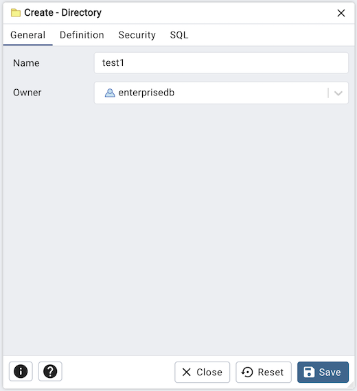
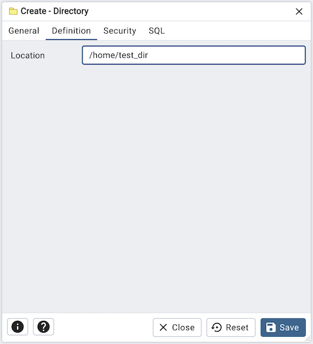
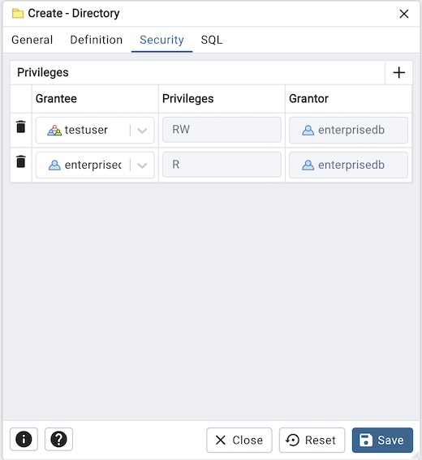
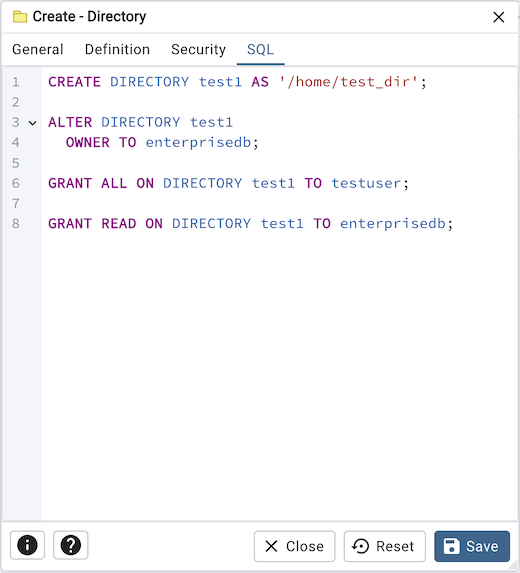

.. _directory_dialog:

*************************
`Directory Dialog`:index:
*************************

Use the Directory dialog to Create an alias for a file system directory path.
To create directories, you must have the CREATE ANY DIRECTORY system privilege.
When you create a directory, you are automatically granted READ and WRITE privileges
on the directory, and you can grant READ and WRITE privileges to other users and roles.
The superuser can also grant these privileges to other users and roles.

Please note that directories are supported when connected to EDB Postgres Advanced Server.
For more information about using directories, please see the EDB Postgres Advanced Server Guide, available at:

   https://www.enterprisedb.com/docs/epas/latest/epas_compat_sql/

The *Directory* dialog organizes the definition of a directory through the
following tabs: *General*, *Definition*, *Security*, and *SQL*.
The *SQL* tab displays the SQL code generated by dialog selections.

Use the fields on the *General* tab to specify directory attributes:

* Use the *Name* field to add a directory alias name. This name will be displayed in the object explorer.
* Select the owner of the directory from the drop-down listbox in the *Owner*
  field.

Click the *Definition* tab to continue.

* Use the *Location* field to specify a fully qualified directory path represented
  by the alias name. The CREATE DIRECTORY command doesn't create the operating system directory.
  The physical directory must be created independently using operating system commands.

Click the *Security* tab to continue.

NOTE:- This *Security* tab will be only available for EPAS 17.

Use the *Security* tab to assign privileges for the directory.

Use the *Privileges* panel to assign security privileges. Click the *Add* icon
(+) to assign a set of privileges:

* Select the name of the role from the drop-down listbox in the *Grantee* field.
* The current user, who is the default grantor for granting the privilege, is displayed in the *Grantor* field.
* Click inside the *Privileges* field. Check the boxes to the left of one or
  more privileges to grant the selected privileges to the specified user.

Click the *Add* icon to assign additional sets of privileges; to discard a
privilege, click the trash icon to the left of the row and confirm deletion in
the *Delete Row* popup.

Click the *SQL* tab to continue.

Your entries in the *Directory* dialog generate a SQL command (see an example
below). Use the *SQL* tab for review; revisit or switch tabs to make any changes
to the SQL command.

Example
*******

The following is an example of the sql command generated by user selections in
the *Directory* dialog:

The example shown demonstrates creating a directory named *test1*. It has a
*location* value equal to */home/test_dir*.

* Click the *Info* button (i) to access online help.
* Click the *Save* button to save work.
* Click the *Close* button to exit without saving work.
* Click the *Reset* button to restore configuration parameters.
