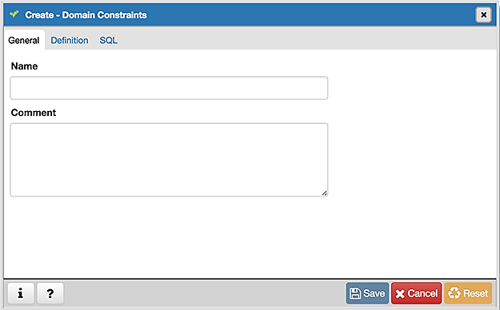
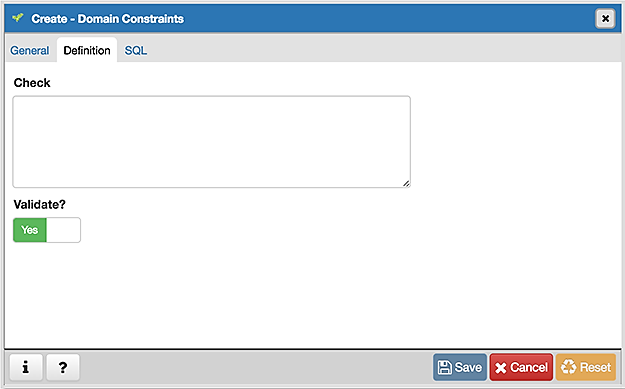
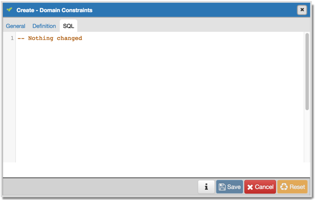

.. _domain_constraint_dialog:

**********************************
`Domain Constraints Dialog`:index:
**********************************

Use the *Domain Constraints* dialog to create or modify a domain constraint. A
domain constraint confirms that the values provided for a domain meet a defined
criteria. The *Domain Constraints* dialog implements options of the ALTER DOMAIN
command.

The *Domain Constraints* dialog organizes the development of a domain constraint
through the following dialog tabs: *General* and *Definition*. The *SQL* tab
displays the SQL code generated by dialog selections.

Use the fields in the *General* tab to identify the domain constraint:

* Use the *Name* field to add a descriptive name for the constraint. The name
  will be displayed in the *pgAdmin* tree control.
* Store notes about the constraint in the *Comment* field.

Click the *Definition* tab to continue.

Use the fields in the *Definition* tab to define the domain constraint:

* Use the *Check* field to provide a CHECK expression. A CHECK expression
  specifies a constraint that the domain must satisfy. A constraint must produce
  a Boolean result; include the key word VALUE to refer to the value being
  tested. Only those expressions that evaluate to TRUE or UNKNOWN will succeed.
  A CHECK expression cannot contain subqueries or refer to variables other than
  VALUE. If a domain has multiple CHECK constraints, they will be tested in
  alphabetical order.
* Move the *Validate?* switch to the *No* position to mark the constraint NOT
  VALID. If the constraint is marked NOT VALID, the constraint will not be
  applied to existing column data. The default value is *Yes*.

Click the *SQL* tab to continue.

Your entries in the *Domain Constraints* dialog generate a SQL command (see an
example below). Use the *SQL* tab for review; revisit or switch tabs to make any
changes to the SQL command.

Example
*******

The following is an example of the sql command generated by user selections in
the *Domain Constraints* dialog:

The example shown demonstrates creating a domain constraint on the domain
*timesheets* named *weekday*. It constrains a value to equal *Friday*.

* Click the *Info* button (i) to access online help.
* Click the *Save* button to save work.
* Click the *Cancel* button to exit without saving work.
* Click the *Reset* button to restore configuration parameters.

