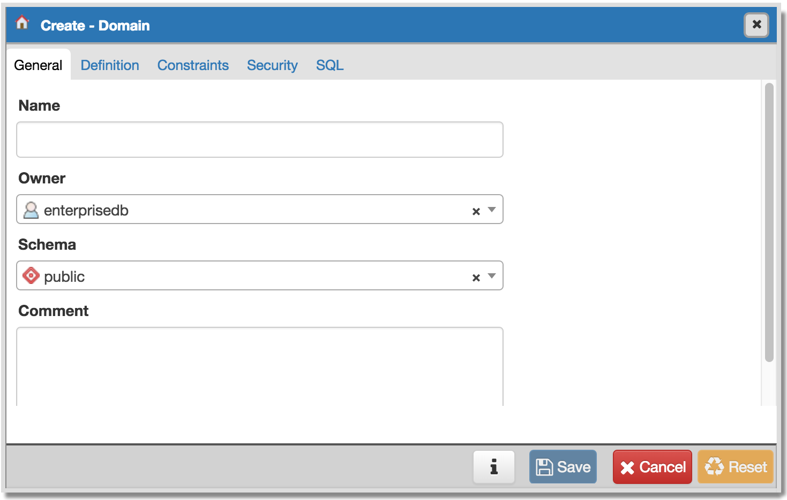
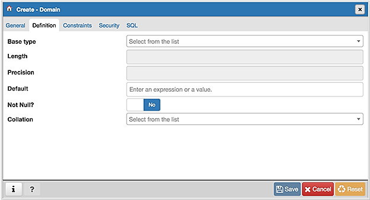
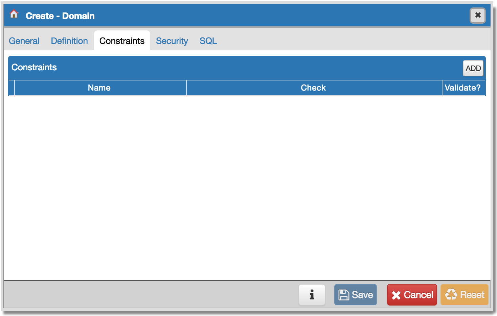
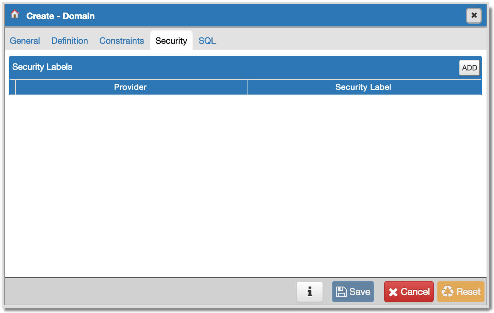
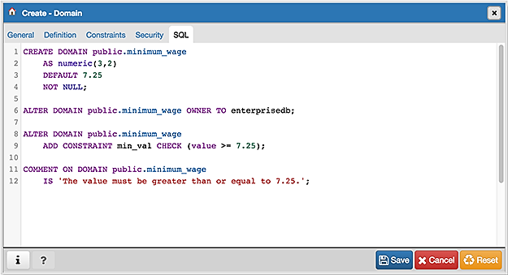

.. _domain_dialog:

**********************
`Domain Dialog`:index:
**********************

Use the *Domain* dialog to define a domain. A domain is a data type definition
that may constrain permissible values. Domains are useful when you are creating
multiple tables that contain comparable columns; you can create a domain that
defines constraints that are common to the columns and re-use the domain
definition when creating the columns, rather than individually defining each
set of constraints.

The *Domain* dialog organizes the development of a domain through the following
tabs: *General*, *Definition*, *Constraints*, and *Security*. The *SQL* tab
displays the SQL code generated by dialog selections.

Use the fields on the *General* tab to identify a domain:

* Use the *Name* field to add a descriptive name for the domain. The name will
  be displayed in the *pgAdmin* tree control.
* Use the drop-down listbox next to *Owner* to select a role that will own the
  domain.
* Select the name of the schema in which the domain will reside from the
  drop-down listbox in the *Schema* field.
* Store notes about the domain in the *Comment* field.

Click the *Definition* tab to continue.

Use the fields in the *Definition* tab to describe the domain:

* Use the drop-down listbox next to *Base type* to specify a data type.
* Use the context-sensitive *Length* field to specify a numeric length for a
  numeric type.
* Use the context-sensitive *Precision* field to specify the total count of
  significant digits for a numeric type.
* Specify a default value for the domain data type in the *Default* field. The
  data type of the default expression must match the data type of the domain. If
  no default value is specified, then the default value is the null value.
* Move the *Not Null* switch to specify the values of this domain are prevented
  from being null.
* Use the drop-down listbox next to *Collation* to apply a collation cast. If
  no collation is specified, the underlying data type's default collation is
  used. The underlying type must be collatable if COLLATE is specified.

Click the *Constraints* tab to continue.

Use the fields in the *Constraints* tab to specify rules for the domain. Click
the *Add* icon (+) to set constraints:

* Use the *Name* field to specify a name for the constraint.
* Use the *Check* field to provide an expression for the constraint.
* Use the *Validate* checkbox to determine whether the constraint will be
  validated. The default checkbox is checked and sets a validation requirement.

A CHECK clause specifies an integrity test which values of the domain must
satisfy. Each constraint must be an expression that produces a Boolean result.
Use the key word VALUE to refer to the value being tested. Expressions
evaluating to TRUE or UNKNOWN succeed. If the expression produces a FALSE
result, an error is reported and the value is not allowed to be converted to
the domain type.  A CHECK expression cannot contain subqueries nor refer to
variables other than VALUE.  If a domain has multiple CHECK constraints, they
will be tested in alphabetical order by name.

Click the *Add* icon (+) to set additional constraints; to discard a constraint,
click the trash icon to the left of the row and confirm deletion in the *Delete
Row* popup.

Click the *Security* tab to continue.

Use the *Security Labels* panel to assign security labels. Click the *Add* icon
(+) to add a label:

* Specify a security label provider in the *Provider* field. The named provider
  must be loaded and must consent to the proposed labeling operation.
* Specify a a security label in the *Security Label* field. The meaning of a
  given label is at the discretion of the label provider. PostgreSQL places no
  restrictions on whether or how a label provider must interpret security
  labels; it merely provides a mechanism for storing them.

Click the *Add* icon (+) to specify each additional label; to discard a label,
click the trash icon to the left of the row and confirm deletion in the *Delete
Row* popup.

Click the *SQL* tab to continue.

Your entries in the *Domain* dialog generate a SQL command (see an example
below). Use the *SQL* tab for review; revisit or switch tabs to make any changes
to the SQL command.

Example
*******

The following is an example of the sql command generated by selections made in
the *Domain* dialog:

The example shown demonstrates creating a domain named *postal_code* that
confirms that the value entered is in proper format.

* Click the *Info* button (i) to access online help.
* Click the *Save* button to save work.
* Click the *Close* button to exit without saving work.
* Click the *Reset* button to restore configuration parameters.

