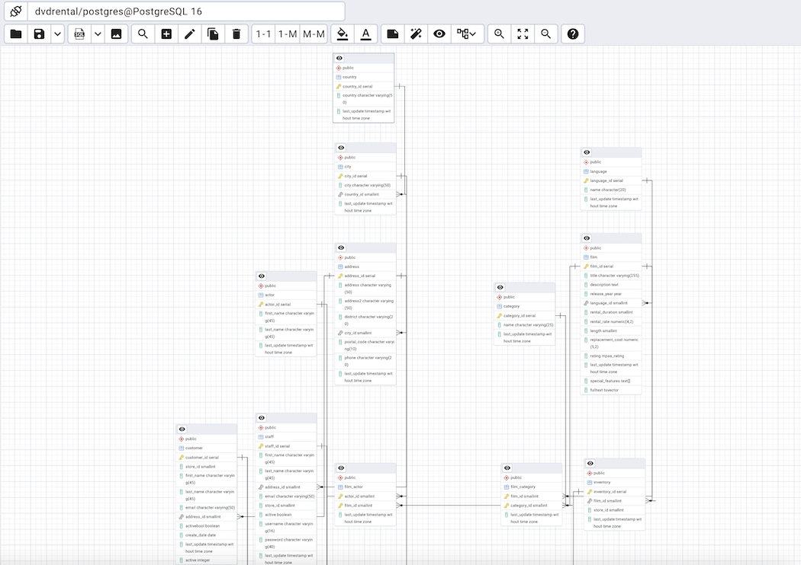
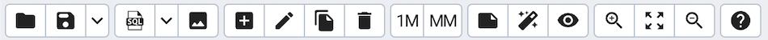
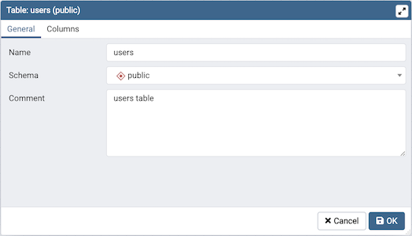
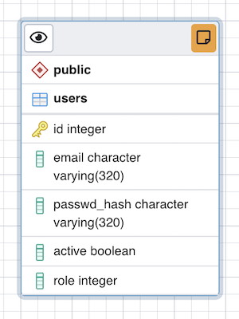
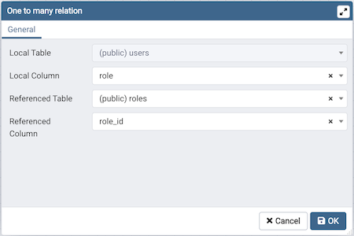
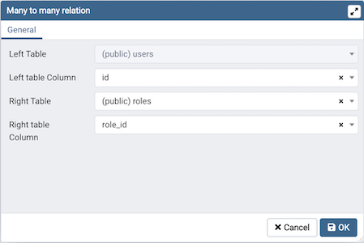
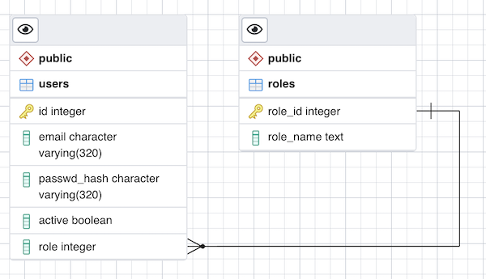
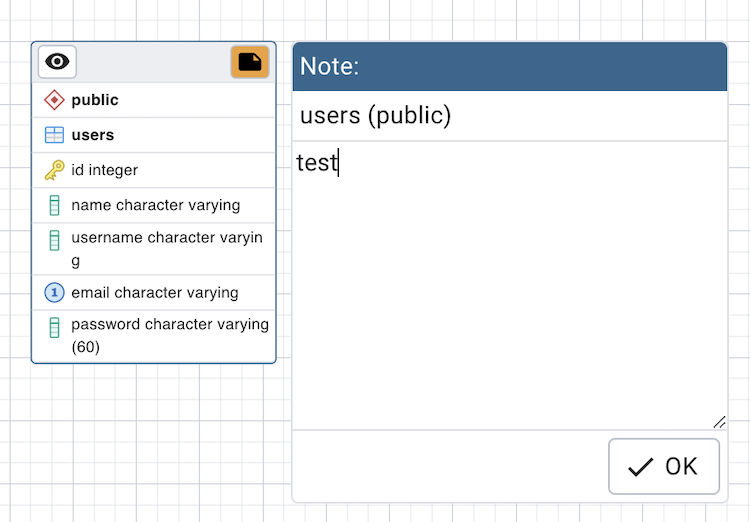

.. _erd_tool:

*****************
`ERD Tool`:index:
*****************

The Entity-Relationship Diagram (ERD) tool is a database design tool that provides a graphical representation of database tables, columns, and inter-relationships. ERD can give sufficient information for the database administrator to follow when developing and maintaining the database. The ERD Tool allows you to:

* Design and visualize the database tables and their relationships.
* Add notes to the diagram.
* Auto-align the tables and links for cleaner visualization.
* Save the diagram and open it later to continue working on it.
* Generate ready to run SQL from the database design.
* Generate the database diagram for an existing database.
* Drag and drop tables from object explorer to the diagram.

You can open multiple copies of the ERD tool in individual tabs simultaneously. To close a copy of the ERD tool, click the *X* in the upper-right hand corner of the tab bar.

Toolbar
*******

The *ERD Tool* toolbar uses context-sensitive icons that provide shortcuts to frequently performed tasks. The option is enabled for the highlighted icon and is disabled for the grayed-out icon.

Hover over an icon on Toolbar to display a tooltip that describes the icon's functionality.

File Options
************

.. table::
   :class: longtable
   :widths: 1 4 1

   +----------------------+---------------------------------------------------------------------------------------------------+----------------+
   | Icon                 | Behavior                                                                                          | Shortcut       |
   +======================+===================================================================================================+================+
   | *Open File*          | Click the *Open File* icon to load a previously saved diagram.                                    | Ctrl + O       |
   +----------------------+---------------------------------------------------------------------------------------------------+----------------+
   | *Save*               | Click the *Save* icon to perform a quick-save of a previously saved diagram, or to save the       | Ctrl + S       |
   |                      | diagram to a file.                                                                                |                |
   +----------------------+---------------------------------------------------------------------------------------------------+----------------+
   | *Save as*            | Click the *Save As* to open a new browser dialog and specify a new location to save the diagram.  | Ctrl + Shift + |
   |                      | You need to click the down arrow beside the save button to see *Save As*.                         | S              |
   +----------------------+---------------------------------------------------------------------------------------------------+----------------+

Export Options
**************

.. table::
   :class: longtable
   :widths: 1 4 1

   +----------------------+---------------------------------------------------------------------------------------------------+----------------+
   | Icon                 | Behavior                                                                                          | Shortcut       |
   +======================+===================================================================================================+================+
   | *Generate SQL*       | Click the *Generate SQL* icon to generate the DDL SQL for the diagram and open a query tool       | Option + Ctrl +|
   |                      | with the generated SQL ready for execution.                                                       | S              |
   |                      | You can select the option *With DROP Table* if you wish to have DROP Table DDL statements before  |                |
   |                      | each CREATE Table DDL. You can see the option by clicking the down arrow beside the SQL button.   |                |
   +----------------------+---------------------------------------------------------------------------------------------------+----------------+
   | *Download image*     | Click the *Download image* icon to save the ERD diagram in a image formate                        | Option + Ctrl +|
   |                      |                                                                                                   | I              |
   +----------------------+---------------------------------------------------------------------------------------------------+----------------+

Editing Options
***************

.. table::
   :class: longtable
   :widths: 1 4 1

   +----------------------+---------------------------------------------------------------------------------------------------+----------------+
   | Icon                 | Behavior                                                                                          | Shortcut       |
   +======================+===================================================================================================+================+
   | *Add table*          | Click this button to add a new table to the diagram. On clicking, this will open a table dialog   | Option/Alt +   |
   |                      | where you can put the table details.                                                              | Ctrl + A       |
   +----------------------+---------------------------------------------------------------------------------------------------+----------------+
   | *Edit table*         | Click this button to edit a table on the diagram. On clicking, this will open a table dialog      | Option/Alt +   |
   |                      | where you can change table details. This will enable when a table is selected.                    | Ctrl + E       |
   +----------------------+---------------------------------------------------------------------------------------------------+----------------+
   | *Clone table*        | Click this button to clone the complete table structure, name it with a auto generated name and   | Option/Alt +   |
   |                      | put it in the diagram.                                                                            | Ctrl + C       |
   +----------------------+---------------------------------------------------------------------------------------------------+----------------+
   | *Drop table/link*    | You can drop a table or link using this button. You need to select a table or link and click on   | Option/Alt +   |
   |                      | this button to drop it.                                                                           | Ctrl + D       |
   +----------------------+---------------------------------------------------------------------------------------------------+----------------+

Table Relationship Options
**************************

.. table::
   :class: longtable
   :widths: 1 4 1

   +----------------------+---------------------------------------------------------------------------------------------------+----------------+
   | Icon                 | Behavior                                                                                          | Shortcut       |
   +======================+===================================================================================================+================+
   | *1M*                 | Click this button to open a one-to-many relationship dialog to add a relationship between the     | Option/Alt +   |
   |                      | two tables. The selected table becomes the referencing table and will have the *many* endpoint of | Ctrl + O       |
   |                      | the link.                                                                                         |                |
   +----------------------+---------------------------------------------------------------------------------------------------+----------------+
   | *MM*                 | Click this button to open a many-to-many relationship dialog to add a relationship between the    | Option/Alt +   |
   |                      | two tables. This option will create a new table based on the selected columns for the two relating| Ctrl + M       |
   |                      | tables and link them.                                                                             |                |
   +----------------------+---------------------------------------------------------------------------------------------------+----------------+

Node Color Options
**************************

.. table::
   :class: longtable
   :widths: 1 5

   +----------------------+----------------------------------------------------------------------------------------------------------+
   | Icon                 | Behavior                                                                                                 |
   +======================+==========================================================================================================+
   | *Fill Color*         | Use Fill Color to change the background color of a table node. This is helpful if you want to            |
   |                      | identify a of group tables. Once set, all the newly added tables will take the same color.               |
   +----------------------+----------------------------------------------------------------------------------------------------------+
   | *Text Color*         | Use Text Color to change the text color of a table node based on the fill color to make text             |
   |                      | easily readable.                                                                                         |
   +----------------------+----------------------------------------------------------------------------------------------------------+

Utility Options
***************

.. table::
   :class: longtable
   :widths: 1 4 1

   +-------------------------+------------------------------------------------------------------------------------------------+----------------+
   | Icon                    | Behavior                                                                                       | Shortcut       |
   +=========================+================================================================================================+================+
   | *Add/Edit note*         | Click this button to make notes on tables nodes while designing the database.                  | Option/Alt +   |
   |                         |                                                                                                | Ctrl + N       |
   +-------------------------+------------------------------------------------------------------------------------------------+----------------+
   | *Auto align*            | Click this button to auto align all tables and links to make it look more cleaner.             | Option/Alt +   |
   |                         |                                                                                                | Ctrl + L       |
   +-------------------------+------------------------------------------------------------------------------------------------+----------------+
   | *Show details*          | Click this button to toggle the column details visibility. It allows you to show few or more   | Option/Alt +   |
   |                         | column details.                                                                                | Shift + D      |
   +-------------------------+------------------------------------------------------------------------------------------------+----------------+
   | *Cardinality Notation*  | Change the cardinality notation format used to present relationship links. Options available   |                |
   |                         | are - Crow's Foot Notation and Chen Notation.                                                  |                |
   +-------------------------+------------------------------------------------------------------------------------------------+----------------+

Zoom Options
************

.. table::
   :class: longtable
   :widths: 1 4 1

   +----------------------+---------------------------------------------------------------------------------------------------+----------------+
   | Icon                 | Behavior                                                                                          | Shortcut       |
   +======================+===================================================================================================+================+
   | *Zoom to fit*        | Click this button to zoom in/out automatically and fit all the tables to the view.                | Option/Alt +   |
   |                      |                                                                                                   | Shift + F      |
   +----------------------+---------------------------------------------------------------------------------------------------+----------------+
   | *Zoom in*            | Click this button to zoom in the diagram.                                                         | Option/Alt +   |
   |                      |                                                                                                   | Shift + "+"    |
   +----------------------+---------------------------------------------------------------------------------------------------+----------------+
   | *Zoom out*           | Click this button to zoom out the diagram.                                                        | Option/Alt +   |
   |                      |                                                                                                   | Shift + "-"    |
   +----------------------+---------------------------------------------------------------------------------------------------+----------------+

Table Dialog
************

The table dialog allows you to:

* Change the table structure details.
* It can be used edit an existing table or add a new one.
* Refer :ref:`table dialog <table_dialog>` for information on different fields.

Table Node
**********

The table node shows table details in a graphical representation:

* The top bar has a *details toggle button* that is used to toggle column details visibility. There is also a *note button* that is visible only if there is some note added. you can click on this button to quickly change the note.
* The first row shows the schema name of the table. Eg. *public* in above image.
* The second row shows the table name. Eg. *users* in above image.
* All other rows below the table name are the columns of the table along with data type. If the column is a primary key then it will have lock key icon eg. id is the primary key in above image. Otherwise, it will have column icon.
* you can click on the node and drag to move on the canvas.
* Upon double click on the table node or by clicking the edit button from the toolbar, the table dialog opens where you can change the table details. Refer :ref:`table dialog <table_dialog>` for information on different fields.

The One to Many Link Dialog
***************************

The one to many link dialog allows you to:

* Add a foreign key relationship between two tables.
* *Local Table* is the table that references a table and has the *many* end point.
* *Local Column* the column that references.
* *Referenced Table* is the table that is being referred and has the *one* end point.
* *Referenced Column* the column that is being referred.

The Many to Many Link Dialog
****************************

The many to many link dialog allows you to:

* Add a many to many relationship between two tables.
* It creates a relationship tables having columns derived from the two tables and link them to the tables.
* *Left Table* is the first table that is to be linked. It will receive the *one* endpoint of the link with the new relation table.
* *Left Column* the column of the first table, that will always be a primary key.
* *Right Table* is the second table that is to be linked. It will receive the *one* endpoint of the link with the new relation table.
* *Right Column* the column of the second table, that will always be a primary key.

The Table Link
**************

The table link shows relationship between tables:

* The single line endpoint of the link shows the column that is being referred.
* The three line endpoint of the link shows the column that refers.
* If one of the columns that is being referred or that refers is removed from the table then the link will get dropped.
* you can click on the link and drag to move on the canvas.

The Table Notes
***************

* You can use the notes popup to mark some notes while designing the database.
* You open the pop-up using the toolbar note button.
* If some note is added to a table then it will have notes button on the table node. You can click on the button to check/update notes.
