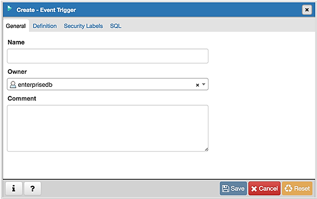
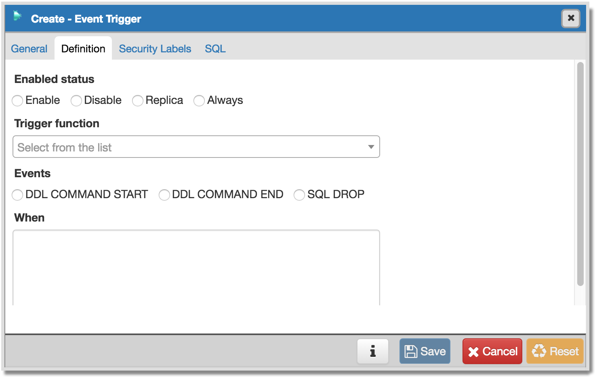
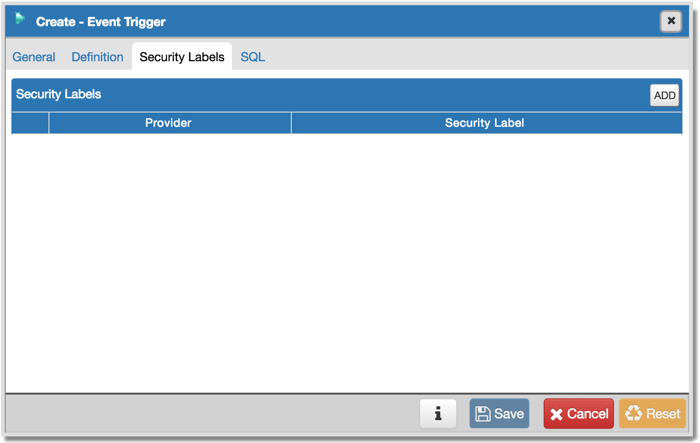
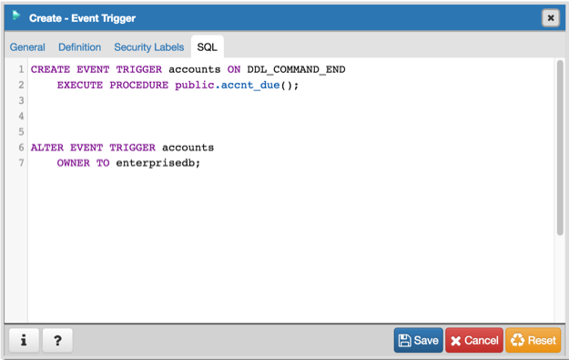

.. _event_trigger_dialog:

*****************************
`Event Trigger Dialog`:index:
*****************************

Use the *Event Trigger* dialog to define an event trigger. Unlike regular
triggers, which are attached to a single table and capture only DML events,
event triggers are global to a particular database and are capable of capturing
DDL events.  Like regular triggers, event triggers can be written in any
procedural language that includes event trigger support, or in C, but not in
SQL.

The *Event Trigger* dialog organizes the development of a event trigger through
the following dialog tabs: *General*, *Definition*, and *Security Labels*. The
*SQL* tab displays the SQL code generated by dialog selections.

Use the fields in the *General* tab to identify the event trigger:

* Use the *Name* field to add a descriptive name for the event trigger. The name
  will be displayed in the *pgAdmin* tree control.
* Use the drop-down listbox next to *Owner* to specify the owner of the event
  trigger.
* Store notes about the event trigger in the *Comment* field.

Click the *Definition* tab to continue.

Use the fields in the *Definition* tab to define the event trigger:

* Select a value from the drop down of *Trigger Enabled* field to specify a status
  for the trigger: *Enable* *Disable*, *Replica* *Always*.
* Use the drop-down listbox next to *Trigger function* to specify an existing
  function.  A trigger function takes an empty argument list, and returns a
  value of type event_trigger.
* Select a value from the drop down of *Events* field to specify when the event
  trigger will fire: *DDL COMMAND START*, *DDL COMMAND END*, or *SQL DROP*.
* Use the *When TAG in* field to enter filter values for TAG for which the trigger
  will be executed. The values must be in single quotes separated by comma.

Click the *Security Labels* tab to continue.

Use the *Security* tab to define security labels applied to the trigger. Click
the *Add* icon (+) to add each security label.

* Specify a security label provider in the *Provider* field. The named provider
  must be loaded and must consent to the proposed labeling operation.
* Specify a security label in the *Security Label* field. The meaning of a given
  label is at the discretion of the label provider. PostgreSQL places no
  restrictions on whether or how a label provider must interpret security
  labels; it merely provides a mechanism for storing them.

Click the *Add* icon (+) to assign additional security labels; to discard a
security label, click the trash icon to the left of the row and confirm deletion
in the *Delete Row* popup.

Click the *SQL* tab to continue.

Your entries in the *Event Trigger* dialog generate a generate a SQL command.
Use the *SQL* tab for review; revisit or switch tabs to make any changes to the
SQL command.

Example
*******

The following is an example of the sql command generated by user selections in
the *Event Trigger* dialog:

The command creates an event trigger named *accounts* that invokes the procedure
named *evt_tri_fun*.

* Click the *Info* button (i) to access online help.
* Click the *Save* button to save work.
* Click the *Close* button to exit without saving work.
* Click the *Reset* button to restore configuration parameters.

