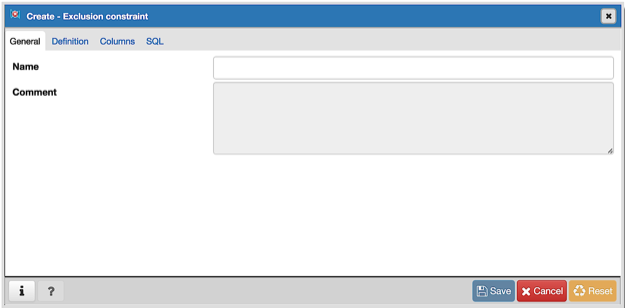
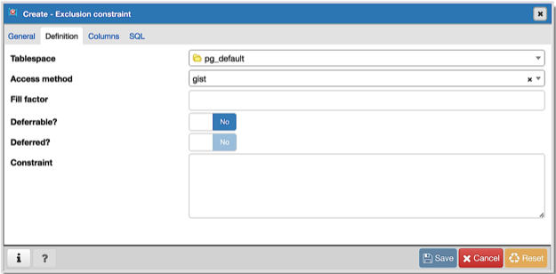
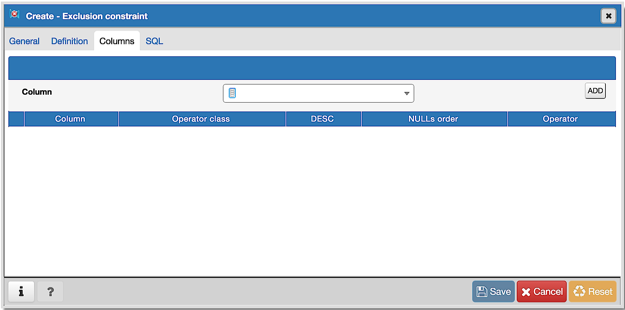
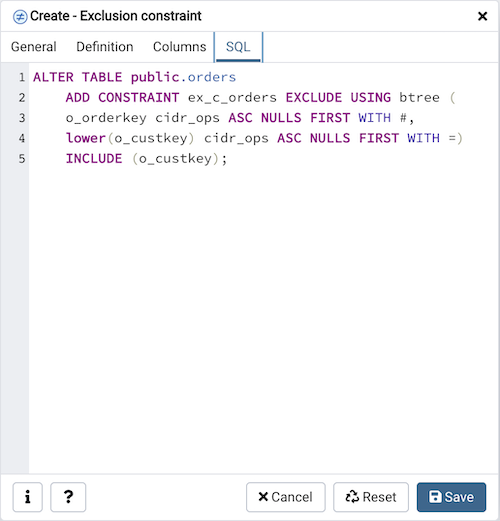

.. _exclusion_constraint_dialog:

************************************
`Exclusion Constraint Dialog`:index:
************************************

Use the *Exclusion constraint* dialog to define or modify the behavior of an
exclusion constraint. An exclusion constraint guarantees that if any two rows
are compared on the specified column or expression (using the specified
operator), at least one of the operator comparisons will return false or null.

The *Exclusion constraint* dialog organizes the development of an exclusion
constraint through the following dialog tabs: *General*, *Definition*, and
*Columns*. The *SQL* tab displays the SQL code generated by dialog selections.

Use the fields in the *General* tab to identify the exclusion constraint:

* Use the *Name* field to provide a descriptive name for the exclusion
  constraint. The name will be displayed in the *pgAdmin* tree control.

Click the *Definition* tab to continue.

Use the fields in the *Definition* tab to define the exclusion constraint:

* Use the drop-down listbox next to *Tablespace* to select the tablespace in
  which the index associated with the exclude constraint will reside.
* Use the drop-down listbox next to *Access method* to specify the type of
  index that will be used when implementing the exclusion constraint:

    * Select *gist* to specify a GiST index.
    * Select *spgist* to specify a space-partitioned GiST index.
    * Select *btree* to specify a B-tree index.
    * Select *hash* to specify a hash index.

* Use the *Fill Factor* field to specify a fill factor for the table and
  associated index. The fill factor is a percentage between 10 and 100. 100
  (complete packing) is the default.
* Move the *Deferrable?* switch to the *Yes* position to specify that the
  timing of the constraint is deferrable, and can be postponed until the end of
  the statement. The default is *No*.
* If enabled, move the *Deferred?* switch to the *Yes* position to specify the
  timing of the constraint is deferred to the end of the statement. The default
  is *No*.
* Use the *Constraint* field to provide a condition that a row must satisfy to
  be included in the table.

Click the *Columns* tab to continue.

Use the fields in the *Columns* tab to to specify the column(s) to which the
constraint applies. Use the drop-down listbox next to *Column* to select a
column and click the *Add* icon (+) to provide details of the action on the
column:

* The *Column* field is populated with the selection made in the *Column*
  drop-down listbox.
* If applicable, use the drop-down listbox in the *Operator class* to specify
  the operator class that will be used by the index for the column.
* Move the *DESC* switch to *DESC* to specify a descending sort order. The
  default is *ASC* which specifies an ascending sort order.
* Use the *NULLs order* column to specify the placement of NULL values (when
  sorted).  Specify *FIRST* or *LAST*.
* Use the drop-down list next to *Operator* to specify a comparison or
  conditional operator.

Use *Include columns* field to specify columns for *INCLUDE* clause of the
constraint. This option is available in Postgres 11 and later.

Click the *SQL* tab to continue.

Your entries in the *Exclusion Constraint* dialog generate a SQL command (see
an example below). Use the *SQL* tab for review; revisit or switch tabs to make
any changes to the SQL command.

Example
*******

The following is an example of the sql command generated by user selections in
the *Exclusion Constraint* dialog:

The example shown demonstrates creating an exclusion constraint named
*exclude_department* that restricts additions to the dept table to those
additions that are not equal to the value of the *deptno* column.  The
constraint uses a btree index.

* Click the *Info* button (i) to access online help.
* Click the *Save* button to save work.
* Click the *Cancel* button to exit without saving work.
* Click the *Reset* button to restore configuration parameters.