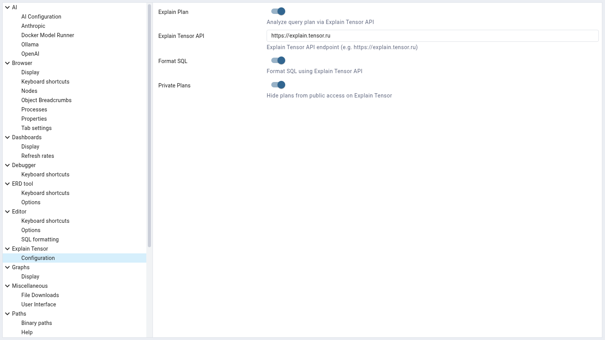

.. _expl_tensor:

***************************
`Explain Tensor`:index:
***************************

**Explain Tensor** is a powerful module integrated into pgAdmin 4 that enables advanced analysis of query execution plans and beautification of SQL code. This tool helps developers and DBAs understand how PostgreSQL executes queries, identify performance bottlenecks, and optimize database workloads effectively.

Key Features:

 * Visual representation of query execution plans with detailed node information.
 * SQL formatting and beautification capabilities for improved readability.
 * Integration with pgAdmin’s browser interface for seamless workflow.

**Requirements:**

Before using the Explain Tensor module, ensure the following:

 1. You are connected to a PostgreSQL server with sufficient privileges to execute commands.

 2. Ensure Explain Tensor are enabled in the server configuration (set ``EXPLAIN_TENSOR_ENABLED`` to ``True`` in ``config.py``).

 3. Configure Explain Tensor in :ref:`Preferences → Explain Tensor <the-explain-tensor-node>`.

**Note:**

 * Using Explain Tensor requires an active internet connection.

 * When analyzing query plans via Explain Tensor, the plan and query are sent to a third-party service
   (by default: https://explain.tensor.ru).

Configuring Explain Tensor
******************************

To configure Explain Tensor, navigate to *File → Preferences → Explain Tensor*.

1. Set the **Explain Plan** switch to *True*.

2. Enter the *Explain Tensor API* URL (default: https://explain.tensor.ru).

3. Set the **Format SQL** switch to *True* if you want to use the SQL formatting capability.

4. Set the **Private Plans** switch to *True* if you want to store plans in your personal archive.

After configuring, click *Save* to apply the changes.

Using Explain Tensor
*************************

To analyze a query plan:

1. Open the **Query Tool** in pgAdmin.

2. Enter your SQL query (e.g., ``SELECT * FROM pg_stat_activity``).

3. Select the ``Buffers`` and ``Timing`` options from the dropdown menu next to the **Explain Analyze** button in the toolbar.

4. Click the **Explain Analyze** button in the toolbar (or press ``Shift+F7``) to generate the execution plan.
   
   Upon successful generation, the *Explain Tensor* panel will appear.

 .. image:: images/expl_tensor_analyze.png
    :alt: Example of Explain Tensor output
    :align: center

Understanding Execution Plans
*****************************

Each node in the execution plan represents a step in query processing. The Explain Tensor module displays:

 * **Plan Tree** – A simplified view of the execution algorithm. Numeric indicators are displayed separately and highlighted with colors indicating load intensity.
   
   Hover over nodes for tooltips with extended information. Nodes are color-coded based on performance impact:

    * Green – Low cost
    * Yellow – Medium cost
    * Red – High cost (potential bottleneck)

 .. image:: images/expl_tensor_plantree.png
    :alt: Example of Explain Tensor plan tree
    :align: center

 * **Diagram** – Shows real dependencies between nodes and resource flows.

 .. image:: images/expl_tensor_diagram.png
    :alt: Example of Explain Tensor diagram
    :align: center

 * **Schema** – Visualizes database tables and their relationships.

 .. image:: images/expl_tensor_schema.png
    :alt: Example of Explain Tensor schema
    :align: center

 * **Statistics** – Summary statistics allow you to analyze large plans in aggregated form, sorted by any metric such as execution time, disk reads, cache usage, or filtered rows.

 .. image:: images/expl_tensor_stats.png
    :alt: Example of Explain Tensor statistics
    :align: center

 * **Pie Chart** – Helps quickly identify dominant nodes and their approximate share of resource consumption.

 .. image:: images/expl_tensor_piechart.png
    :alt: Example of Explain Tensor pie chart
    :align: center

 * **Tiled Visualization** – Allows compact evaluation of node connections in large plans and highlights problematic sections.

 .. image:: images/expl_tensor_tilemap.png
    :alt: Example of Explain Tensor tiled visualization
    :align: center

 * **Smart Recommendations** – Automatically generated based on structural and resource metrics, these provide precise guidance on resolving performance issues.

 .. image:: images/expl_tensor_recs.png
    :alt: Example of Explain Tensor recommendations
    :align: center

 * **Personal Archive** – Contains all the plans you've analyzed, giving you instant access regardless of whether they were published publicly.

 .. image:: images/expl_tensor_personal.png
    :alt: Example of Explain Tensor personal archive
    :align: center

Formatting SQL Code
*******************

The **Format SQL** feature automatically indents and aligns SQL statements for better clarity.

To format the SQL query, use the *Edit* → *Format SQL* button (or press ``Ctrl+K``).

Example input:

.. code-block:: sql

 SELECT u.name, p.title FROM users u JOIN posts p ON u.id=p.user_id WHERE u.active=true ORDER BY p.created_at DESC;

Formatted output:

.. code-block:: sql

 SELECT
 	u.name
 ,	p.title
 FROM
 	users u
 JOIN
 	posts p
 		ON u.id = p.user_id
 WHERE
 	u.active = TRUE
 ORDER BY
 	p.created_at DESC;

This makes complex queries easier to read and debug.

