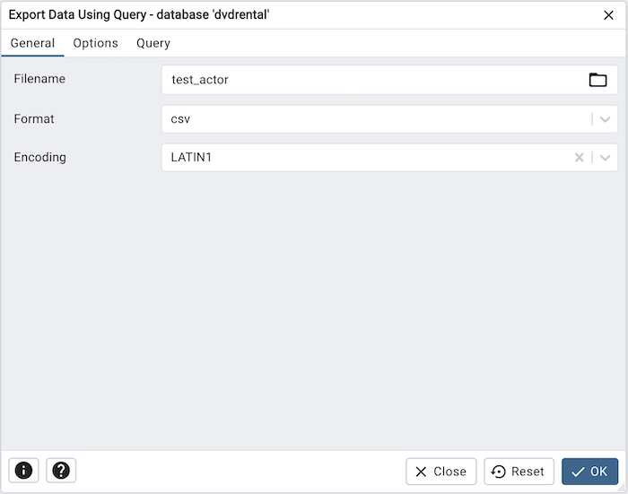
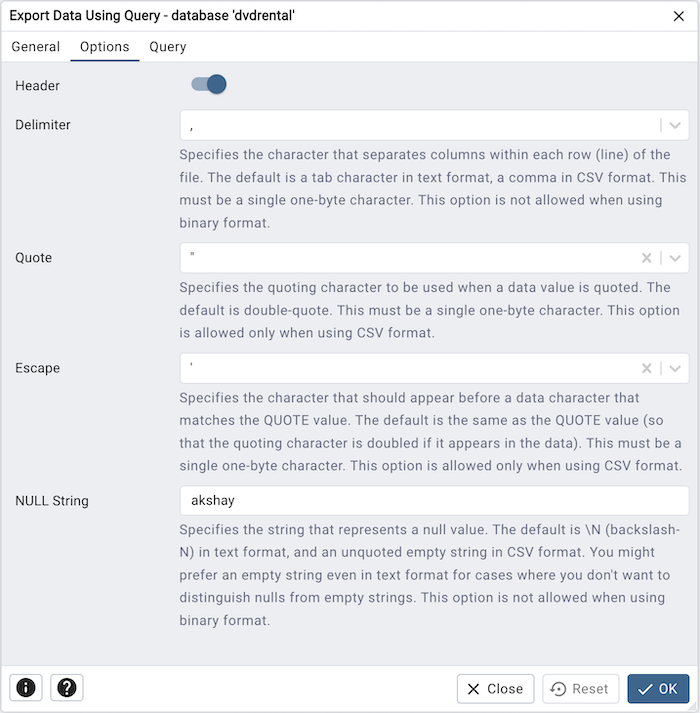
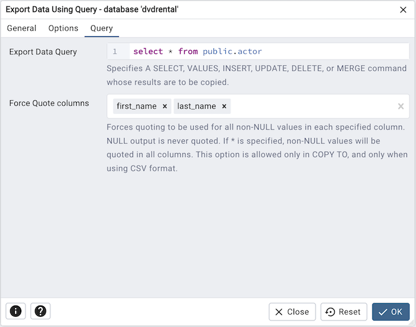
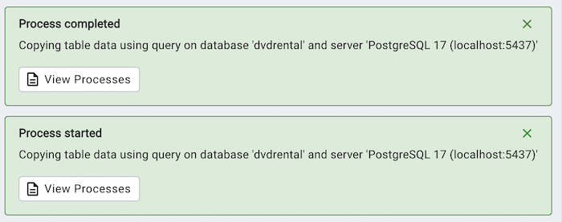
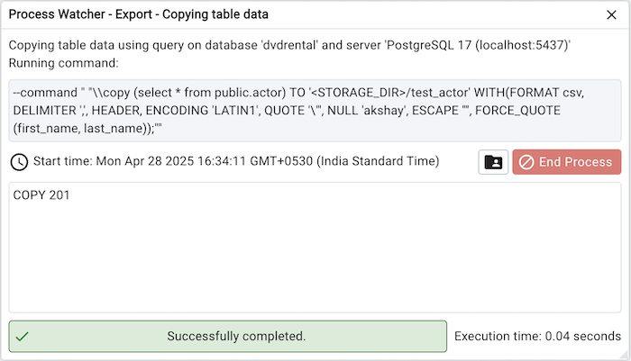

.. _export_data_using_query:

***************************************
`Export Data Using Query Dialog`:index:
***************************************

Use the *Export Data Using Query* dialog to copy data to a file.

The *Export Data Using Query* dialog organizes the export of data through the
*General*, *Options* and *Query* tabs.

Use the fields in the *General* tab to specify export preferences:

* Enter the name of the target file in the *Filename* field.
  Optionally, select the *Browse* icon (ellipsis) to the right to navigate
  into a directory and select a file.

* Use the drop-down listbox in the *Format* field to specify the file type.
  Select:

  * *binary* for a .bin file.
  * *csv* for a .csv file.
  * *text* for a .txt file.

* Use the drop-down listbox in the *Encoding* field to specify the type of
  character encoding.

* Use the fields in the *Options* tab to specify additional information:

   * Move the *Header* switch to the *Yes* position to include the table header
     with the data rows. If you include the table header, the first row of the
     file will contain the column names.
   * If you are exporting data, specify the delimiter that will separate the
     columns within the target file in the *Delimiter* field. The separating
     character can be a colon, semicolon, a vertical bar, or a tab.
   * Specify a quoting character used in the *Quote* field. Quoting can be
     applied to string columns only (i.e. numeric columns will not be quoted)
     or all columns regardless of data type. The character used for quoting can
     be a single quote or a double quote.
   * Specify a character that should appear before a data character that matches
     the *QUOTE* value in the *Escape* field.
   * Use the *NULL String* field to specify a string that will represent a null
     value within the source or target file.

Click the *Query* tab to continue.

Use the fields in the *Query* tab to write the query that will be exported:

* Use the *Export Data Query* field to specifies A SELECT, VALUES, INSERT, UPDATE,
  DELETE, or MERGE command whose results are to be copied .

* Use *Force Quote columns* field to forces quoting to be used for all non-NULL
  values in each specified column. NULL output is never quoted. This is a creatable
  select control. If you would like to quote all columns then provide only '*' in
  the field.

After completing the *Export Data Using Query* dialog, click the *OK* button to
perform the export. pgAdmin will notify you when the background
process completes:

Use the *View Processes* button on the notification to open the *Process
Watcher* and review detailed information about the execution of the command
that performed the export:

Use the **End Process** button to end the Export process.

.. note:: If you are running *pgAdmin* in *Server Mode* you can click on the |sm_icon| icon in the process watcher window to open the file location in the Storage Manager. You can use the :ref:`Storage Manager <storage_manager>` to download the exported file on the client machine .

.. |sm_icon| image:: images/sm_icon.png
