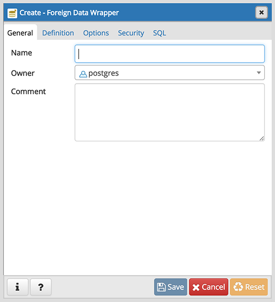
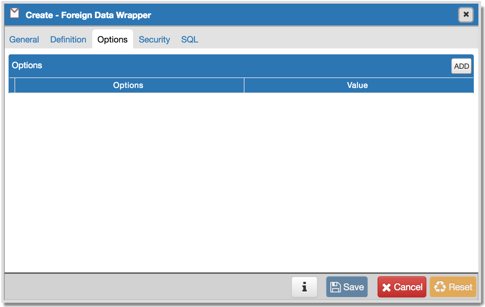
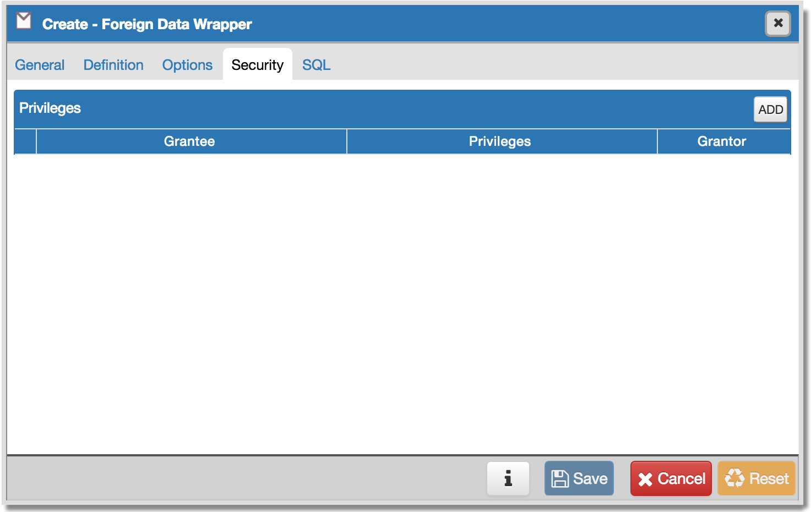
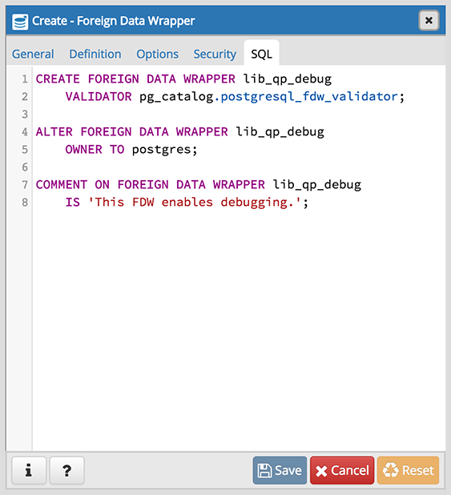

.. _foreign_data_wrapper_dialog:

************************************
`Foreign Data Wrapper Dialog`:index:
************************************

Use the *Foreign Data Wrapper* dialog to create or modify a foreign data
wrapper. A foreign data wrapper is an adapter between a Postgres database and
data stored on another data source.

You must be a superuser to create a foreign data wrapper.

The *Foreign Data Wrapper* dialog organizes the development of a foreign data
wrapper through the following dialog tabs: *General*, *Definition*, *Options*,
and *Security*. The *SQL* tab displays the SQL code generated by dialog
selections.

Use the fields in the *General* tab to identify the foreign data wrapper:

* Use the *Name* field to add a descriptive name for the foreign data wrapper.
  A foreign data wrapper name must be unique within the database. The name will
  be displayed in the *pgAdmin* tree control.
* Use the drop-down listbox next to *Owner* to select the name of the role that
  will own the foreign data wrapper.
* Store notes about the foreign data wrapper in the *Comment* field.

Click the *Definition* tab to continue.

.. image:: images/foreign_data_wrapper_definition.png
    :alt: Foreign data wrapper dialog definition tab
    :align: center

Use the fields in the *Definition* tab to set parameters:

* Select the name of the handler function from the drop-down listbox in the
  *Handler* field. This is the name of an existing function that will be called
  to retrieve the execution functions for foreign tables.
* Select the name of the validator function from the drop-down listbox in the
  *Validator* field. This is the name of an existing function that will be
  called to check the generic options given to the foreign data wrapper, as
  well as options for foreign servers, user mappings and foreign tables using
  the foreign data wrapper.

Click the *Options* tab to continue.

Use the fields in the *Options* tab to specify options:

* Click the the *Add* icon (+) button to add an option/value pair for the
  foreign data wrapper. Supported option/value pairs will be specific to the
  selected foreign data wrapper.
* Specify the option name in the *Option* field and provide a corresponding
  value in the *Value* field.

Click the *Add* icon (+) to specify each additional pair; to discard an option,
click the trash icon to the left of the row and confirm deletion in the *Delete
Row* popup.

Click the *Security* tab to continue.

Use the *Security* tab to assign security privileges. Click the *Add* icon (+)
to assign a set of privileges.

* Select the name of the role from the drop-down listbox in the *Grantee* field.
* Click inside the *Privileges* field. Check the boxes to the left of one or
  more privileges to grant the selected privileges to the specified user.
* The current user, who is the default grantor for granting the privilege, is displayed in the *Grantor* field.

Click add to assign additional privileges; to discard a privilege, click the
trash icon to the left of the row and confirm deletion in the *Delete Row*
popup.

Click the *SQL* tab to continue.

Your entries in the *Foreign Data Wrapper* dialog generate a SQL command (see an
example below). Use the *SQL* tab for review; revisit or switch tabs to make any
changes to the SQL command.

Example
*******

The following is an example of the sql command generated by user selections in
the *Foreign Data Wrapper* dialog:

The example creates a foreign data wrapper named *libpq_debug* that uses
pre-existing validator and handler functions, *dblink_fdw_validator* and
*libpg_fdw_handler*.  Selections on the *Options* tab set *debug* equal to
*true*.  The foreign data wrapper is owned by *postgres*.

* Click the *Help* button (?) to access online help.
* Click the *Save* button to save work.
* Click the *Cancel* button to exit without saving work.
* Click the *Reset* button to restore configuration parameters.
