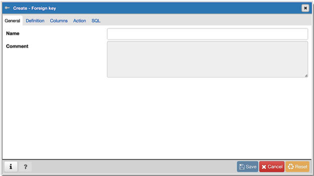
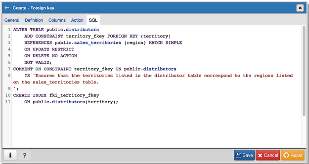

.. _foreign_key_dialog:

***************************
`Foreign key Dialog`:index:
***************************

Use the *Foreign key* dialog to specify the behavior of a foreign key
constraint. A foreign key constraint maintains referential integrity between
two tables.  A foreign key constraint cannot be defined between a temporary
table and a permanent table.

The *Foreign key* dialog organizes the development of a foreign key constraint
through the following dialog tabs: *General*, *Definition*, *Columns*, and
*Action*. The *SQL* tab displays the SQL code generated by dialog selections.

Use the fields in the *General* tab to identify the foreign key constraint:

* Use the *Name* field to add a descriptive name for the foreign key. The name
  will be displayed in the *pgAdmin* tree control.
* Store notes about the foreign key constraint in the *Comment* field.

Click the *Definition* tab to continue.

.. image:: images/foreign_key_definition.png
    :alt: Foreign key dialog definition tab
    :align: center

Use the fields in the *Definition* tab to define the foreign key constraint:

* Move the *Deferrable?* switch to the *Yes* position to specify the timing of
  the constraint is deferrable and can be postponed until the end of the
  statement. The default is *No*.
* If enabled, move the *Deferred?* switch to the *Yes* position to specify the
  timing of the constraint is deferred to the end of the statement. The default
  is *No*.
* Move the *Match type* switch specify the type of matching that is enforced by
  the constraint:

    * Select *Full* to indicate that all columns of a multicolumn foreign key
      must be null if any column is null; if all columns are null, the row is
      not required to have a match in the referenced table.
    * Select *Simple* to specify that a single foreign key column may be null;
      if any column is null, the row is not required to have a match in the
      referenced table.

* Move the *Validated* switch to the *Yes* position to instruct the server to
  validate the existing table content (against a foreign key or check
  constraint) when you save modifications to this dialog.
* Move the *Auto FK Index* switch to the *No* position to disable the automatic
  index feature.
* The field next to *Covering Index* generates the name of an index if the *Auto
  FK Index* switch is in the *Yes* position; or, this field is disabled.

Click the *Columns* tab to continue.

.. image:: images/foreign_key_columns.png
    :alt: Foreign key dialog columns tab
    :align: center

Use the fields in the *Columns* tab to specify one or more reference column(s).
A Foreign Key constraint requires that one or more columns of a table must only
contain values that match values in the referenced column(s) of a row of a
referenced table:

* Use the drop-down listbox next to *Local column* to specify the column in the
  current table that will be compared to the foreign table.
* Use the drop-down listbox next to *References* to specify the name of the
  table in which the comparison column(s) resides.
* Use the drop-down listbox next to *Referencing* to specify a column in the
  foreign table.

Click the *Add* icon (+) to add a column to the list; repeat the steps above and
click the *Add* icon (+) to add additional columns. To discard an entry, click
the trash icon to the left of the entry and confirm deletion in the *Delete Row*
popup.

Click the *Action* tab to continue.

.. image:: images/foreign_key_action.png
    :alt: Foreign key dialog action tab
    :align: center

Use the drop-down listboxes on the *Action* tab to specify behavior related to
the foreign key constraint that will be performed when data within the table is
updated or deleted:

* Use the drop-down listbox next to *On update* to select an action that will be
  performed when data in the table is updated.
* Use the drop-down listbox next to *On delete* to select an action that will be
  performed when data in the table is deleted.

The supported actions are:

+-------------+------------------------------------------------------------------------------------------------------------+
| NO ACTION   | Produce an error indicating that the deletion or update will create a foreign key constraint violation.    |
|             | If the constraint is deferred, this error will be produced at constraint check time if any referencing     |
|             | rows still exist.  This is the default.                                                                    |
+-------------+------------------------------------------------------------------------------------------------------------+
| RESTRICT    | Throw an error indicating that the deletion or update would create a foreign key constraint violation.     |
|             | This is the same as NO ACTION except that the check is not deferrable.                                     |
+-------------+------------------------------------------------------------------------------------------------------------+
| CASCADE     | Delete any rows referencing the deleted row, or update the values of the referencing column(s) to the new  |
|             | values of the referenced columns, respectively.                                                            |
+-------------+------------------------------------------------------------------------------------------------------------+
| SET NULL    | Set the referencing column(s) to null.                                                                     |
+-------------+------------------------------------------------------------------------------------------------------------+
| SET DEFAULT | Set the referencing column(s) to their default values.  There must be a row in the referenced table        |
|             | that matches the default values (if they are not null), or the operation will fail.                        |
+-------------+------------------------------------------------------------------------------------------------------------+

Click the *SQL* tab to continue.

Your entries in the *Foreign key* dialog generate a SQL command (see an example
below). Use the *SQL* tab for review; revisit or switch tabs to make any changes
to the SQL command.

Example
*******

The following is an example of the sql command generated by user selections in
the *Foreign key* dialog:

The example shown demonstrates creating a foreign key constraint named
*jobhist_ref_dept_fk* that matches values in the *jobhist* table *dept_no*
column with those of the *dept* table *deptno* column.

* Click the *Info* button (i) to access online help.
* Click the *Save* button to save work.
* Click the *Close* button to exit without saving work.
* Click the *Reset* button to restore configuration parameters.
