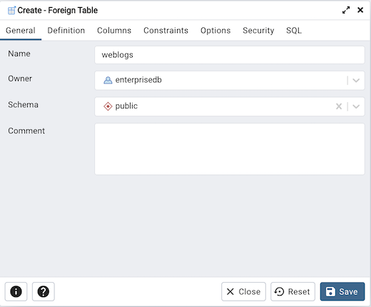
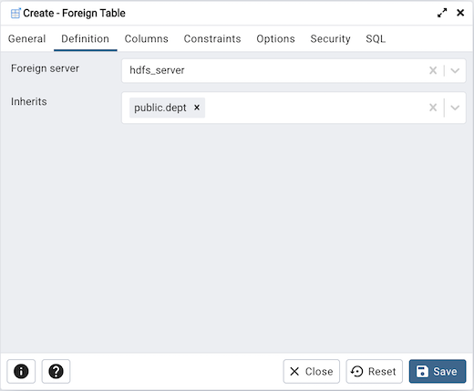
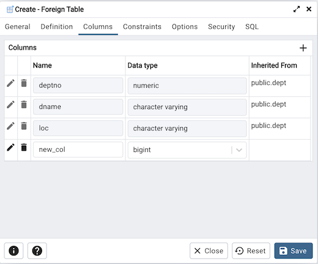
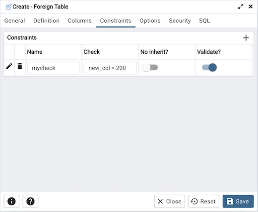
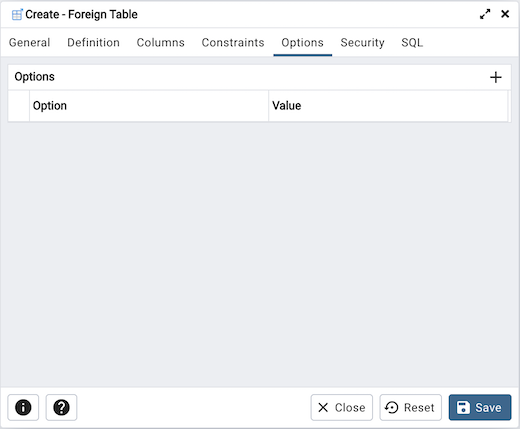
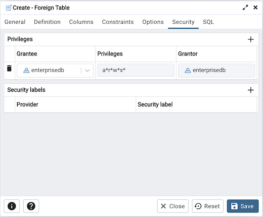
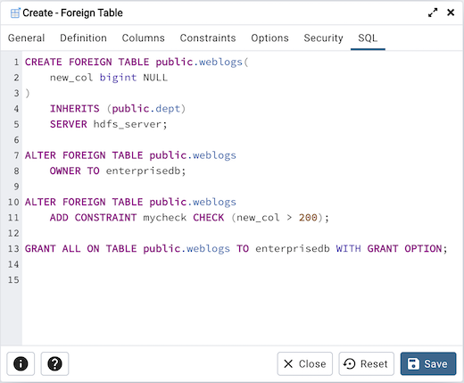

.. _foreign_table_dialog:

*****************************
`Foreign Table Dialog`:index:
*****************************

Use the *Foreign Table* dialog to define a foreign table in the current
database. Foreign tables define the structure of an external data source that
resides on a foreign server.

The *Foreign Table* dialog organizes the development of a foreign table through
the following dialog tabs: *General*, *Definition*, *Columns*, *Constraints*,
*Options*, and *Security*. The *SQL* tab displays the SQL code generated by
dialog selections.

Use the fields in the *General* tab to identify the foreign table:

* Use the *Name* field to add a descriptive name for the foreign table. The name
  of the foreign table must be distinct from the name of any other foreign
  table, table, sequence, index, view, existing data type, or materialized view
  in the same schema. The name will be displayed in the *pgAdmin* tree control.
* Use the drop-down listbox next to *Owner* to select the name of the role that
  will own the foreign table.
* Select the name of the schema in which the foreign table will reside from the
  drop-down listbox in the *Schema* field.
* Store notes about the foreign table in the *Comment* field.

Click the *Definition* tab to continue.

Use the fields in the *Definition* tab to define the external data source:

* Use the drop-down listbox next to *Foreign server* to select a foreign server.
  This list is populated with servers defined through the *Foreign Server*
  dialog.
* Use the drop-down listbox next to *Inherits* to specify a parent table. The
  foreign table will inherit all of its columns. This field is optional.

Click the *Columns* tab to continue.

Use the fields in the *Columns* tab to to add columns and their attributes to
the table. Click the *Add* icon (+) to define a column:

* Use the *Name* field to add a descriptive name for the column.
* Use the drop-down listbox in the *Data Type* field to select a data type for
  the column. This can include array specifiers. For more information on which
  data types are supported by PostgreSQL, refer to Chapter 8 of the core
  documentation.

Click the *Add* icon (+) to specify each additional column; to discard a column,
click the trash icon to the left of the row and confirm deletion in the *Delete
Row* popup.

Click the *Constraints* tab to continue.

Use the fields in the *Constraints* tab to apply a table constraint to the
foreign table. Click the *Add* icon (+) to define a constraint:

* Use the *Name* field to add a descriptive name for the constraint. If the
  constraint is violated, the constraint name is present in error messages, so
  constraint names like *col must be positive* can be used to communicate
  helpful information.
* Use the *Check* field to write a check expression producing a Boolean result.
  Each row in the foreign table is expected to satisfy the check expression.
* Check the *No Inherit* checkbox to specify that the constraint will not
  propagate to child tables.
* Uncheck the *Validate* checkbox to disable validation. The database will not
  assume that the constraint holds for all rows in the table.

Click the *Add* icon (+) to specify each additional constraint; to discard a
constraint, click the trash icon to the left of the row and confirm deletion in
he *Delete Row* popup.

Click the *Options* tab to continue.

Use the fields in the *Options* tab to specify options to be associated with
the new foreign table or one of its columns; the accepted option names and
values are specific to the foreign data wrapper associated with the foreign
server. Click the *Add* icon (+) to add an option/value pair.

* Specify the option name in the *Option* field. Duplicate option names are not
  allowed.
* Provide a corresponding value in the *Value* field.

Click the *Add* icon (+) to specify each additional option/value pair; to
discard an option, click the trash icon to the left of the row and confirm
deletion in the *Delete Row* popup.

Click the *Security* tab to continue.

Use the *Security* tab to assign privileges and define security labels.

Use the *Privileges* panel to assign privileges to a role. Click the *Add* icon
(+) to set privileges for database objects:

* Select the name of the role to which privileges will be assigned from the
  drop-down listbox in the *Grantee* field.
* Click inside the *Privileges* field. Check the boxes to the left of one or
  more privileges to grant the selected privilege to the specified user.
* The current user, who is the default grantor for granting the privilege, is displayed in the *Grantor* field.

Click the *Add* icon (+) to assign additional privileges; to discard a
privilege, click the trash icon to the left of the row and confirm deletion in
the *Delete Row* popup.

Use the *Security Labels* panel to define security labels applied to the
function. Click the *Add* icon (+) to add each security label selection:

* Specify a security label provider in the *Provider* field. The named provider
  must be loaded and must consent to the proposed labeling operation.
* Specify a a security label in the *Security Label* field. The meaning of a
  given label is at the discretion of the label provider. PostgreSQL places no
  restrictions on whether or how a label provider must interpret security
  labels; it merely provides a mechanism for storing them.

Click the *Add* icon (+) to assign additional security labels; to discard a
security label, click the trash icon to the left of the row and confirm deletion
in the *Delete Row* popup.

Click the *SQL* tab to continue.

Your entries in the *Foreign Table* dialog generate a SQL command (see an
example below). Use the *SQL* tab for review; revisit or switch tabs to make
any changes to the SQL command.

Example
*******

The following is an example of the sql command generated by user selections in
the *Foreign Table* dialog:

The example shown demonstrates creating a foreign table *weblogs* with multiple
columns and two options.

* Click the *Info* button (i) to access online help.
* Click the *Save* button to save work.
* Click the *Cancel* button to exit without saving work.
* Click the *Reset* button to restore configuration parameters.
