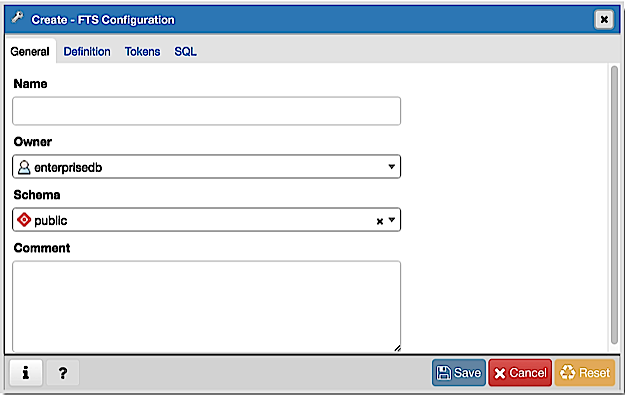
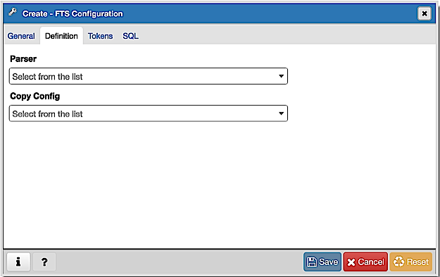
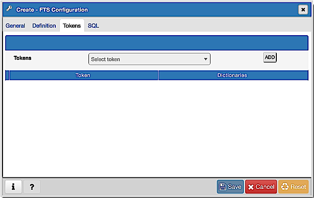
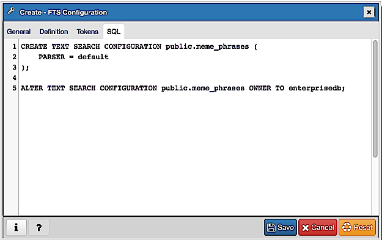

.. _fts_configuration_dialog:

*********************************
`FTS Configuration Dialog`:index:
*********************************

Use the *FTS Configuration* dialog to configure a full text search. A text
search configuration specifies a text search parser that can divide a string
into tokens, along with dictionaries that can identify searchable tokens.

The *FTS Configuration* dialog organizes the development of a FTS configuration
through the following dialog tabs: "*General*, *Definition*, and *Tokens*. The
*SQL* tab displays the SQL code generated by dialog selections.

Click the *General* tab to begin.

Use the fields in the *General* tab to identify a FTS configuration:

* Use the *Name* field to add a descriptive name for the FTS configuration. The
  name will be displayed in the *pgAdmin* tree control.
* Use the drop-down listbox next to *Owner* to specify the role that will own
  the configuration.
* Select the name of the schema in which the FTS configuration will reside from
  the drop-down listbox in the *Schema* field.
* Store notes about the FTS configuration in the *Comment* field.

Click the *Definition* tab to continue.

Use the fields in the *Definition* tab to define parameters:

* Select the name of the text search parser from the drop-down listbox in the
  *Parser* field.
* Select a language from the drop-down listbox in the *Copy Config* field.

Click the *Tokens* tab to continue.

Use the fields in the *Tokens* tab to add a token:

* Use the *Tokens* field to specify the name of a token.
* Click the *Add* icon (+) to create a token.
* Use the *Dictionaries* field to specify a dictionary.

Repeat these steps to add additional tokens; to discard a token, click the
trash icon to the left of the row and confirm deletion in the *Delete Row*
popup.

Click the *SQL* tab to continue.

Your entries in the *FTS Configuration* dialog generate a SQL command (see an
example below). Use the *SQL* tab for review; revisit or switch tabs to make
any changes to the SQL command.

Example
*******

The following is an example of the sql command generated by user selections in
the *FTS Configuration* dialog:

The example shown demonstrates creating a FTS configuration named
*meme_phrases*. It uses the *default* parser.

* Click the *Info* button (i) to access online help.
* Click the *Save* button to save work.
* Click the *Cancel* button to exit without saving work.
* Click the *Reset* button to restore configuration parameters.

