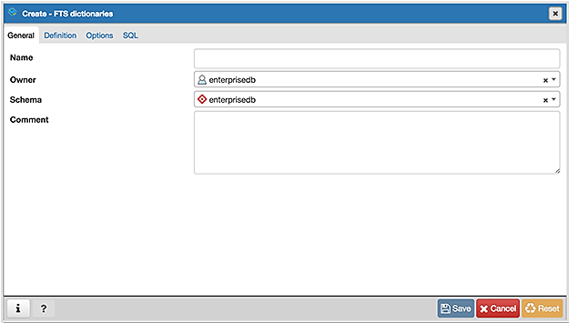
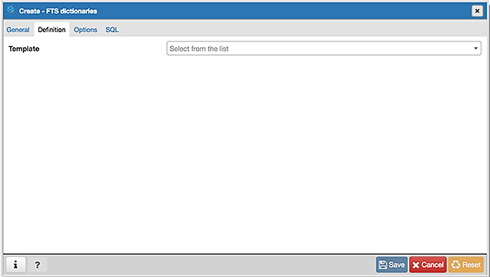
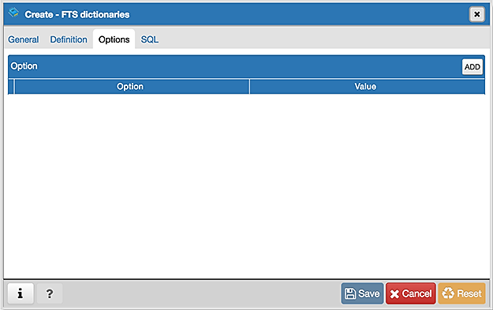
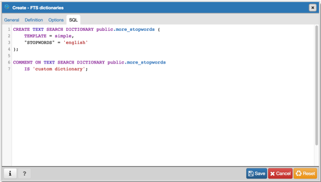

.. _fts_dictionary_dialog:

******************************
`FTS Dictionary Dialog`:index:
******************************

Use the *FTS Dictionary* dialog to create a full text search dictionary. You
can use a predefined templates or create a new dictionary with custom
parameters.

The *FTS Dictionary* dialog organizes the development of a FTS dictionary
through the following dialog tabs: *General*, *Definition*, and *Options*. The
*SQL* tab displays the SQL code generated by dialog selections.

Use the fields in the *General* tab to identify the dictionary:

* Use the *Name* field to add a descriptive name for the dictionary. The name
  will be displayed in the *pgAdmin* tree control.
* Use the drop-down listbox next to *Owner* to select the role that will own the
  FTS Dictionary.
* Select the name of the schema in which the dictionary will reside from the
  drop-down listbox in the *Schema* field.
* Store notes about the dictionary in the *Comment* field.

Click the *Definition* tab to continue.

Use the field in the *Definition* tab to choose a template from the drop-down
listbox:

* Select *ispell* to select the Ispell template. The Ispell dictionary template
  supports morphological dictionaries, which can normalize many different
  linguistic forms of a word into the same lexeme. For example, an English
  Ispell dictionary can match all declensions and conjugations of the search
  term bank, e.g., banking, banked, banks, banks', and bank's. Ispell
  dictionaries usually recognize a limited set of words, so they should be
  followed by another broader dictionary; for example, a Snowball dictionary,
  which recognizes everything.
* Select *simple* to select the simple template. The simple dictionary template
  operates by converting the input token to lower case and checking it against
  a file of stop words. If it is found in the file then an empty array is
  returned, causing the token to be discarded. If not, the lower-cased form of
  the word is returned as the normalized lexeme. Alternatively, the dictionary
  can be configured to report non-stop-words as unrecognized, allowing them to
  be passed on to the next dictionary in the list.
* Select *snowball* to select the Snowball template. The Snowball dictionary
  template is based on a project by Martin Porter, inventor of the popular
  Porter's stemming algorithm for the English language. Snowball now provides
  stemming algorithms for many languages (see the Snowball site for more
  information). Each algorithm understands how to reduce common variant forms of
  words to a base, or stem, spelling within its language. A Snowball dictionary
  recognizes everything, whether or not it is able to simplify the word, so it
  should be placed at the end of the dictionary list. It is useless to have it
  before any other dictionary because a token will never pass through it to the
  next dictionary.
* Select *synonym* to select the synonym template. This dictionary template is
  used to create dictionaries that replace a word with a synonym. Phrases are not
  supported (use the thesaurus template (Section 12.6.4) for that). A synonym
  dictionary can be used to overcome linguistic problems, for example, to prevent
  an English stemmer dictionary from reducing the word Paris to pari.
* Select *thesaurus* to select the thesaurus template. A thesaurus dictionary
  replaces all non-preferred terms by one preferred term and, optionally,
  preserves the original terms for indexing as well. PostgreSQL's current
  implementation of the thesaurus dictionary is an extension of the synonym
  dictionary with added phrase support.

Click the *Options* tab to continue.

Use the fields in the *Options* tab to provide template-specific options. Click
the *Add* icon (+) to add an option clause:

* Specify the name of an option in the *Option* field
* Provide a value for the option in the *Value* field.

Click the *Add* icon (+) to specify each additional option/value pair; to
discard an option, click the trash icon to the left of the row and confirm
deletion in the *Delete Row* popup.

Click the *SQL* tab to continue.

Your entries in the *FTS Dictionary* dialog generate a generate a SQL command.
Use the *SQL* tab for review; revisit or switch tabs to make any changes to the
SQL command.

Example
*******

The following is an example of the sql command generated by user selections in
the *FTS Dictionary* dialog:

The example shown demonstrates creating a custom dictionary named
*more_stopwords* which is based on the simple template and is configured to use standard English.

* Click the *Info* button (i) to access online help.
* Click the *Save* button to save work.
* Click the *Close* button to exit without saving work.
* Click the *Reset* button to restore configuration parameters.

