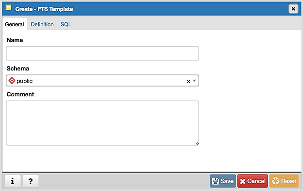
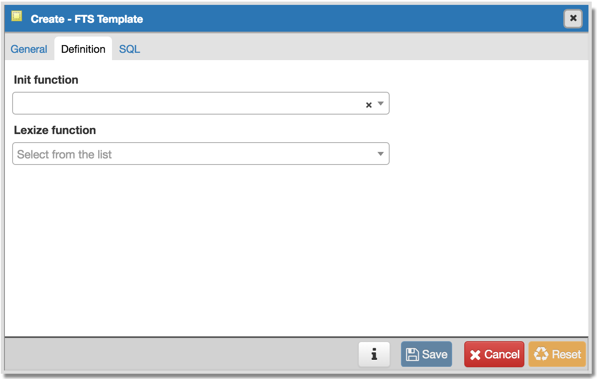
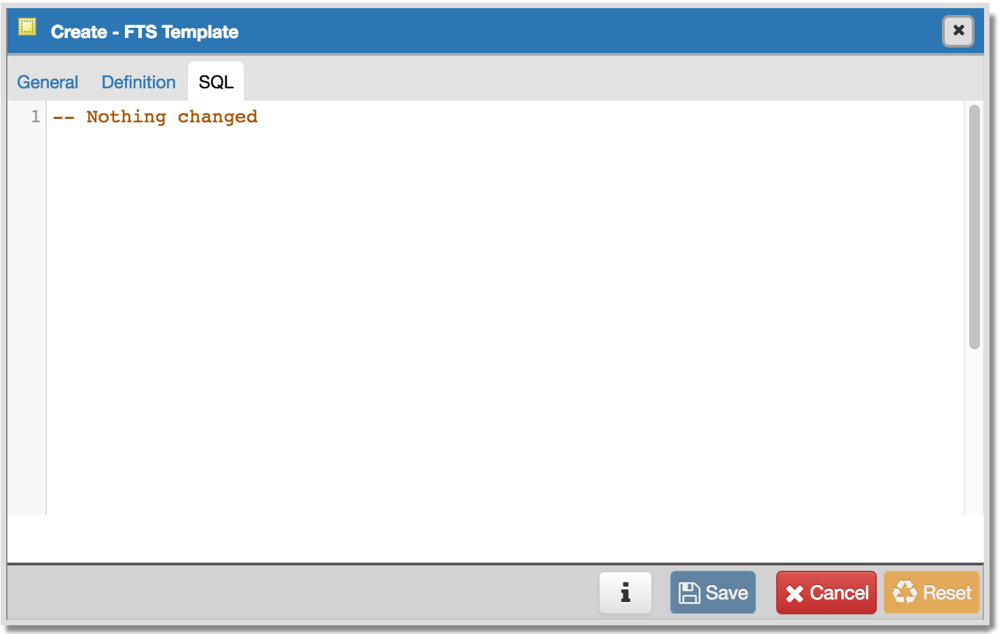

.. _fts_template_dialog:

****************************
`FTS Template Dialog`:index:
****************************

Use the *FTS Template* dialog to create a new text search template. A text
search template defines the functions that implement text search dictionaries.

The *FTS Template* dialog organizes the development of a text search Template
through the following dialog tabs: *General*, and *Definition*. The *SQL* tab
displays the SQL code generated by dialog selections.

Use the fields in the *General* tab to identify a template:

* Use the *Name* field to add a descriptive name for the template. The name will
  be displayed in the *pgAdmin* tree control.
* Select the name of the schema in which the template will reside from the
  drop-down listbox in the *Schema* field.
* Store notes about the template in the *Comment* field.

Click the *Definition* tab to continue.

Use the fields in the *Definition* tab to define function parameters:

* Use the drop-down listbox next to *Init function* to select the name of the
  init function for the template. The init function is optional.
* Use the drop-down listbox next to *Lexize function* to select the name of the
  lexize function for the template. The lexize function is required.

Click the *SQL* tab to continue.

Your entries in the *FTS Template* dialog generate a SQL command (see an example
below). Use the *SQL* tab for review; revisit or switch tabs to make any changes
to the SQL command.

Example
*******

The following is an example of the sql command generated by user selections in
the *FTS Template* dialog:

The example shown demonstrates creating a fts template named *eng.template* that
uses the ispell dictionary.

* Click the *Info* button (i) to access online help.
* Click the *Save* button to save work.
* Click the *Close* button to exit without saving work.
* Click the *Reset* button to restore configuration parameters.

