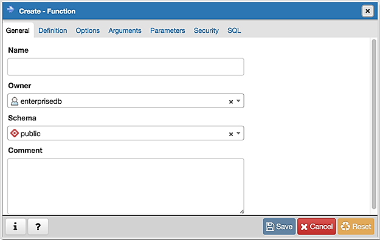
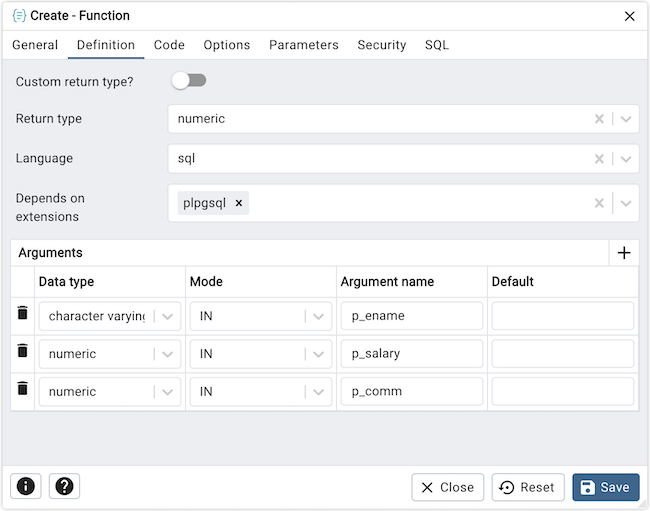
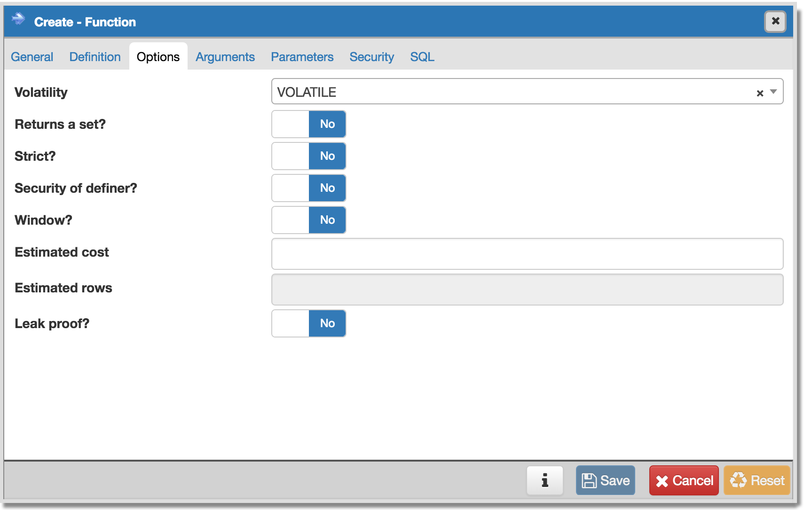
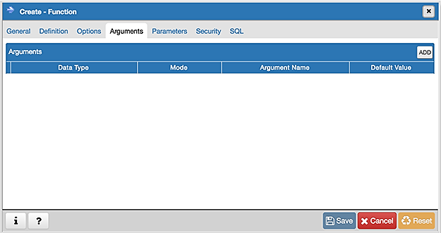
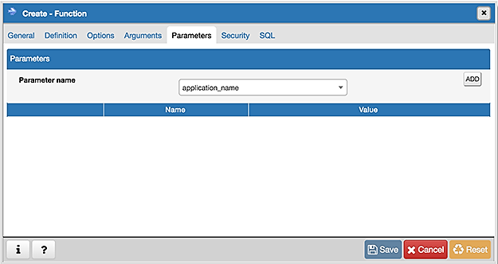
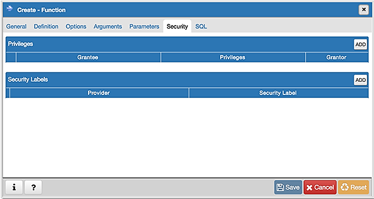
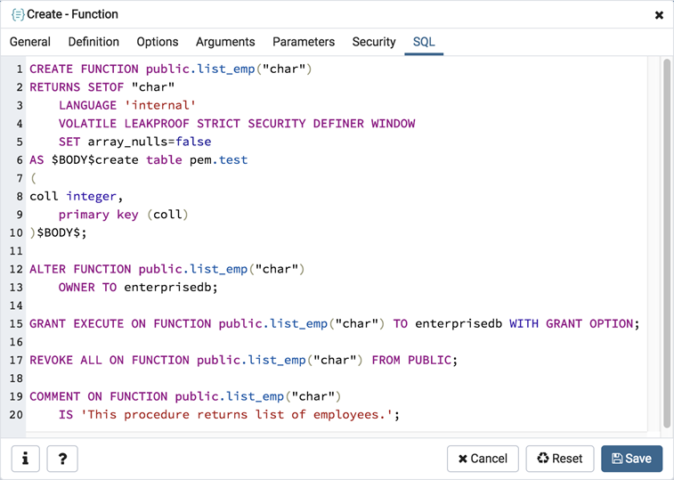

.. _function_dialog:

************************
`Function Dialog`:index:
************************

Use the *Function* dialog to define a function.  If you drop and then recreate a function, the new function is not the same entity as the old; you must drop existing rules, views, triggers, etc. that refer to the old function.

The *Function* dialog organizes the development of a function through the following dialog tabs: *General*, *Definition*, *Options*, *Arguments*, *Parameters*, and *Security*. The *SQL* tab displays the SQL code generated by dialog selections.

Use the fields in the *General* tab to identify a function:

* Use the *Name* field to add a descriptive name for the function. The name will be displayed in the *pgAdmin* tree control.
* Use the drop-down listbox next to *Owner* to select the name of the role that will own the function.
* Use the drop-down listbox next to *Schema* to select the schema in which the function will be created.
* Store notes about the function in the *Comment* field.

Click the *Definition* tab to continue.

Use the fields in the *Definition* tab to define the function:

* Use the drop-down listbox next to *Return type* to select the data type returned by the function, if any.
* Use the drop-down listbox next to *Language* to select the implementation language. The default is *sql*.
* Use the *Code* field to write the code that will execute when the function is called.

Click the *Options* tab to continue.

Use the fields in the *Options* tab to describe or modify the action of the function:

* Use the drop-down listbox next to *Volatility* to select one of the following. *VOLATILE* is the default value.

    * *VOLATILE* indicates that the function value can change even within a single table scan, so no optimizations can be made.
    * *STABLE* indicates that the function cannot modify the database, and that within a single table scan it will consistently return the same result for the same argument values.
    * *IMMUTABLE* indicates that the function cannot modify the database and always returns the same result when given the same argument values.

* Move the *Returns a Set?* switch to indicate if the function returns a set that includes multiple rows. The default is *No*.
* Move the *Strict?* switch to indicate if the function always returns NULL whenever any of its arguments are NULL. If *Yes*, the function is not executed when there are NULL arguments; instead a NULL result is assumed automatically. The default is *No*.
* Move the *Security of definer?* switch to specify that the function is to be executed with the privileges of the user that created it. The default is *No*.
* Move the *Window?* switch to indicate that the function is a window function rather than a plain function. The default is *No*. This is currently only useful for functions written in C. The WINDOW attribute cannot be changed when replacing an existing function definition. For more information about the CREATE FUNCTION command, see the PostgreSQL core documentation available at:

   http://www.postgresql.org/docs/9.5/static/functions-window.html

* Use the *Estimated cost* field to specify a positive number representing the estimated execution cost for the function, in units of cpu_operator_cost. If the function returns a set, this is the cost per returned row.
* Use the *Estimated rows* field to specify a positive number giving the estimated number of rows that the query planner should expect the function to return. This is only allowed when the function is declared to return a set. The default assumption is 1000 rows.
* Move the *Leak proof?* switch to indicate whether the function has side effects. The default is *No*. This option can only be set by the superuser.

Click the *Arguments* tab to continue.

Use the fields in the *Arguments* tab to define an argument. Click the *Add* icon (+) to set parameters and values for the argument:

* Use the drop-down listbox in the *Data type* field to select a data type.
* Use the drop-down listbox in the *Mode* field to select a mode. Select *IN* for an input parameter; select *OUT* for an output parameter; select *INOUT* for both an input and an output parameter; or, select *VARIADIC* to specify a VARIADIC parameter.
* Provide a name for the argument in the *Argument Name* field.
* Specify a default value for the argument in the *Default Value* field.

Click the *Add* icon (+) to define another argument; to discard an argument, click the trash icon to the left of the row and confirm deletion in the *Delete Row* popup.

Click the *Parameters* tab to continue.

Use the fields in the *Parameters* tab to specify settings that will be applied when the function is invoked. Click the *Add* icon (+) to add a *Name*/*Value* field in the table.

* Use the drop-down listbox in the *Name* column in the *Parameters* panel to select a parameter.
* Use the *Value* field to specify the value that will be associated with the selected variable. This field is context-sensitive.

Click the *Security* tab to continue.

Use the *Security* tab to assign privileges and define security labels.

Use the *Privileges* panel to assign usage privileges for the function to a role.

* Select the name of the role from the drop-down listbox in the *Grantee* field.
* Click inside the *Privileges* field. Check the boxes to the left of one or more privileges to grant the selected privilege to the specified user.
* Select the name of the role from the drop-down listbox in the *Grantor* field. The default grantor is the owner of the database.

Click the *Add* icon (+) to assign additional privileges; to discard a privilege, click the trash icon to the left of the row and confirm deletion in the *Delete Row* popup.

Use the *Security Labels* panel to define security labels applied to the function. Click the *Add* icon (+) to add each security label selection:

* Specify a security label provider in the *Provider* field. The named provider must be loaded and must consent to the proposed labeling operation.
* Specify a a security label in the *Security Label* field. The meaning of a given label is at the discretion of the label provider. PostgreSQL places no restrictions on whether or how a label provider must interpret security labels; it merely provides a mechanism for storing them.

Click the *Add* icon (+) to assign additional security labels; to discard a security label, click the trash icon to the left of the row and confirm deletion in the *Delete Row* popup.

Click the *SQL* tab to continue.

Your entries in the *Function* dialog generate a generate a SQL command (see an example below). Use the *SQL* tab for review; revisit or switch tabs to make any changes to the SQL command.

**Example**

The following is an example of the sql command generated by selections made in the *Function* dialog:

The example demonstrates creating an *edbspl* function named *emp_comp*.  The function adds two columns (p_sal and p_comm), and then uses the result to compute a yearly salary, returning a NUMERIC value.

* Click the *Info* button (i) to access online help.View context-sensitive help in the *Tabbed browser*, where a new tab displays the PostgreSQL core documentation.
* Click the *Save* button to save work.
* Click the *Cancel* button to exit without saving work.
* Click the *Reset* button to restore configuration parameters.

