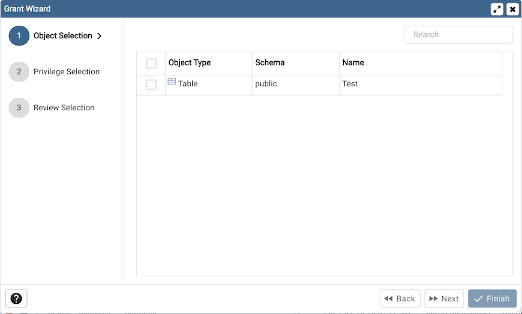
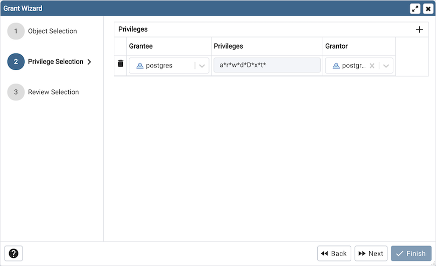
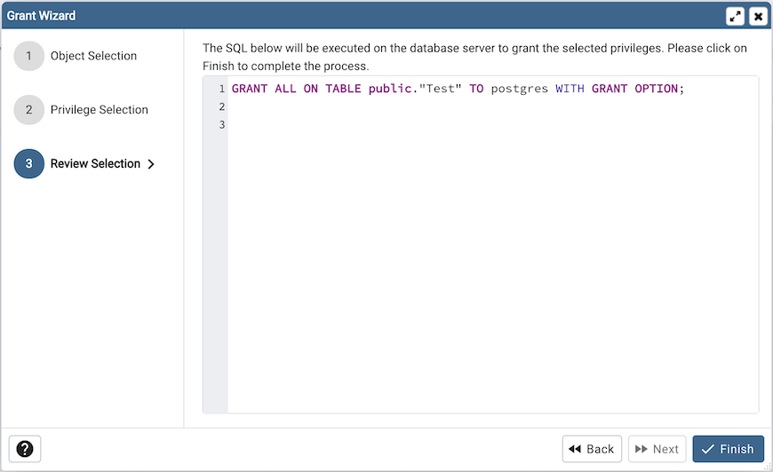

.. _grant_wizard:

*********************
`Grant Wizard`:index:
*********************

The *Grant Wizard* tool is a graphical interface that allows you to manage the privileges of one or more database objects in a point-and-click environment. A search box, dropdown lists, and checkboxes facilitate quick selections of database objects, roles and privileges.

The wizard organizes privilege management through a sequence of windows: *Object Selection (step 1 of 3)*, *Privileges Selection (step 2 of 3)* and *Final (Review Selection) (step 3 of 3)*. The *Final (Review Selection)* window displays the SQL code generated by wizard selections.

To launch the *Grant Wizard* tool, select a database object in the *pgAdmin* tree control, then navigate through *Tools* on the menu bar to click on the *Grant Wizard* option.

Use the fields in the *Object Selection (step 1 of 3)* window to select the object or objects on which you are modifying privileges. Use the *Search by object type or name* field to locate a database object, or use the scrollbar to scroll through the list of all accessible objects.

* Each row in the table lists object identifiers; check the checkbox in the left column to include an object as a target of the Grant Wizard.  The table displays:

    * The object type in the *Object Type* field
    * The schema in which the object resides in the *Schema* field
    * The object name in the *Name* field.

Click the *Next* button to continue, or the *Cancel* button to close the wizard without modifying privileges.

Use the fields in the *Privileges Selection (step 2 of 3)* window to grant privileges. If you grant a privilege WITH GRANT OPTION, the Grantee will have the right to grant privileges on the object to others. If WITH GRANT OPTION is subsequently revoked, any role who received access to that object from that Grantee (directly or through a chain of grants) will lose thier privileges on the object.

* Click the *Add* icon (+) to assign a set of privileges.
* Select the name of the role from the drop-down listbox in the *Grantee* field.
* Click inside the *Privileges* field. Check the boxes to the left of one or more privileges to grant the selected privileges to the specified user. If privileges have previously been granted on a database object, unchecking a privilege for a group or user will result in revoking that privilege.
* If enabled, select the name of the role from the drop-down listbox in the *Grantor* field. The default grantor is the owner of the database.
* Click the *Add* icon (+) to assign a set of privileges to another role; to discard a privilege, click the trash icon to the left of the row and confirm deletion in the *Delete Row* dialog.

For more information about granting privileges on database objects, see the `PostgreSQL core documentation <http://www.postgresql.org/docs/9.5/static/sql-grant.html>`_.

Click the *Next* button to continue, the *Back* button to select or deselect additional database objects, or the *Cancel* button to close the wizard without modifying privileges.

Your entries in the *Grant Wizard* tool generate a SQL command; you can review the command in the *Final (Review Selection) (step 3 of 3)* window (see an example below).

**Example**

The following is an example of the sql command generated by user selections in the *Grant Wizard* tool:

The commands displayed assign a role named *Bob* *INSERT* and *UPDATE* privileges *WITH GRANT OPTION* on the *sales_meetings* and the *sales_territories* tables.

* Click the *Back* button to select or deselect additional database objects, roles and privileges.
* Click the *Cancel* button to exit without saving work.
* Click the *Finish* button to save selections and exit the wizard.