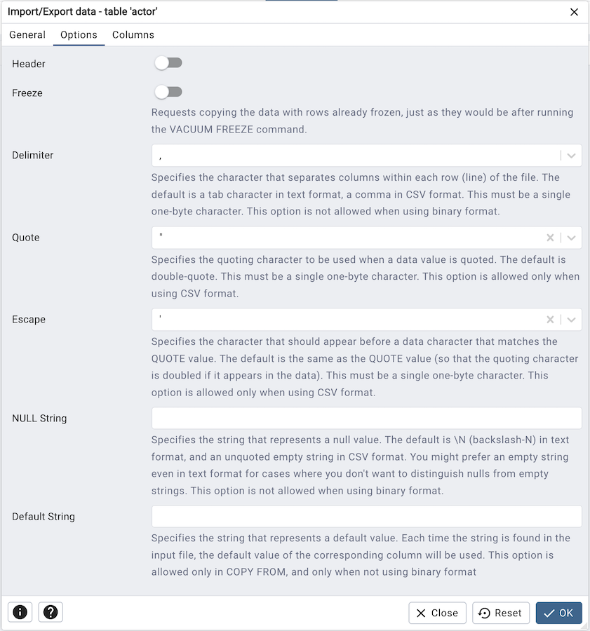
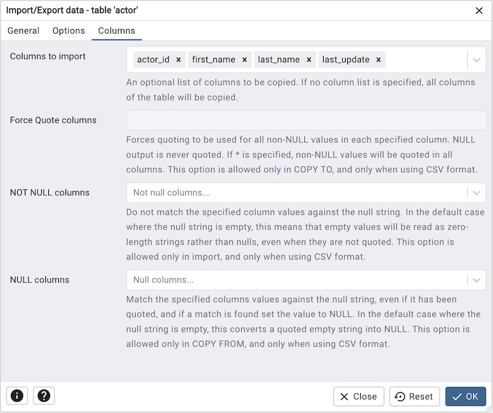
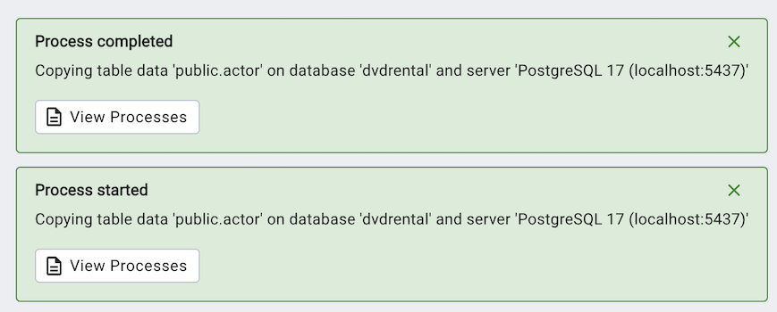
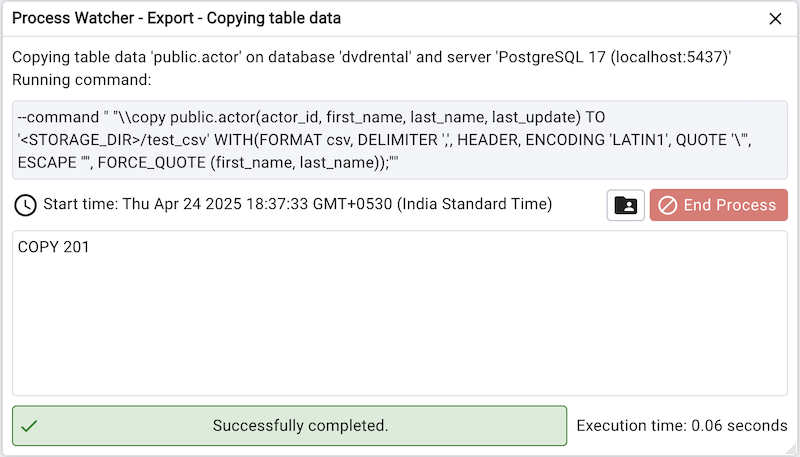
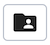

.. _import_export_data:

**********************************
`Import/Export Data Dialog`:index:
**********************************

Use the *Import/Export data* dialog to copy data from a table to a file, or copy
data from a file into a table.

The *Import/Export data* dialog organizes the import/export of data through the
*General*, *Options* and *Columns* tabs.

.. image:: images/import_export_general.png
    :alt: Import Export data dialog general tab
    :align: center

Use the fields in the *General* tab to specify import and export preferences:

* Move the *Import/Export* switch to the *Import* position to specify that the
  server should import data to a table from a file. The default is *Import*.

* Enter the name of the source or target file in the *Filename* field.
  Optionally, select the *Browser* icon (ellipsis) to the right to navigate
  into a directory and select a file.

* Use the drop-down listbox in the *Format* field to specify the file type.
  Select:

  * *binary* for a .bin file.
  * *csv* for a .csv file.
  * *text* for a .txt file.

* Use the drop-down listbox in the *Encoding* field to specify the type of
  character encoding.

* Use the fields in the *Options* tab to specify additional information:

   * Move the *OID* switch to the *Yes* position to include the *OID* column.
     The *OID* is a system-assigned value that may not be modified. The default
     is *No*.
   * Move the *Header* switch to the *Yes* position to include the table header
     with the data rows. If you include the table header, the first row of the
     file will contain the column names.
   * If you are exporting data, specify the delimiter that will separate the
     columns within the target file in the *Delimiter* field. The separating
     character can be a colon, semicolon, a vertical bar, or a tab.
   * Specify a quoting character used in the *Quote* field. Quoting can be
     applied to string columns only (i.e. numeric columns will not be quoted)
     or all columns regardless of data type. The character used for quoting can
     be a single quote or a double quote.
   * Specify a character that should appear before a data character that matches
     the *QUOTE* value in the *Escape* field.
   * Use the *NULL Strings* field to specify a string that will represent a null
     value within the source or target file.

Click the *Columns* tab to continue.

Use the fields in the *Columns* tab to select the columns that will be imported
or exported:

* Click inside the *Columns to export/import* field to deselect one or more
  columns from the drop-down listbox. To delete a selection, click the *x* to
  the left of the column name. Click an empty spot inside the field to access
  the drop-down list.

* If enabled, click inside the *NOT NULL columns* field to select one or more
  columns that will not be checked for a NULL value. To delete a column, click
  the *x* to the left of the column name.

After completing the *Import/Export data* dialog, click the *OK* button to
perform the import or export.  pgAdmin will inform you when the background
process completes:

Use the **Stop Process** button to stop the Import/Export process.

Use the *Click here for details* link on the notification to open the *Process
Watcher* and review detailed information about the execution of the command
that performed the import or export:

.. note:: If you are running *pgAdmin* in *Server Mode* you can click on the |sm_icon| icon in the process watcher window to open the file location in the Storage Manager. You can use the :ref:`Storage Manager <storage_manager>` to download the backup file on the client machine .

