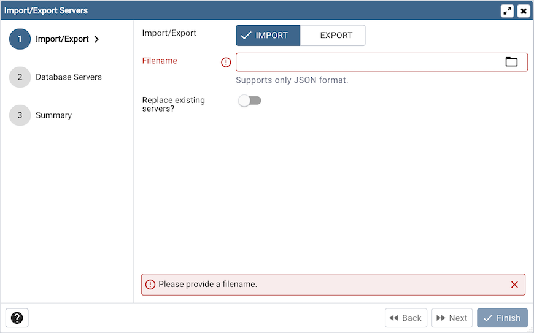
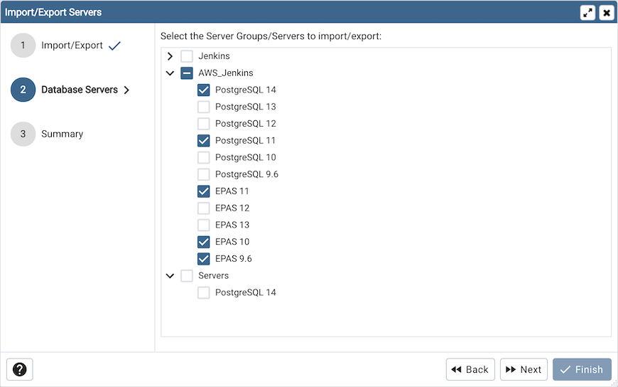
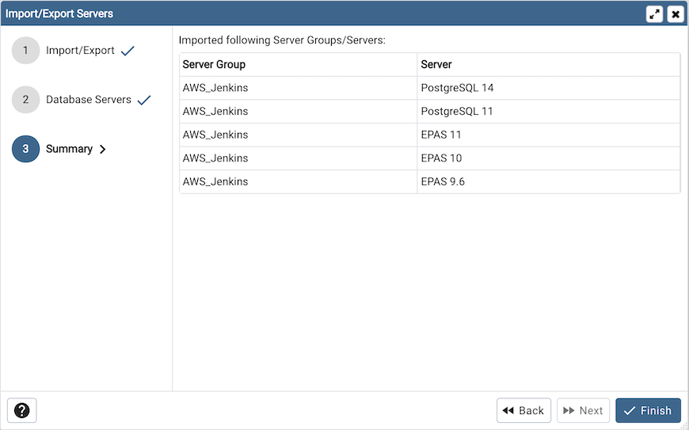

.. _import_export_servers:

******************************
`Import/Export Servers`:index:
******************************

Server definitions (and their groups) can be exported to a JSON file and
re-imported to the same or a different system to enable easy pre-configuration
of pgAdmin.

Using pgAdmin 4 GUI
###################

To launch the *Import/Export Servers...* tool, navigate through *Tools* on the
menu bar to click on the *Import/Export Servers* option.

* Use the *Import/Export* field to select the Server Groups/Servers
  to be imported or exported.

* Use the *Filename* field to select the JSON file to import servers or create the
  new file in case of Export where the servers to be exported in the JSON format.

* Use the *Remove all the existing servers?* field to specify whether to remove all the
  existing servers or not before importing the new selected servers.
  This field is applicable only in case of Import Servers.

Click the *Next* button to continue, or the *X* button to close the wizard.

* Select the Server Groups/ Servers to be imported/exported.

Click the *Next* button to continue, or the *X* button to close the wizard.

Check the summary of the servers that are going to be imported/exported on the
Summary page.

Click the *Finish* button to close the wizard.

Using 'setup.py' command line script
####################################

.. note:: To export or import servers using ``setup.py`` script, you must use
        the Python interpreter that is normally used to run pgAdmin to ensure
        that the required Python packages are available. In most packages, this
        can be found in the Python Virtual Environment that can be found in the
        installation directory. When using platform-native packages, the system
        installation of Python may be the one used by pgAdmin.

Exporting Servers
*****************

To export the servers defined in an installation, simply invoke ``setup.py`` with
the ``--dump-servers`` command line option, followed by the name (and if required,
path) to the desired output file. By default, servers owned by the desktop mode
user will be dumped (pgadmin4@pgadmin.org by default - see the DESKTOP_USER
setting in ``config.py``). This can be overridden with the ``--user`` command
line option. There can be multiple configurations of pgAdmin on the same system.
To dump the servers from specific pgAdmin config DB file, ``--sqlite-path`` option
can be used. It is also recommended to use this option when running pgAdmin in
desktop mode. By default SQLITE_PATH setting in ``config.py`` is taken.
For example:

.. code-block:: bash

    /path/to/python /path/to/setup.py --dump-servers output_file.json

    # or, to specify a non-default user name:

    /path/to/python /path/to/setup.py --dump-servers output_file.json --user user@example.com

    # to specify a pgAdmin config DB file:

    /path/to/python /path/to/setup.py --dump-servers output_file.json --sqlite-path /path/to/pgadmin4.db

To export only certain servers, use the ``--servers`` option and list one or
more server IDs. For example:

.. code-block:: bash

    /path/to/python /path/to/setup.py --dump-servers output_file.json --server 1 2 5

Importing Servers
*****************

To import the servers defined in a JSON file, simply invoke ``setup.py`` with
the ``--load-servers`` command line option, followed by the name (and if required,
path) of the JSON file containing the server definitions. Servers will be owned
by the desktop mode user (pgadmin4@pgadmin.org by default - see the DESKTOP_USER
setting in ``config.py``). This can be overridden with the ``--user`` command
line option. There can be multiple configurations of pgAdmin on the same system.
The default behaviour is for the imported servers to be added to the existent list,
which might lead to duplicates. This can be overridden with the ``--replace`` command
line option, which will replace the list of servers with the newly imported one.
To load the servers into a specific pgAdmin config DB file, ``--sqlite-path`` option
can be used. It is also recommended to use this option when running pgAdmin in
desktop mode. By default SQLITE_PATH setting in ``config.py`` is taken. For example:

.. code-block:: bash

    /path/to/python /path/to/setup.py --load-servers input_file.json

    # or, to replace the list of servers with the newly imported one:

    /path/to/python /path/to/setup.py --load-servers input_file.json --replace

    # or, to specify a non-default user name to own the new servers:

    /path/to/python /path/to/setup.py --load-servers input_file.json --user user@example.com

    # to specify a pgAdmin config DB file:

    /path/to/python /path/to/setup.py --load-servers input_file.json --sqlite-path /path/to/pgadmin4.db

If any Servers are defined with a Server Group that is not already present in
the configuration database, the required Group will be created.

JSON format
***********

The JSON file format used when importing or exporting servers is quite
straightforward and simply contains a list of servers, with a number of
attributes. The following attributes are required to be present in every server
definition: Name, Group, Port, Username, SSLMode, MaintenanceDB and one of Host,
HostAddr or Service.

Password fields cannot be imported or exported.

The following example shows both a minimally defined and a fully defined server:

.. code-block:: python

    {
        "Servers": {
            "1": {
                "Name": "Minimally Defined Server",
                "Group": "Server Group 1",
                "Port": 5432,
                "Username": "postgres",
                "Host": "localhost",
                "SSLMode": "prefer",
                "MaintenanceDB": "postgres"
            },
            "2": {
                "Name": "Fully Defined Server",
                "Group": "Server Group 2",
                "Host": "host.domain.com",
                "HostAddr": "192.168.1.2",
                "Port": 5432,
                "MaintenanceDB": "postgres",
                "Username": "postgres",
                "Role": "my_role_name",
                "SSLMode": "require",
                "Comment": "This server has every option configured in the JSON",
                "DBRestriction": "live_db test_db",
                "PassFile": "/path/to/pgpassfile",
                "SSLCert": "/path/to/sslcert.crt",
                "SSLKey": "/path/to/sslcert.key",
                "SSLRootCert": "/path/to/sslroot.crt",
                "SSLCrl": "/path/to/sslcrl.crl",
                "SSLCompression": 1,
                "Shared": false,
                "BGColor": "#ff9900",
                "FGColor": "#000000",
                "Service": "postgresql-10",
                "Timeout": 60,
                "UseSSHTunnel": 1,
                "TunnelHost": "192.168.1.253",
                "TunnelPort": 22,
                "TunnelUsername": "username",
                "TunnelAuthentication": 0
            }
        }
    }

