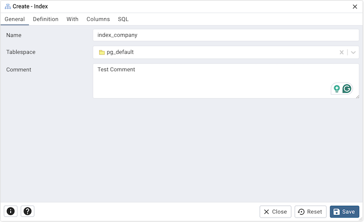
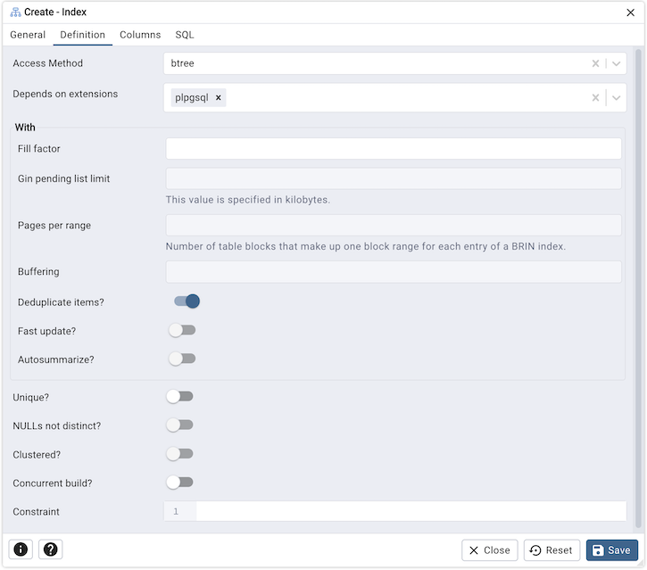
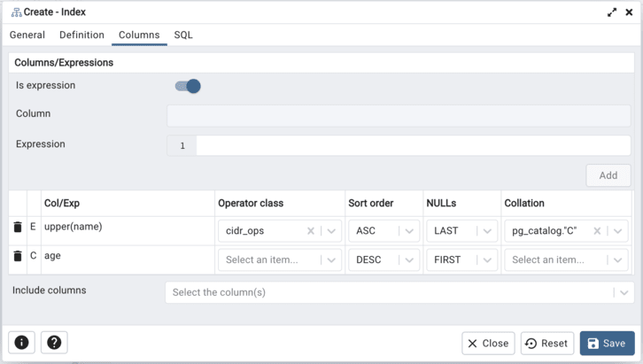
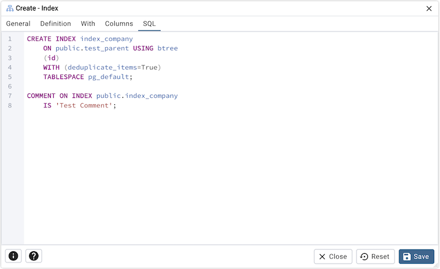

.. _index_dialog:

*********************
`Index Dialog`:index:
*********************

Use the *Index* dialog to create an index on a specified table or materialized
view.

The *Index* dialog organizes the development of a index through the following
dialog tabs: *General*, *Definition*, and *Columns*. The *SQL* tab displays the SQL code
generated by dialog selections.

Use the fields in the *General* tab to identify the index:

* Use the *Name* field to add a descriptive name for the index. The name will
  be displayed in the *pgAdmin* tree control.
* Use the drop-down listbox next to *Tablespace* to select the tablespace in
  which the index will reside.
* Store notes about the index in the *Comment* field.

Click the *Definition* tab to continue.

Use the fields in the *Definition* tab to define the index:

* Use the drop-down listbox next to *Access Method* to select an index type:

    * Select *btree* to create a B-tree index.  A B-tree index may improve
      performance when managing equality and range queries on data that can be
      sorted into some ordering (the default).
    * Select *hash* to create a hash index.  A hash index may improve
      performance when managing simple equality comparisons.
    * Select *gist* to create a GiST index.  A GiST index may improve
      performance when managing two-dimensional geometric data types and
      nearest-neighbor searches.
    * Select *gin* to create a GIN index.  A GIN index may improve
      performance when managing values with more than one key.
    * Select *spgist* to create a space-partitioned GiST index. A SP-GiST index
      may improve performance when managing non-balanced data structures.
    * Select *brin* to create a BRIN index.  A BRIN index may improve
      performance when managing minimum and maximum values and ranges.

* Use the *Fill Factor* field to specify a fill factor for the index. The fill
  factor specifies how full the selected method will try to fill each index
  page.
* Use the *Gin pending list limit* field to specify the maximum size of a GIN index's pending list, which is used 
  when fastupdate is enabled. This value is specified in kilobytes.
* Use the *Pages per range* field to specify the number of table blocks that make up one block range 
  for each entry of a BRIN index.
* Select *Buffering* to specify whether the buffering build technique is used to build the index. The default is
  *Auto*
* Move the switch next to *Deduplicate items?* towards the *right position* to control usage of the B-tree 
  deduplication technique. The default is *Yes*. This option is available only on PostgreSQL 13 and above.
* Move the switch next to *Fast update?* towards the *right position* to control usage of the fast update technique. 
  The default is *Yes*.
* Move the switch next to *Autosummarize* towards the *right position* to define whether a summarization run is 
  queued for the previous page range whenever an insertion is detected on the next one. The default is *No*
* Move the switch next to *Unique?* towards the *right position* to check for duplicate values
  in the table when the index is created and when data is added. The default is *No*.
* Move the switch next to *NULLs not distinct?* towards the *right position* to treat null values as not distinct. 
  The default is*No*. This option is available only on PostgreSQL 15 and above.
* Move the *Clustered?* switch to the *Yes* position to instruct the server to
  cluster the table.
* Move the *Concurrent build?* switch to the *Yes* position to build the index
  without taking any locks that prevent concurrent inserts, updates, or deletes
  on the table.
* Use the *Constraint* field to provide a constraint expression; a constraint
  expression limits the entries in the index to those rows that satisfy the
  constraint.

Click the *Columns* tab to continue.

Use the fields in the *Columns* tab to specify which column(s) or expression(s)
the index queries. Use the *Is expression ?* switch to enable
expression sql input. Use the drop-down listbox next to *Column*
to select a column. Once the *Column* is selected or the *Expression* is
entered then click the *Add* icon (+) to provide details of the action on the
column/expression:

* The *Col/Exp* field is populated with the selection made in the *Column*
  drop-down listbox or the *Expression* entered.
* If enabled, use the drop-down listbox to select an available *Operator class*
  to specify the type of action performed on the column.
* If enabled, use the drop-down listbox to select *Sort order*:

    * Select *ASC* to specify an ascending sort order (the default);
    * Select *DESC* to specify a descending sort order.
* If enabled, use the drop-down listbox to select *Nulls*:

    * Select *First* to specify nulls sort before non-nulls;
    * Select *Last* to specify nulls sort after non-nulls (the default).
* Use the drop-down listbox in the *Collation* field to select a collation to
  use for the index.

Use *Include columns* field to specify columns for *INCLUDE* clause of the
constraint. This option is available in Postgres 11 and later.

Click the *SQL* tab to continue.

Your entries in the *Index* dialog generate a SQL command (see an example
below). Use the *SQL* tab for review; revisit or switch tabs to make any
changes to the SQL command.

Example
*******

The following is an example of the sql command generated by user selections in
the *Index* dialog:

The example shown demonstrates creating an index named *index_sal* that indexes
the values in the *job* column of the *jobhist* table.

* Click the *Info* button (i) to access online help.
* Click the *Save* button to save work.
* Click the *Close* button to exit without saving work.
* Click the *Reset* button to restore configuration parameters.
