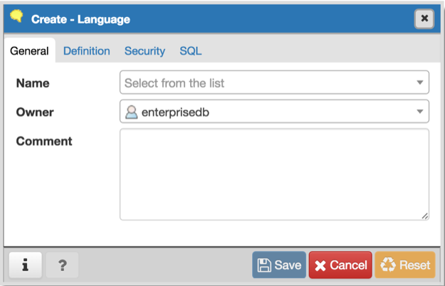
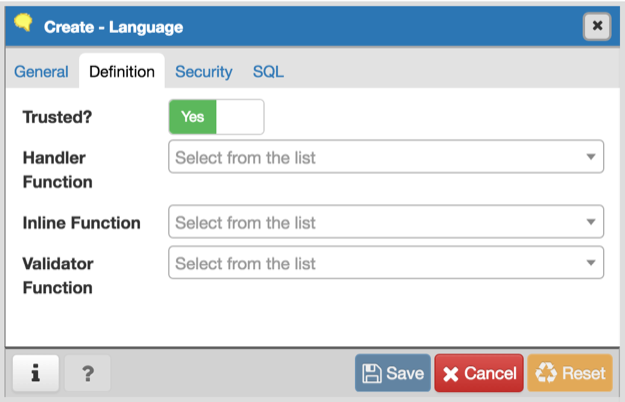
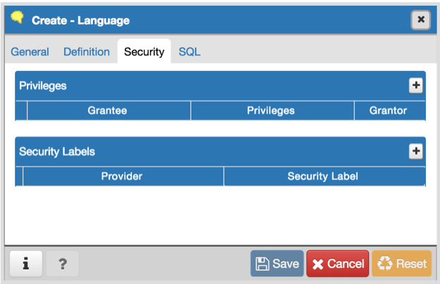
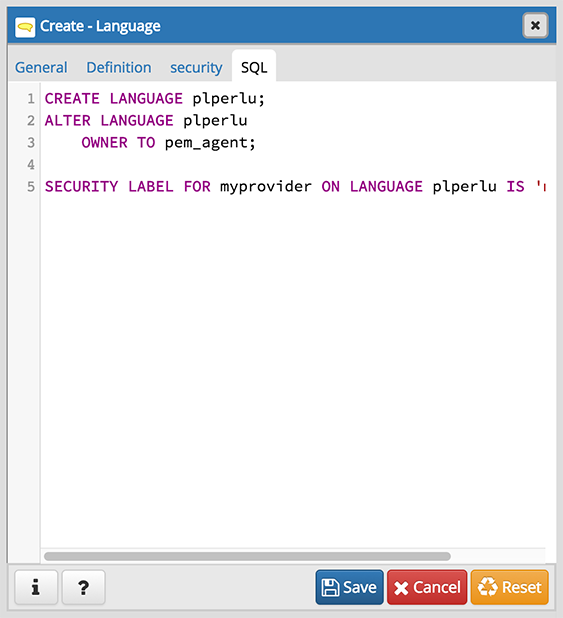

.. _language:

************************
`Language Dialog`:index:
************************

Use the CREATE LANGUAGE dialog to register a new procedural language.

The *Language* dialog organizes the registration of a procedural language
through the following dialog tabs: *General*, *Definition*,  and *Security*.
The *SQL* tab displays the SQL code generated by dialog selections.

Use the fields in the *General* tab to identify a language:

* Use the drop-down listbox next to *Name* to select a language script.
* Use the drop-down listbox next to *Owner* to select a role.
* Store notes about the language in the *Comment* field.

Click the *Definition* tab to continue.

Use the fields in the *Definition* tab to define parameters:

* Move the *Trusted?* switch to the *No* position to specify only users with
  PostgreSQL superuser privilege can use this language. The default is *Yes*.
* When enabled, use the drop-down listbox next to *Handler Function* to select
  the function that will be called to execute the language's functions.
* When enabled, use the drop-down listbox next to *Inline Function* to select
  the function that will be called to execute an anonymous code block (DO
  command) in this language.
* When enabled, use the drop-down listbox next to *Validator Function* to
  select the function that will be called when a new function in the language
  is created, to validate the new function.

Click the *Security* tab to continue.

Use the *Security* tab to assign privileges and define security labels.

Use the *Privileges* panel to assign privileges to a role. Click the *Add* icon
(+) to set privileges for database objects:

* Select the name of the role from the drop-down listbox in the *Grantee* field.
* Click inside the *Privileges* field. Check the boxes to the left of one or
  more privileges to grant the selected privilege to the specified user.
* The current user, who is the default grantor for granting the privilege, is displayed in the *Grantor* field.

Click the *Add* icon (+) to assign additional privileges; to discard a
privilege, click the trash icon to the left of the row and confirm deletion in
the *Delete Row* popup.

Use the *Security Labels* panel to define security labels applied to the
function. Click the *Add* icon (+) to add each security label selection:

* Specify a security label provider in the *Provider* field. The named provider
  must be loaded and must consent to the proposed labeling operation.
* Specify a a security label in the *Security Label* field. The meaning of a
  given label is at the discretion of the label provider. PostgreSQL places no
  restrictions on whether or how a label provider must interpret security
  labels; it merely provides a mechanism for storing them.

Click the *Add* icon (+) to assign additional security labels; to discard a
security label, click the trash icon to the left of the row and confirm deletion
in the *Delete Row* popup.

Click the *SQL* tab to continue.

Your entries in the *Language* dialog generate a SQL command (see an example
below). Use the *SQL* tab for review; revisit or switch tabs to make any changes
to the SQL command.

Example
*******

The following is an example of the sql command generated by user selections in
the *Language* dialog:

The example shown demonstrates creating the procedural language named *plperl*.

* Click the *Info* button (i) to access online help.
* Click the *Save* button to save work.
* Click the *Cancel* button to exit without saving work.
* Click the *Reset* button to restore configuration parameters.
