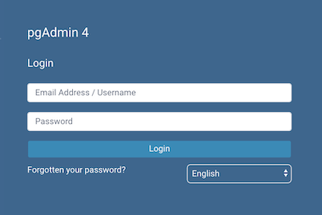
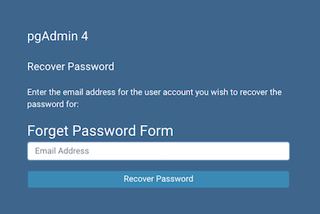

.. _login:

*********************
`Login Page`:index:
*********************

Use the *Login* page to log in to pgAdmin:

Use the fields in the *Login* page to authenticate your connection. There are
two ways to authenticate your connection:

- From pgAdmin version 4.21 onwards, support for LDAP authentication
  has been added. If LDAP authentication has been enabled for your pgAdmin
  application, you can use your LDAP credentials to log in to pgAdmin:

  * Provide the LDAP username in the *Email Address/Username* field.

  * Provide your LDAP password in the Password field.

- Alternatively, you can use the following information to log in to pgAdmin:

  * Provide the email address associated with your account in the
    *Email Address/Username* field.

  * Provide your password in the *Password* field.

Click the *Login* button to securely log into pgAdmin.

Please note that if the pgAdmin server is restarted, then you will be logged
out. You need to re-login to continue.

Recovering a Lost Password
**************************

If you cannot supply your password, click the *Forgotten your password?* button
to launch a password recovery utility.

* Provide the email address associated with your account in the *Email Address*
  field.
* Click the *Recover Password* button to initiate recovery. An email, with
  directions on how to reset a password, will be sent to the address entered in
  the *Email Address* field.

If you have forgotten the email associated with your account, please contact
your administrator.

Please note that your LDAP password cannot be recovered using this page. If
you enter your LDAP username in the *Email Address/Username* field, and then
enter your email to recover your password, an error message will be displayed
asking you to contact the LDAP administrator to recover your LDAP password.

Avoiding a bruteforce attack
****************************

You have the possibility to lock an account by setting ``MAX_LOGIN_ATTEMPTS``
once it has reached the maximum number of login attempts.
You can disable this feature by setting the value to zero.
